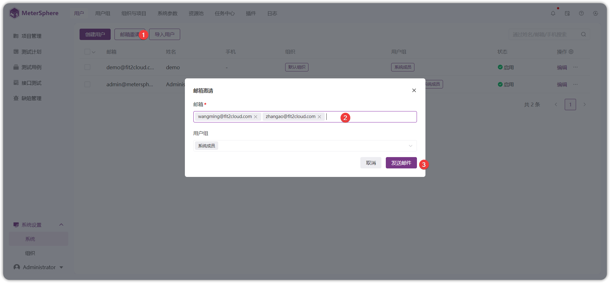
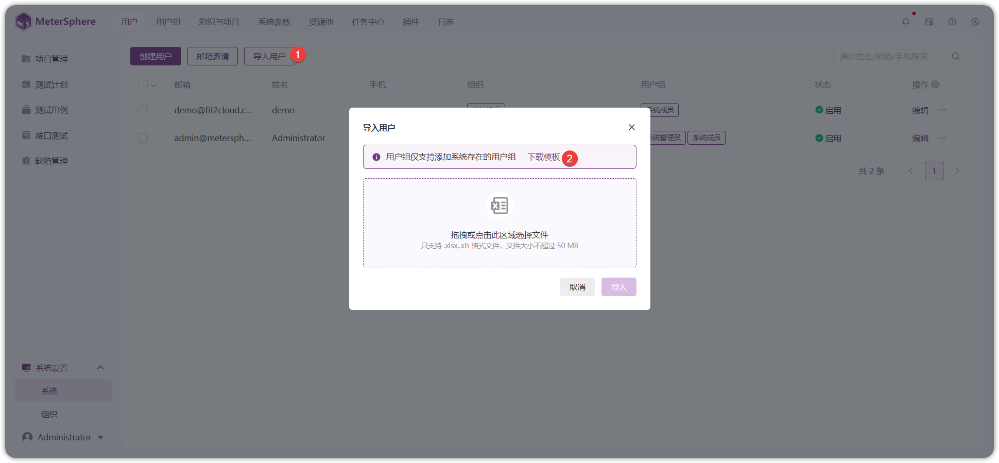
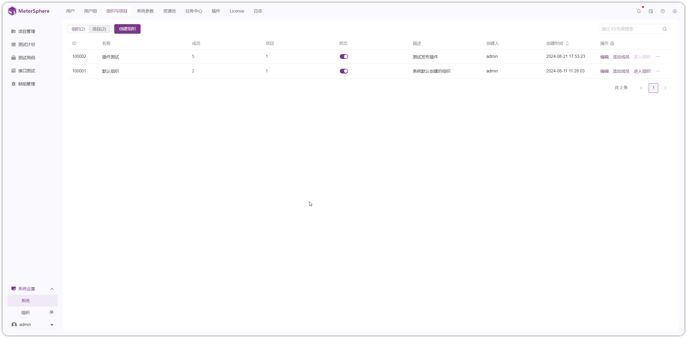
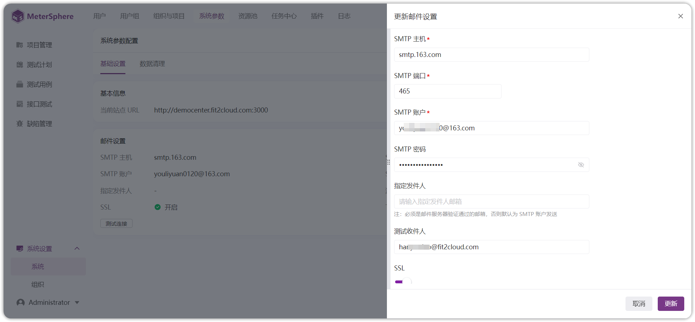
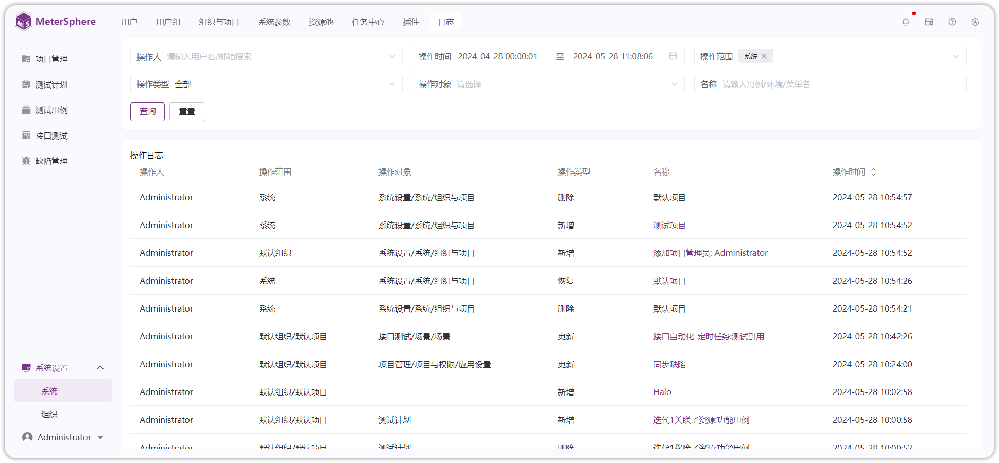
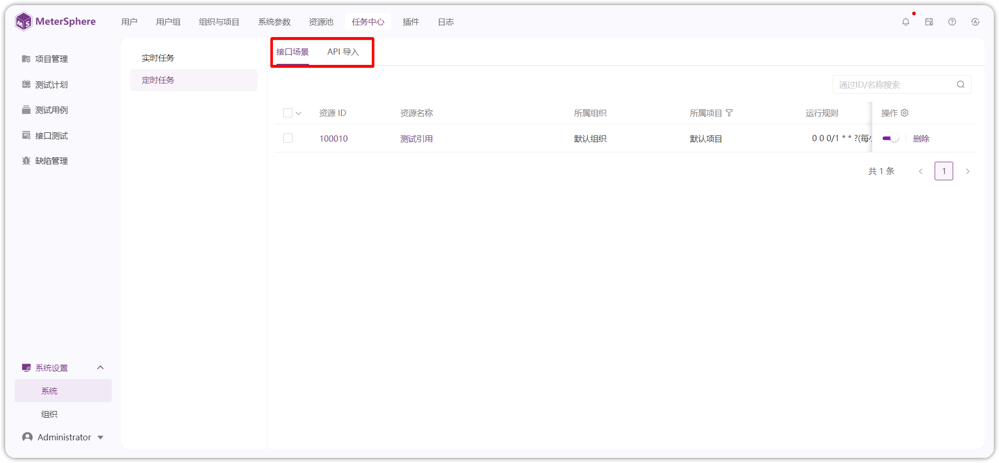

## 1 用户
!!! ms-abstract ""
    点击左侧【系统设置-系统-用户】进入用户管理界面。默认显示当前系统中的全部用户数据。</br>
{ width="900px" }

!!! ms-abstract "操作说明"

    - 【编辑】: 点击列表【用户组】修改用户组信息，点击列表【编辑】按钮修改用户基础信息及权限。</br>
    - 【重置密码】:点击【...】按钮，可以重置用户密码为邮箱。</br>
    - 【禁用】:点击【...】按钮，点击禁用当前用户为不可登录状态。</br>
    - 【删除】:点击【...】按钮，点击删除当前用户。</br>
    - 【查询】:用户列表右上方搜索框，根据姓名、邮箱、手机查询用户。</br>


!!! ms-abstract ""
    - **创建用户**<br>
    点击【创建用户】按钮创建用户，在弹出页面中编辑用户姓名、邮箱、手机等信息，默认为系统成员。可批量添加用户并设置用户组权限，保存后添加为平台用户。
{ width="900px" }

!!! ms-abstract ""
    - **邮箱邀请**<br>
    通过邮箱邀请用户。可填写多个邮箱地址，默认为系统成员，可编辑修改用户权限。<br>点击【发送邮件】按钮，系统将批量发送邮件，邀请用户自主注册账号、设置密码等信息并登录 MeterSphere 平台。


!!! ms-abstract "注意"

    注意：使用该功能需要提前在【系统设置-系统-系统参数-邮件设置】提前配置上可用的 SMTP 邮件服务。详情参考 [系统参数](./system.md#4)。
{ width="900px" }

!!! ms-abstract ""
    - **导入用户**<br>
    点击【导入用户】按钮，下载模版并填写用户信息，通过 Excel 文件批量导入用户。
{ width="900px" }


!!! ms-abstract ""

    - **用户批量操作**<br>
    用户列表多选数据，批量对用户进行【添加至项目】、【添加至用户组】、【添加至组织】、【重置密码】、【禁用】、【启用】 、【删除】等操作。<br>
{ width="900px" }


## 2 用户组
!!! ms-abstract ""
    点击左侧【系统设置-系统-用户组】菜单进入用户组界面。用户基于自身需求创建自定义用户组，赋予用户组不同的权限设置。系统预置管理员角色权限不可编辑，系统预置角色不可删除，内容如下：</br>

     - 【系统用户组】：系统管理员、系统成员。<br>
     - 【组织用户组】：组织管理员、组织成员。<br>
     - 【项目用户组】：项目管理员、项目成员。<br>
    
{ width="900px" }

!!! ms-abstract ""

    - **创建用户组**<br>
    系统、组织、项目模块点击【+】按钮添加自定义用户组，配置勾选平台用户访问菜单权限，点击【保存】按钮保存勾选的权限配置。
    
{ width="900px" }
{ width="900px" }

!!! ms-abstract "操作说明"

    - 【恢复默认】: 恢复为上一次保存的权限。</br>
    - 【重命名】:点击【...】按钮，重命名用户组。</br>
    - 【删除】:点击【...】按钮，删除用户组。</br>
    -  【选中用户组 +】：快捷添加用户组成员。</br>
    - 【查询】:列表左上方输入框搜索用户组。</br>


## 3 组织与项目
### 3.1 组织
!!! ms-abstract ""
    点击左侧【系统设置-系统-组织与项目】菜单默认进入组织管理界面，可以切换为【项目】页签。
{ width="900px" }

!!! ms-abstract "操作说明"

    -  【添加成员】: 给当前组织添加成员用户。</br>
    -  【结束】:结束组织不展示在组织切换列表。</br>
    -  【删除】:点击【...】按钮，删除用户组。社区版只可使用一个组织，且不可删除默认- 组织。</br>
    - 【查询】:列表右上方书输入框使用 ID 、名称查询组织。</br>


!!! ms-abstract ""
    - **编辑组织**<br>
    点击【编辑】按钮编辑组织，在弹出页面中修改名称、组织管理员、描述。
{ width="900px" }


### 3.2 项目
!!! ms-abstract ""
    【系统设置-系统-组织与项目】界面，右侧页签切换为【项目】页签，进入项目管理界面。
    
{ width="900px" }

!!! ms-abstract "操作说明"

    - 【添加成员】: 给当项目添加成员用户。</br>
    - 【结束】:结束项目不展示在项目切换列表。</br>
    - 【删除】:点击【...】按钮，删除项目，系统会在 30 天后执行删除项目。删除确认后，点击名称旁边【闹钟图标】撤销删除，项目删除前可正常使用。</br>
    -  【查询】:列表右上方书输入框使用 ID 、名称查询项目。</br>


!!! ms-abstract ""

    - **新增项目**<br>
    点击【创建项目】按钮新建项目，在弹出页面中编辑项目名称、项目管理员、开启模块、描述、启用停用状态等信息。
{ width="900px" }


!!! ms-abstract "操作说明"

    【项目管理员】：默认为当前创建人，项目管理员自动加入当前项目。当项目管理员不在当前创建的项目所属组织时，自动将项目管理员加入到项目所属组织，赋予组织成员用户组。</br>
    【开启模块】：默认全选，可以自定义选择。若编辑项目取消模块，已产生数据保留，但是无入口进入对应模块。</br>
    【资源池】：用于接口测试执行任务，默认可用 Local 资源池。资源池配置在[系统-资源池](./system.md#5)配置。</br>
    【状态】：默认启用，有启用，关闭两种状态。</br>

!!! ms-abstract ""

    - **编辑项目**<br>
    点击【编辑】按钮编辑项目，在弹出页面中修改项目名称、项目管理员、开启模块、描述、启用停用状态等信息。
{ width="900px" }


## 4 系统参数
!!! ms-abstract ""
    点击左侧【系统设置-系统-系统参数】进入参数设置界面，用于平台【基本设置】、【邮件设置】、【内存清理】等参数的设置。</br>

    - 【基本信息】：设置平台站点URL。URL 值一般为浏览器访问 MeterSphere 的地址。</br>
    - 【邮件设置】：设置SMTP邮件服务，用于用户邮箱邀请用户，测试消息推送。</br>
    - 【内存清理】：可以设置系统日志保留时长，定时每天 0 点定时清理。</br>
    - 【变更历史】：对系统内所有的项目生效，超出设置的用例变更历史会被清除，更新后立即生效。
{ width="900px" }
{ width="900px" }

!!! ms-abstract ""
    - **邮件配置**<br>
    点击【邮件配置】按钮，填写SMTP邮件配置基础信息，测试连接通过后使用。
{ width="900px" }


## 5 资源池
!!! ms-abstract ""
    点击左侧【系统设置-系统-资源池】资源池界面。测试资源池主要用于接口测试。

!!! ms-abstract "注意"
    社区版限制一个资源池，不可删除默认资源池。

    
{ width="900px" }

!!! ms-abstract "操作说明"

    - 【查询】：左上角通用名称查询。</br>
    - 【编辑】：修改资源池信息。</br>
    - 【删除】：删除资源池。</br>


## 6 授权
!!! ms-abstract ""
    点击左侧【系统设置-系统-授权】进入授权管理界面，点击【授权验证】导入企业版证书 license ，开启 X-Pack 功能。
{ width="900px" }


<!--
### 4.2 创建 Kubernetes 资源池 (X-Pack)
!!! ms-abstract ""
    点击【创建资源池】按钮，在弹出的界面中为新建资源池编辑名称、描述等相关信息，【类型】选择【Kubernetes】，填写相应的配置信息，并支持设定资源池最大并发数量或最大线程数量。
{ width="900px" }

!!! ms-abstract ""
    获取 Master URL，输入 kubectl describe svc kubernetes 可获得 Endpoints 地址<br>
    获取 Token，需要有 k8s 集群环境，之后创建好 SA 和 token，命令如下
    ```
    # 1 创建 namespaces
    kubectl create namespace metersphere
    # 2 创建 SA
    kubectl create serviceaccount ms -n metersphere
    # 3 创建 namespace 授权 SA
    kubectl create clusterrolebinding ms --clusterrole=admin --serviceaccount=metersphere:ms -n metersphere
    # 4 查询 SA token
    kubectl describe sa/ms -n metersphere
    kubectl describe secrets -n metersphere ms-token-xxxx
    ```
!!! ms-abstract ""
    Namespace 可以进行自定义，在 k8s 集群上创建自定义的 Namespace
    ```
    kubectl create ns ms-pool
    ```
!!! ms-abstract ""
    下载 deployment.yaml 上传到 k8s 集群服务器上，输入命令使其生效后，输入命令查询自定义 Namespace 下的 ms-node-controller 是否正常起来
    ```
    # 使 deployment.yaml 生效
    kubectl apply -f deployment.yaml -n ms-pool
    # 查询 ms-node-controller 服务
    kubectl get all -n ms-pool
    ```
{ width="900px" }

!!! ms-abstract ""
    Deploy Name 使用默认的 ms-node-controller 就行，不需要更改。<br>
    配置完成后，点击确定即可。在资源池列表中有该资源池，在性能测试页面-压力配置处也可以看到该资源池。
{ width="900px" }

{ width="900px" }

-->


## 7 日志
!!! ms-abstract ""
    点击左侧【系统设置-系统-日志】进入日志界面，显示登录用户权限范围内的全部测试资源日志信息，使用高级查询来快速查找相关日志。
{ width="900px" }

<!--
### 5.3 LDAP 设置
!!! ms-abstract ""
    切换至【LDAP设置】标签，点击【编辑】按钮配置 LDAP 登录相关参数。
{ width="900px" }

!!! ms-abstract "选项"
    * 【LDAP地址】：ldap://serveurl:389 或 ldaps://serveurl:636
    * 【绑定DN】：cn=administrator,cn=Users,dc=metersphere,dc=com
    * 【用户OU】：ou=metersphere,dc=metersphere,dc=com
    * 【用户过滤器】：sAMAccountName={0}
    * 【LDAP属性映射】：{"username":"sAMAccountName","name":"cn","email":"mail"}

!!! ms-abstract "选项说明"
    * 【OU】：同级多OU用｜分割
    * 【用户过滤器】：根据规则到 用户OU 里面去检索用户，可能的选项为 (uid={0}) 或 (sAMAccountName={0}) 或 (cn={0}) 
    * 【LDAP属性映射】：{"username":"sAMAccountName","name":"cn","email":"mail","phone":"phone"}，username,name,email 三项不可修改删除, phone 属性可选
    * 【启用LDAP认证】：启用后登录页显示 LDAP 登录选项

!!! ms-abstract "注意"
    用户过滤器用什么筛选, LDAP 属性映射字段要与其一致, 过滤器用 sAMAccountName, LDAP属性映射也要用 sAMAccountName

!!! ms-abstract ""    
    启用 LDAP 认证后，登录页会新增 LDAP 登录选项。
{ width="900px" }-->


## 8 任务中心
!!! ms-abstract ""
    点击左侧【系统设置-系统-任务中心】进入任务中心管理界面。<br>
    实时任务：支持查看当前接口用例、接口场景正在运行的任务状态。<br>
    定时任务：可创建测试定时执行任务
   { width="900px" }

## 9 插件
!!! ms-abstract ""
    点击左侧【系统设置-系统-插件】进入插件管理界面，MeterSphere v3.0 LTS 版本支持 DevOps、API 导入、请求、项目管理、协议 类型的插件。具体内容下载页面表格。
{ width="900px" }

!!! ms-abstract ""
    - **上传插件**<br>
    进入下载地址：https://github.com/metersphere 下载需要使用的且和当前MeterSphere版本对应的插件 jar 包。
    点击【上传插件】按钮，上传插件 jar 包，配置插件使用组织范围、描述。
{ width="900px" }


!!! ms-abstract "操作说明"
    - 【编辑】：修改插件 jar 配置，更新插件使用组织范围、描述。</br>
    - 【禁用】：禁用当前使用插件。</br>
    - 【删除】：钮删除当前使用插件。</br>
