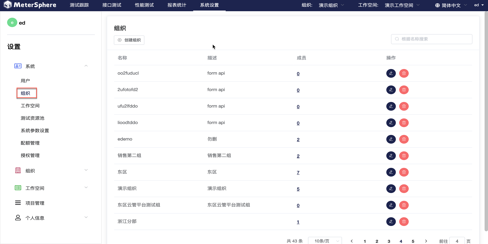
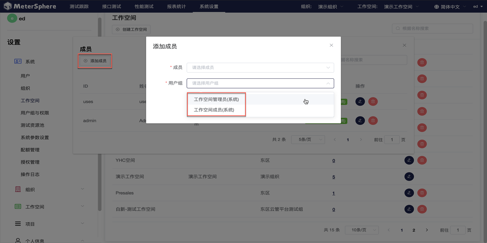
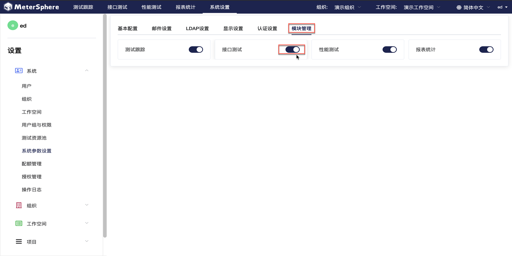

系统管理主要针对租户和测试资源的管理和配置。目前，MeterSphere 内置四级租户体系并可设置只读用户。平台默认用户组及用户组角色划分为：

    系统级用户组 ：系统管理员； 
    组织级用户组 ：组织管理员、组织成员；
    工作空间级用户组：工作空间管理员、工作空间成员；
    项目级用户组：项目管理员、项目成员；

平台用户组支持用户在`用户组与权限`功能页面中自定义。

##用户管理

点击左侧`系统`下拉菜单中的`用户`进入用户界面。右侧显示当前系统中的全部用户列表，可以对用户进行新增、修改、查询、删除、更改状态等操作。

!!! info "说明"
     MeterSphere 部署成功后会自动创建一个系统管理员账户，用户名为admin，默认密码为metersphere。如将平台用于生产环境，请及时更改密码。

- 创建用户

点击`创建用户`按钮创建用户，在弹出页面中编辑用户信息。

需要创建多个用户时，可点击`导入用户`按钮，下载模版并填写用户信息，通过 Excel 文件导入用户。

- 为用户添加用户组

点击`添加用户组`按钮为用户添加用户组信息。新用户至少所属一个用户组，每个用户可以所属多个用户组。

-  查询用户

用户列表右上方，使用搜索框，根据名称查询用户。

-  针对用户的其他操作

在用户列表右侧操作列，可以点击`Switch`开关切换选定用户启用状态，点击`编辑`按钮修改用户密码，点击`删除`按钮删除该用户。

## 组织管理

点击左侧`系统`下拉菜单中的`组织`进入组织界面。右侧当前系统中所有的组织，可以对组织及组织下成员进行新增，修改，查询，删除，更改状态操作。

- 创建组织

点击`创建组织`按钮创建组织，在弹出页面中编辑组织信息。

- 管理组织成员

点击组织`成员`一栏下的数字按钮查看当前组织成员。点击`编辑`按钮修改选定成员的用户信息，点击`删除`按钮删除选定成员。

点击`添加成员`按钮为当前组织添加用户。在弹出的页面中，点击下拉菜单选择已有用户，并为用户设置用户组角色为`组织管理员`或`组织成员`。

-  查询组织

组织列表右上方，使用搜索框，根据名称查询组织。

-  删除组织

组织列表中，点击`删除`按钮删除选定组织。

## 工作空间管理

点击左侧`系统`下拉菜单中的`工作空间`进入工作空间界面。右侧显示当前系统中所有的工作空间，可以对工作空间以及工作空间下成员进行创建，编辑，删除，查询操作。

- 创建工作空间

点击`创建组织`按钮创建组织，在弹出页面中编辑组织信息，选择工作空间所属组织。

- 管理工作空间成员

与查看组织成员类似。点击工作空间`成员`一栏下的数字按钮查看当前工作空间成员。点击`编辑`按钮修改选定成员的用户信息，点击`删除`按钮删除选定成员。

点击`添加成员`按钮为当前组织添加用户。在弹出的页面中，点击下拉菜单选择已有用户，并为用户设置用户组角色为`工作空间管理员`或`工作空间成员`。

-  查询工作空间

工作空间列表右上方，使用搜索框，根据名称查询工作空间。

-  删除工作空间

工作空间列表中，点击`删除`按钮删除选定工作空间。

## 用户组与权限

点击左侧`系统`下拉菜单中的`用户组与权限`进入用户组界面。用户可基于自身需求创建自定义用户组，并赋予用户组不同的权限设置。

- 创建用户组

点击`创建用户组`按钮新建自定义用户组。在弹出的界面中编辑用户组名称及描述，选择用户组所属类型。使用`Switch`开关切换用户组适用状态。新建用户组类型为系统类型时自动切换为全局用户组，此开关为默认打开状态；新建用户组类型为其他类型时，全局状态可关闭，此时须为用户组选择所属组织。

- 为用户组配置权限

回到用户组列表中，点击`设置`按钮进入用户组权限设置页面，在该页面中基于用户组需求勾选操作权限，一个用户组即为一个权限集，点击`确认`按钮完成配置。

- 编辑用户组信息

点击`编辑`按钮编辑选定用户组信息，在弹出页面中可以更改用户组名称及描述。

- 查询用户组

用户组列表右上方，使用搜索框，根据名称查询用户组。

- 删除用户组

用户组列表中，点击`删除`按钮删除选定用户组。

## 测试资源池管理

点击左侧`系统`下拉菜单中的`测试资源池`进入资源池界面。测试资源池主要用于接口测试及性能等测试。右侧资源池列表中，可以通过`Switch`开关切换资源池启用状态，点击`编辑`按钮更改资源池信息，点击`删除`按钮删除选定资源池。

- 创建资源池

点击`创建资源池`按钮，在弹出的界面中为新建资源池编辑名称、描述等相关信息。当前系统支持用户创建 Node 或 K8s类型的资源池，并支持设定资源池最大并发数量或最大线程数量。

!!! info "说明"
     Node 类型资源池须手动安装  JMeter 工具；K8s 类型资源池系统默认自动安装  JMeter 工具。

- 查询资源池

资源池列表右上方，使用搜索框，根据名称查询资源池。

- 删除资源池

资源池列表中，点击`删除`按钮删除选定资源池。

## 系统参数设置

点击左侧`系统`下拉菜单中的`系统参数设置`进入参数设置界面，用于平台基本配置、邮箱、LDAP、显示、认证、模块管理等参数的设置。

### 修改当前站点 URL

性能测试执行过程中 node-controller 节点需要通过配置的 `当前站点URL` 下载 JMX 等测试资源文件。在执行性能测试前需要配置并检查测试资源池中的节点可以正常访问到该 URL，URL 值一般为通过浏览器访问 MeterSphere 的地址。

!!! info "选项"

     - 当前站点URL：当前 MeterSphere 站点地址，用于性能测试 Jmeter 从 MeterSphere 站点获取压测脚本等数据；	
     - Prometheus地址：Prometheus监控服地址；	 
     - 并发数：限制场景接口自动化中场景并行执行时的并发数量。

### 邮件设置

切换至`邮件设置`标签，点击`编辑`按钮可以对 SMTP 信息进行修改、保存。

### LDAP 设置

切换至`LADP`标签，点击`编辑`按钮配置 LDAP 登录相关参数。

!!! info "选项"
    * LDAP地址 ldap://serveurl:389 或 ldaps://serveurl:636
    * 绑定DN cn=administrator,cn=Users,dc=metersphere,dc=com
    * 用户OU ou=metersphere,dc=metersphere,dc=com
    * 用户过滤器 sAMAccountName={0}
    * LDAP属性映射 {"username":"sAMAccountName","name":"cn","email":"mail"}

!!! info "选项说明"
    * OU 同级多OU用｜分割
    * 用户过滤器 根据规则到 用户OU 里面去检索用户，可能的选项为 (uid={0}) 或 (sAMAccountName={0}) 或 (cn={0}) 
    * LDAP属性映射 {"username":"sAMAccountName","name":"cn","email":"mail","phone":"phone"}，username,name,email 三项不可修改删除, phone 属性可选
    * 启用LDAP认证 启用后登录页显示 LDAP登录选项

!!! warning "注意"
    用户过滤器用什么筛选, LDAP 属性映射字段要与其一致, 过滤器用 sAMAccountName, LDAP属性映射也要用 sAMAccountName
    
启用 LDAP 认证后，登录页会新增 LDAP 登录选项。

### 显示设置

切换至`显示设置`标签，可自定义系统logo、主题色、页面Title等等信息。

### 认证设置

切换至`认证设置`标签，支持添加 CAS 和 OIDC 的认证信息。

### 模块管理

切换至`模块管理`标签，使用`Switch`开关更改功能模块启用状态。

## 配额管理

点击左侧`系统`下拉菜单中的`配额管理`进入配额管理界面，支持为不同组织和工作空间分配不同的测试资源。

配额列表中，点击`编辑`按钮更改配额参数，点击`删除`按钮删除配额该条设置。

## 授权管理

点击左侧`系统`下拉菜单中的`授权管理`进入授权管理界面，点击`授权验证`导入企业版证书，开启 X-Pack 功能。

## 操作日志

点击左侧`系统`下拉菜单中的`操作日志`进入日志界面，显示登录用户权限范围内的全部测试资源日志信息，并支持使用高级查询来快速查找相关日志。

## 插件管理

### Jenkins 插件设置

- 下载地址：https://github.com/metersphere/jenkins-plugin

在构建步骤中添加MeterSphere插件。

配置好系统参数和待执行的用例。

