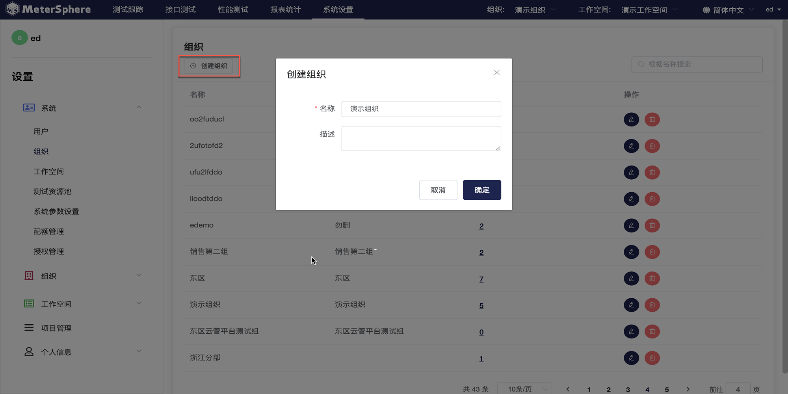
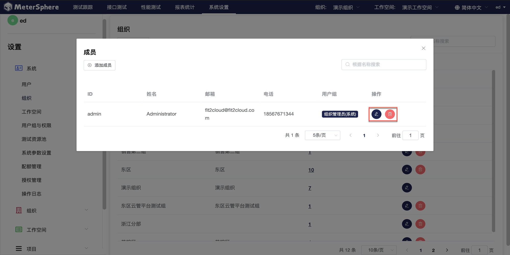
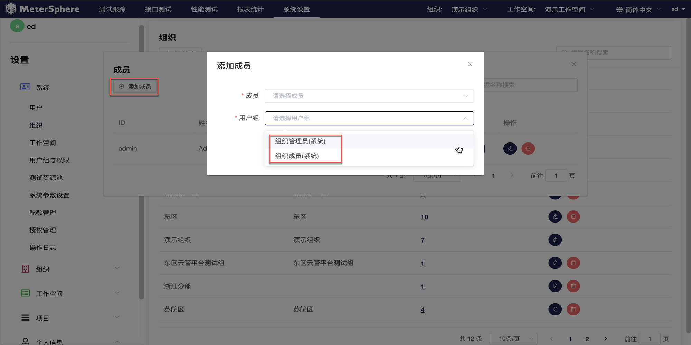

系统管理主要是针对租户和测试资源的管理和配置，目前对于租户的角色设置有系统级角色 ：admin； 组织级角色 ：admin；工作空间级角色：测试经理，测试人员，只读用户。

##用户管理

点击左侧`系统`下拉菜单中的`用户`进入用户界面。右侧当前系统中所有的用户，可以对用户进行新增，修改，查询，删除，更改状态操作。

- 创建用户

点击`创建用户`按钮创建用户，在弹出页面中编辑用户信息。

需要创建多个用户时，可点击`导入用户`按钮，下载模版并填写用户信息，通过 Excel 文件导入用户。

- 设置用户角色

点击`添加角色`按钮设置用户角色，最多可以给用户匹配5个角色。

-  查询用户

使用搜索框，根据名称查询用户。

-  删除用户，更改用户状态

点击`Switch`开关切换用户状态，点击`删除`按钮删除用户。

## 组织管理

点击左侧`系统`下拉菜单中的`组织`进入组织界面。右侧当前系统中所有的组织，可以对组织及组织下成员进行新增，修改，查询，删除，更改状态操作。

- 创建组织

点击`创建组织`按钮创建组织，在弹出页面中编辑组织信息。

- 管理组织成员

点击组织`成员`一栏下的数字按钮查看当前组织成员。点击`编辑`按钮修改组织成员角色。

点击`添加成员`按钮为当前组织添加用户。在弹出的页面中，点击下拉菜单选择已有用户，并为用户设置角色为`组织管理员`或`组织成员`。

-  查询组织

使用搜索框，根据名称查询组织。

-  删除用户

点击`删除`按钮删除组织。

## 工作空间管理

点击左侧`系统`下拉菜单中的`工作空间`进入工作空间界面。右侧显示当前系统中所有的工作空间，可以对工作空间以及工作空间下成员进行创建，编辑，删除，查询操作。

- 创建工作空间

点击`创建组织`按钮创建组织，在弹出页面中编辑组织信息，选择工作空间所属组织。

- 管理工作空间成员

与查看组织成员类似。点击工作空间`成员`一栏下的数字按钮查看当前组织成员。点击`编辑`按钮修改组织成员角色。

点击`添加成员`按钮为当前组织添加用户。在弹出的页面中，点击下拉菜单选择已有用户，并为用户设置角色为`测试经理`、`测试人员`或`只读用户`。

-  查询工作空间

使用搜索框，根据名称查询工作空间。

-  删除工作空间

点击`删除`按钮删除工作空间。

## 测试资源池管理

进入测试资源池界面。右侧显示当前系统下创建的全部资源池，可以对资源池进行新增，修改，删除，查询，启用禁用操作。

- 创建资源池

点击"创建资源池"，录入资源池名称，描述，类型，根据类型不同录入相应所填项。

- 修改资源池

选择要修改的资源池，点击修改按钮。

- 查询资源池

使用搜索框，根据名称查询资源池。

- 删除资源池

点击`删除`按钮删除资源池。

## 系统参数设置

### 修改当前站点 URL

性能测试执行过程中 node-controller 节点需要通过配置的 `当前站点URL` 下载 JMX 等测试资源文件。在执行性能测试前需要配置并检查测试资源池中的节点可以正常访问到该 URL，URL 值一般为通过浏览器访问 MeterSphere 的地址。

### 邮件设置

点击`编辑`按钮可以对SMTP信息进行修改、保存。

### LDAP 设置

配置LDAP登录相关参数。

!!! info "选项"
    * LDAP地址 ldap://serveurl:389 或 ldaps://serveurl:636
    * 绑定DN cn=administrator,cn=Users,dc=metersphere,dc=com
    * 用户OU ou=metersphere,dc=metersphere,dc=com
    * 用户过滤器 sAMAccountName={0}
    * LDAP属性映射 {"username":"sAMAccountName","name":"cn","email":"mail"}

!!! info "选项说明"
    * OU 同级多OU用｜分割
    * 用户过滤器 根据规则到 用户OU 里面去检索用户，可能的选项为 (uid={0}) 或 (sAMAccountName={0}) 或 (cn={0}) 
    * LDAP属性映射 {"username":"sAMAccountName","name":"cn","email":"mail","phone":"phone"}，username,name,email 三项不可修改删除, phone 属性可选
    * 启用LDAP认证 启用后登录页显示 LDAP登录选项

!!! warning "注意"
    用户过滤器用什么筛选, LDAP属性映射字段要与其一致, 过滤器用 sAMAccountName, LDAP属性映射也要用 sAMAccountName
    
启用LDAP认证后，登录页会新增LDAP登录选项。

##插件管理

###Jenkins插件设置

- 下载地址：https://github.com/metersphere/jenkins-plugin

在构建步骤中添加MeterSphere插件。

配置好系统参数和待执行的用例。

