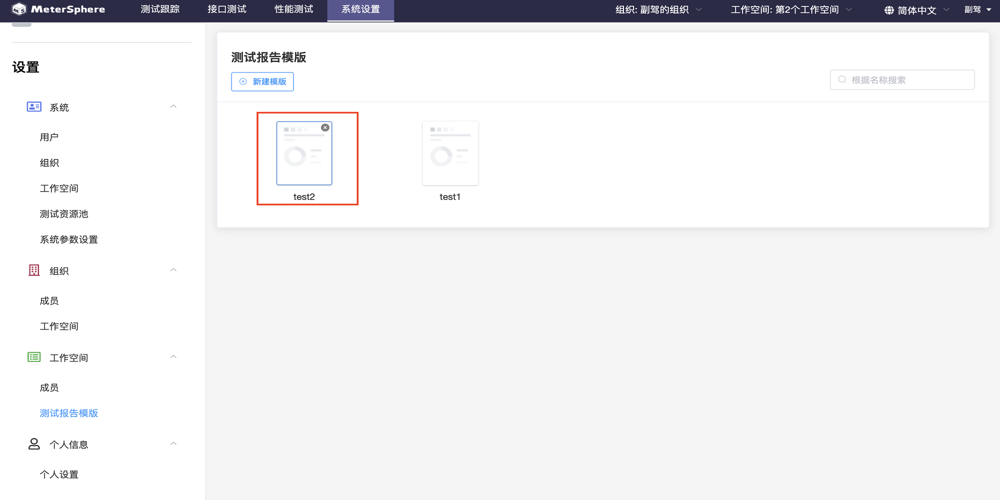
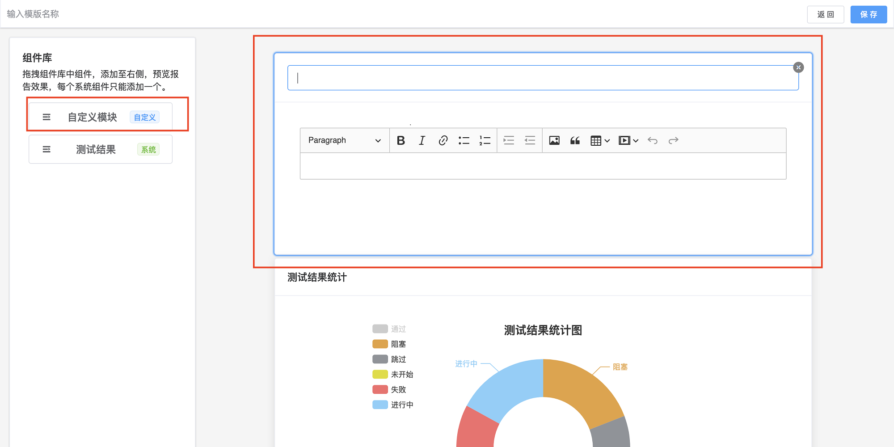

## 工作空间成员管理
>同系统下工作空间操作

## 测试报告模版管理

进入测试报告模版页面，可以对测试模版进行创建，修改，删除，查询操作。

- 查询测试报告模版

查询单个测试报告模版，可以通过名称查询。

- 创建测试报告模版

点击`新建模版`进入模版编辑页面，左边是组件库，右边是测试报告内容，测试报告的模版可以通过拖拽左边的组件进行编辑。

拖拽左边自定义模块，可以自定义组件内容。

- 保存测试模版

输入测试模版名称-保存。

- 编辑测试报告模版

点击模版可以对现有模版进行编辑。

