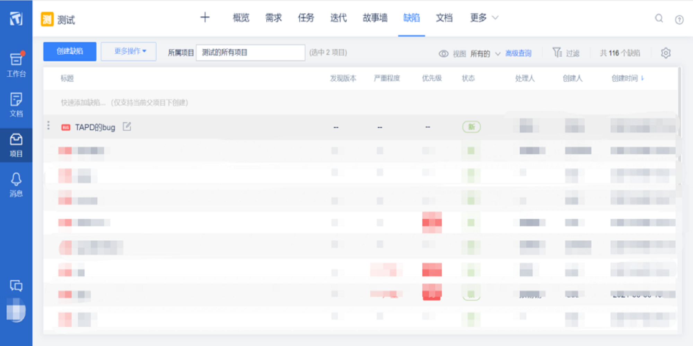
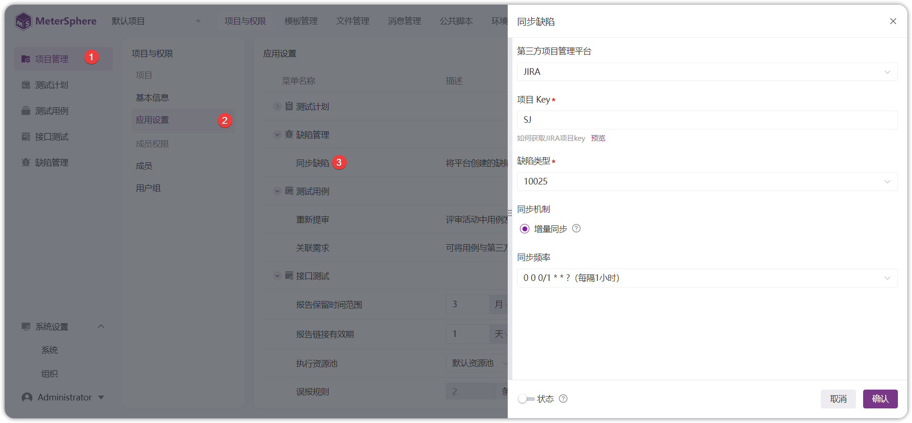
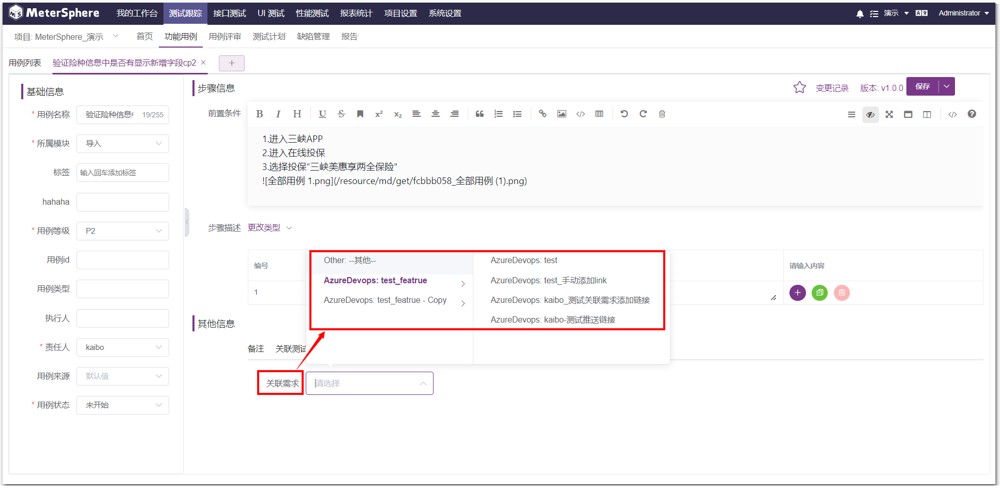
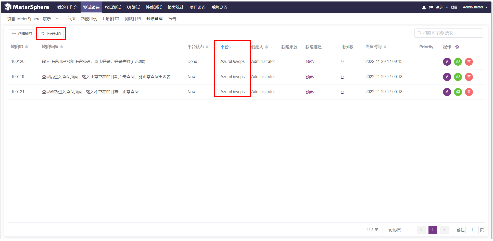

## 1 成员
!!! ms-abstract ""
    点击左侧【工作空间】下拉菜单中的【成员】进入成员界面，查看当前工作空间中的所有成员信息。可以对成员进行【新增】，【编辑】，【查询】，【删除】。

- 添加成员
!!! ms-abstract ""
    点击【添加成员】按钮添加成员户，在弹出页面中选择要添加的用户。

!!! ms-abstract "参数说明"
    - 可根据用户 ID 和用户邮箱搜索需要添加的用户，系统支持可一次添加多个成员。
	- 可选择用户组，此下拉信息的用户组，其【所属类型】属于【组织级别】的用户组，系统支持一次添加多个用户组。
	- 点击【确认】完成组织成员添加。

- 编辑成员
!!! ms-abstract ""
    在成员信息中可点击【编辑】和【删除】进行成员修改和删除操作。

-  查询用户
!!! ms-abstract ""
    可按名称来模糊查询成员信息，输入查询信息，点击回车即可完成查询。

## 2 服务集成
!!! ms-abstract ""
    可查看当前工作空间里集成的缺陷管理平台，并设置和修改当前工作空间需要将测试用例缺陷数据同步的缺陷管理平台。 
    点击【工作空间】菜单栏，点击【服务集成】，即可查看当前工作空间已集成的缺陷管理平台，同时可点击【编辑】集成 TAPD、JIRA 和禅道、Azure Devops等平台。

!!! ms-abstract "Metersphere 平台与管理工具集成设置可分为三步骤来完成"
    1.首先配置和项目管理工具集成设置。 
    2. 其次配置项目相关信息。 
    3. 然后为每个登录用户设置各自的个人账号，此配置也可以不设置。

### 2.1 与TAPD集成
!!! ms-abstract ""
    第一步：服务集成配置。

!!! ms-abstract "参数说明"
    【API 账号和口令】是 Tapd Basic Auth 账号信息在【公司管理-安全与集成-开放平台】中查询。

!!! ms-abstract ""
    第二步：关联项目配置。 
    配置完服务集成后，还需要配置项目中引用 TAPD 项目的设置，即关联项目。点击页面右下角的【马上关联项目】进行设置。

!!! ms-abstract ""
    跳转到项目管理页面，点击项目列表中的【编辑】按钮，编辑项目里【TAPD 项目 ID】，以及缺陷模板等相关信息。

!!! ms-abstract ""
    同时，还需要配置项目中的 TAPD 缺陷模板设置，【缺陷模板】需要选择【TAPD-默认模板】。

!!! ms-abstract ""
    第三步：添加个人平台账号。 
    点击服务集成页面右下角的【马上添加】进行设置。

!!! ms-abstract ""
    该信息为通过 TAPD 提交缺陷的用户认证信息，若未填写，则使用组织中配置的默认信息。 
    选择【第三方平台账号】设置【Tapd】信息，如果不设置个人平台账号，则所有使用 MeterSphere 提交缺陷的用户，此缺陷推送到配置的服务平台上账号都是服务配置中设定的账号信息。

!!! ms-abstract ""
    参数说明：【TAPD 昵称】是 TAPD 个人设置里查看。

!!! ms-abstract ""
    以上配置完成后，在 Metersphere 系统中测试用例里，就可以关联 TAPD 的相关需求。

!!! ms-abstract ""
    在缺陷管理提交缺陷后，平台类型显示为 TAPD 的数据，点击【同步缺陷】按钮，会将数据同步到 TAPD 系统中。

!!! ms-abstract ""
    在 TAPD 缺陷中可以查询到同步过来的缺陷数据。

### 2.2 与JIRA集成 
!!! ms-abstract "注意"
    v2.4 版本缺陷对接实现了插件化，可根据自身需求开发对应插件。
    目前已实现 Jira 平台的插件化，原先使用 Jira 的用户，需要下载下插件，并在【系统设置-插件管理】上传插件。
    使用方式跟原来一致，具体参考插件项目：https://github.com/metersphere/metersphere-platform-plugin

!!! ms-abstract ""
    第一步：填写对接 JIRA 的地址、认证信息和问题类型，如下。

!!! ms-abstract "注意"
    问题类型需要和 JIRA 的事务类型保持一致，必须在 JIRA 中存在此类型，如下：

!!! ms-abstract ""
    如果右上角切换组织，需要重复上述对接 JIRA 操作

!!! ms-abstract ""
    第二步： 关联项目配置 
    配置完服务集成后，还需要配置项目中引用 JIRA 项目的设置，即关联项目。点击页面右下角的【马上关联项目】进行设置。

!!! ms-abstract ""
    跳转到项目管理页面，点击项目列表中的【编辑】按钮，设置项目里项目相关配置。 

!!! ms-abstract "参数说明"
    【集成第三方平台】：选择【JIRA】。 
    【缺陷模板】：选择【JIRA-默认模板】 
    【使用 Jira 缺陷模板】：选中，则表示系统会自动同步 JIRA 系统中的缺陷模板；不选择，则需要进入第四步，手动配置 MS 缺陷模板和 Jira 系统中的缺陷模板的字段对应关系。 
    【JIRA 项目 Key】：项目的关键字的需要在 JIRA 平台上进行查询，如下。

!!! ms-abstract ""
    第三步：添加个人平台账号。 
    点击服务集成页面右下角的【马上添加】进行设置。

!!! ms-abstract ""
    该信息为通过 Jira 提交缺陷的用户认证信息，若未填写，则使用组织中配置的默认信息.点击【第三方平台账号】设置【Jira 信息】，如果不设置个人平台账号，则所有使用 MeterSphere 提交缺陷的用户，此缺陷推送到配置的服务平台上账号都是服务配置中设定的账号信息。

!!! ms-abstract ""
    以上配置完成后，在 Metersphere 系统中测试用例里，就可以关联JIRA 的相关需求，或同步相关缺陷。  

### 2.3 与禅道集成
!!! ms-abstract ""
    第一步：服务集成配置。

!!! ms-abstract ""
    禅道目前存在 GET 和 PATH_INFO 两种接口调用方式（即其requestType 参数）对于禅道接口的调用使用的是 PATH_INFO 方式和 GET 请求方式的支持，用户可以根据自己使用的禅道系统的配置情况自主选择请求方式。

!!! ms-abstract "说明"
	1. 账号密码为具有相应权限的 Zentao 账号，账号需要具有超级 model 调用接口权限。
    2. 请求方式：在禅道里具体查看：参考禅道配置文件中$config->requestType 的值；配置文件参考路径：/opt/zbox/app/zentao/config/my.php 。
	3. 如果提示因为安全问题 api 禁用，需要修改禅道服务器配置文件，加上 '$config->features->apiGetModel = true;' 这个配置。

!!! ms-abstract ""
    第二步： 关联项目配置 
    配置完服务集成后，还需要配置项目中引用禅道项目的设置，即关联项目。点击页面右下角的【马上关联项目】进行设置。

!!! ms-abstract ""
    跳转到【项目管理】，点击【编辑】，编辑项目里【禅道项目ID】，以及缺陷模板等相关信息。

!!! ms-abstract "参数说明"
    【Zentao（禅道）项目 ID】：如果 禅道 bug 是附属在项目上，则关联的Zentao ID 为项目 ID；如果 禅道 Bug 是附属在产品上，则关联的 ZentaoID 为产品 ID。

!!! ms-abstract ""
    第三步：添加个人平台账号 
    点击服务集成页面右下角的【马上添加】进行设置。

!!! ms-abstract ""
    该信息为通过禅道提交缺陷的用户名、密码，若未填写，则使用组织中配置的默认信息。 
    选择【第三方平台账号】设置【禅道信息】，如果不设置个人平台账号，则所有使用 MeterSphere 提交缺陷的用户，此缺陷推送到配置的服务平台上账号都是服务配置中设定的账号信息。

!!! ms-abstract ""
    以上配置完成后，在 Metersphere 系统中测试用例里，就可以关联禅道的相关需求。

!!! ms-abstract ""
    在缺陷管理提交缺陷后，数据会同步到禅道系统中。

### 2.4 与Azure Devops集成
!!! ms-abstract ""
    第一步：服务集成配置。 
    填写【Basic Auth 账号信息】后，点击【测试连接】即可 

!!! ms-abstract ""
    第二步： 关联项目配置
    配置完服务集成后，还需要配置项目中引用禅道项目的设置，即关联项目。点击页面右下角的【马上关联项目】进行设置。  

!!! ms-abstract ""
    跳转到【项目管理】，点击【编辑】，编辑项目里【集成第三方平台】、【AzureDevops项目ID】、【AzureDevops过滤ID】，以及缺陷模板等相关信息。  

!!! ms-abstract ""
    第三步：添加个人平台账号 
    点击服务集成页面右下角的【马上添加】进行设置。

!!! ms-abstract ""
    选择【第三方平台账号】设置【AzureDevops 信息】，如果不设置个人平台账号，则使用 MeterSphere 提交缺陷的用户，此缺陷推送到配置的服务平台上账号都是服务配置中设定的账号信息。  

!!! ms-abstract ""
    以上配置完成后，在 Metersphere 系统中测试用例里，就可以关联 AzureDevops 的相关需求。  

!!! ms-abstract ""
    在缺陷管理提交缺陷后，点击【同步按钮】，数据会同步到 AzureDevops 系统中。  

## 3 项目管理
!!! ms-abstract ""
    工作空间下对所有项目及项目使用到的 Jar 包进行统一管理。

- 创建项目
!!! ms-abstract ""
    点击页面左侧【项目管理】，点击【创建项目】，填写相关项目基本信息

!!! ms-abstract ""
    根据项目实际情况，选择对应的第三方集成平台以及用例模板和缺陷模板，点击保存即可。

!!! ms-abstract "参数说明"
    【第三方集成平台】：目前只支持以上几种集成平台，可参考上面【工作空间-服务集成】进行配置。 
    【用例模板】：可参考【项目设置-模板管理-用例模板】进行自定义用例模板。 
    【缺陷模板】：可参考【项目设置-模板管理-缺陷模板】进行自定义缺陷模板。

!!! ms-abstract ""
    自动生成 Jira 缺陷模版 (X-Pack)  
    【创建项目】，填写第三方集成平台为 Jira 后，勾选下面的【使用 Jira 缺陷模板】，填写好其他配置信息，点击【保存】即可

- 编辑项目
!!! ms-abstract ""
    点击【编辑】按钮，可编辑项目相关信息后，点击【确定】按钮即可

- 删除项目
!!! ms-abstract ""
    点击【删除】按钮，填写上方提示内容，点击【确定】按钮，该项目即可被删除

- 环境配置
!!! ms-abstract ""
    点击【环境配置】按钮，填写环境相关信息即可，具体情况可参考【工作空间-环境管理】

## 4 配额管理 (X-Pack)
!!! ms-abstract ""
    进入【配额管理】页面，可【编辑】上方的项目默认配额，编辑完成后，在配额列表中使用默认配置的，将同步更新编辑的数据。

!!! ms-abstract ""
    点击项目的【编辑】按钮，可对单个项目进行配额管理设置

!!! ms-abstract ""
    点击【删除】按钮，即可删除已配置好的内容，恢复到最初状态，使用默认配额的状态也由【是】变成【否】

## 5 环境管理
!!! ms-abstract ""
    工作空间下所有测试相关环境统一管理。此环境配置管理即是当前工作空间的 所有项目的 所有环境信息，可对当前工作空间的环境进行添加、修改及移除的操作。并且支持各个环境配置信息的导入和导出，方便客户快速新建和维护测试环境。 
    点击页面左侧【工作空间】，点击【环境配置】，即可查看当前工作空间中的所有项目的所有环境列表。

### 5.1 环境列表
创建环境 
!!! ms-abstract ""
    点击页面列表信息左上角的【创建环境】，可新增此工作空间下任意项目的测试环境。

!!! ms-abstract ""
    在工作空间下创建环境，需要指定此环境是用于哪个项目，其他环境设置信息同项目管理里的新增环境。

!!! ms-abstract "参数说明"
    【选择项目】：指定环境所属的项目，此项目是当前工作空间下，有权限的项目列表。  
    【环境名称】：为新创建的环境命名。 
    【通用配置】：此处设置的变量是环境变量，可单个添加和批量添加。IP 和域名映射关系设置以及链接超时、响应超时设置。 
    【HTTP配置】：此处可配置环境地址以及启用条件，也可设置请求头。 
    【数据库配置】：配置数据库的数据驱动以及连接信息等，目前支持 MYSQL、Oracle、SQLServer、Postgre数据库 
    【TCP 配置】：配置连接 TCP 请求的相关信息 
    【证书配置】：可在此配置相关的证书信息 
    【全局前置脚本】：全局前置脚本可分为【单个请求步骤前执行】和【所有场景步骤前执行】 
    【全局后置脚本】：全局后置脚本可分为【单个请求步骤后执行】和【所有场景步骤后执行】 
    【全局认证配置】：可配置认证方式和加密等信息 
    【全局断言】：可启用误报设置和选择多种类型方式进行断言

- 通用配置
!!! ms-abstract ""
    此处设置的变量是环境变量，类型可以为多种类型，可单个添加和批量添加

!!! ms-abstract ""
    IP 和域名进行映射配置，可设置链接超时、响应超时时间

- HTTP配置
!!! ms-abstract ""
    设置 HTTP/HTTPS 请求地址，点击【添加】后，点击【确定】按钮即可

!!! ms-abstract ""
    可设置模块、路径等条件来启用该环境

!!! ms-abstract ""
    可单个设置或者批量设置请求头信息

- 数据库配置
!!! ms-abstract ""
    配置数据库的数据驱动以及连接信息等，目前支持 MYSQL、Oracle、SQLServer、Postgre数据库

!!! ms-abstract ""
    执行多条SQL语句需在数据库后面加上【?allowMultiQueries=true】，可设置最大连接数和超时时间，点击【校验】或【添加】

- TCP 配置
!!! ms-abstract ""
    可配置连接 TCP 请求的相关信息，主要有 TCPClientImpl、BinaryTCPClientImpl、LengthPrefixedBinaryTCPClientImpl 三种方式

- 证书配置
!!! ms-abstract ""
    证书文件上传支持 p12，jks，pfx 格式

- 全局前置脚本
!!! ms-abstract ""
    可在单个请求步骤前执行和在所有场景步骤前执行，点击【i】可查看提示信息

!!! ms-abstract ""
    【单个请求步骤前执行】可设置【全局前置脚本】执行的协议以及顺序

!!! ms-abstract ""
    【所有场景步骤前执行】可关联场景结果，场景执行成功但是此处前置脚本执行失败，执行结果是显示失败

- 全局后置脚本
!!! ms-abstract ""
    可参考上面【全局前置脚本】

- 全局认证配置
!!! ms-abstract ""
    可配置认证方式和加密信息

- 全局断言
!!! ms-abstract ""
    可启用/关闭误报

!!! ms-abstract ""
    可选择多种类型进行断言设置，可勾选忽略状态码，点击【添加】按钮即可

 导入环境 

!!! ms-abstract ""
    点击【导入】按钮导入环境，仅支持通过 metersphere 导出的 json 文件。

!!! ms-abstract ""
    导入支持为一个项目批量创建不同的环境。

 导出环境 
!!! ms-abstract ""
    点击【导出环境】按钮导出环境，将环境导出的 json 文件。

 编辑环境 
!!! ms-abstract ""
    点击【编辑】按钮编辑环境，可修改环境配置。

 复制环境 
!!! ms-abstract ""
    点击【复制】按钮进行复制环境，可复制当前环境配置。

 删除环境 
!!! ms-abstract ""
    点击【删除】按钮，点击【确定】，即可删除环境配置。

### 5.2 环境组 
 创建环境组
!!! ms-abstract ""
    MeterSphere 支持跨项目进行接口、接口用例、场景用例等自动化脚本引用，可以根据不同项目、已经不同环境组合成一个环境组，当自动化执行时，可以直接选择该环境组。 
    点击【创建环境组】，选择不同项目、不同环境信息。

 编辑环境组
!!! ms-abstract ""
    点击【编辑】按钮编辑环境组，可修改当前环境组。

 复制环境组
!!! ms-abstract ""
    点击【复制】按钮，复制环境组。

 删除环境组
!!! ms-abstract ""
    点击【删除】按钮，根据提示信息输入后，点击【确定】按钮，删除环境组。

## 6 操作日志
!!! ms-abstract "同系统下操作日志"
    显示登录用户所处【工作空间】下的所有有权限【项目】的测试资源日志信息。

