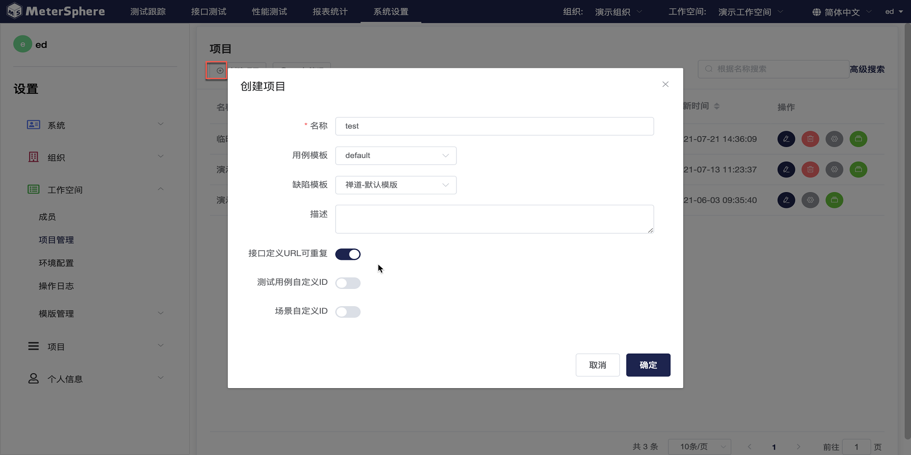
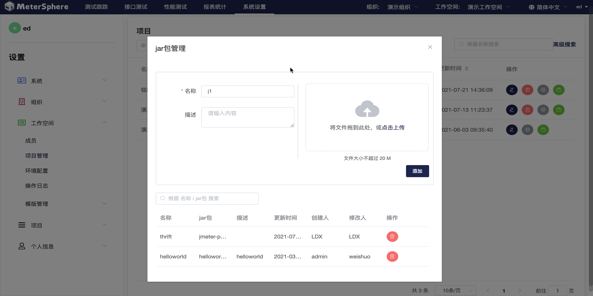
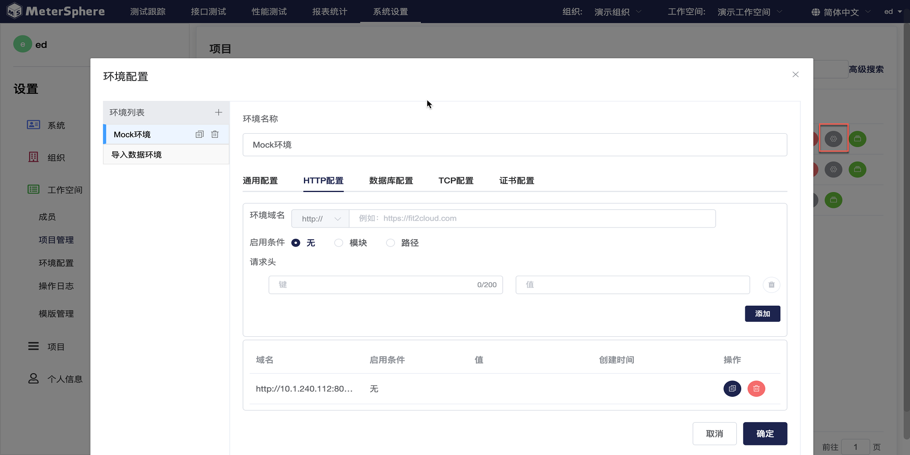
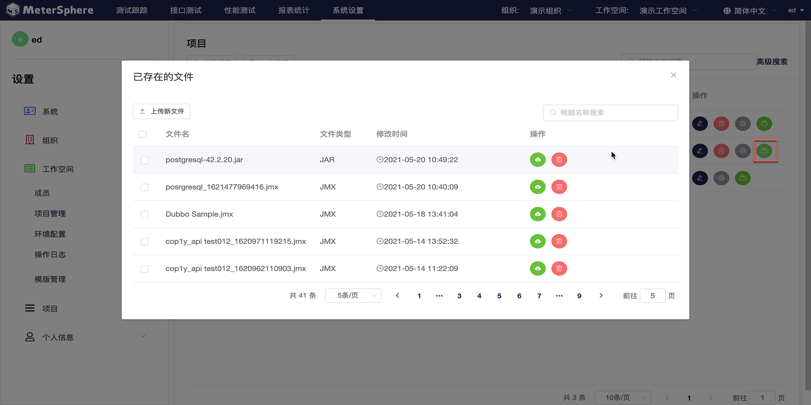
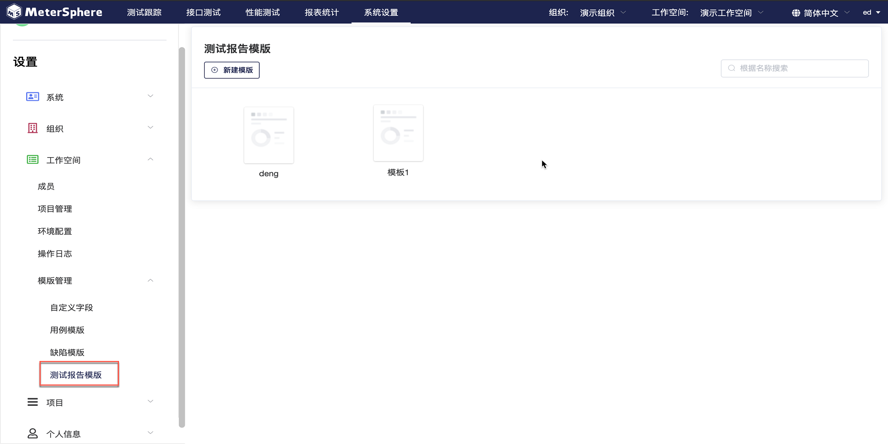
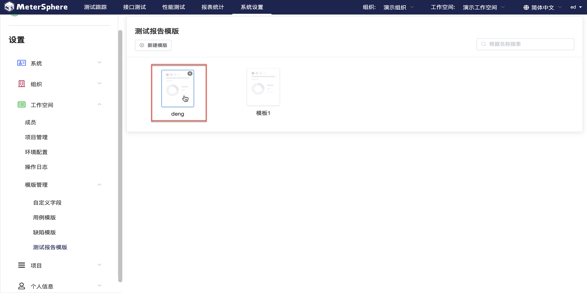

## 工作空间成员管理
>同系统下工作空间操作

##项目管理

点击左侧`工作空间`下拉菜单中的`项目管理`进入项目界面，查看当前工作空间中的所有项目信息。可以对项目进行新增，修改，查询，删除、环境配置操作，同时支持管理 jar 包及资源文件。

- 创建项目

点击`创建项目`按钮，在弹出页面中编辑项目信息，点击`确认`保存项目。

- jar包管理

点击`jar包管理`按钮，在弹出页面中编辑 jar包信息，上传本地 jar包，点击`添加`完成上传。已上传的 jar包将在界面下方列表显示，支持查询、删除等操作。

- 环境配置

点击某一项目的`环境配置`按钮，在弹出的页面中点击`+`按钮为此项目创建环境。填写环境名称、配置参数后点击`确认`保存环境。左侧显示为此项目配置的全部环境，支持复制、删除等操作。

- 资源文件管理

点击某一项目的`资源文件`按钮，在弹出页面中查看本项目下全部资源文件。点击`上传文件`按钮为此项目上传新的资源文件；已上传的资源文件以列表显示，支持查询、重新上传、删除等操作。

##环境配置

点击左侧`工作空间`下拉菜单中的`环境配置`进入环境界面，右侧环境列表显示当前工作空间下属项目的全部环境信息。环境列表支持复制、编辑及移除等操作，同时支持环境信息以 json 格式导入、导出。

- 创建环境

点击`环境创建`按钮新建环境，在弹出的页面中选择适用项目，编辑环境信息，点击`确认`完成创建。

##操作日志
>同系统下操作日志

##模版管理

支持用户自定义用例模板、缺陷模板和测试报告模板。

###自定义字段

点击左侧`工作空间`下拉菜单中的`模版管理`，点击`自定义字段`，右侧显示当前工作空间下的自定义字段列表，支持查询、编辑、复制、删除等操作。点击`创建字段`按钮新建自定义字段，在弹出的页面中设置字段基本信息，点击`确认`完成添加。

###用例模版

在`模版管理`下拉菜单中点击`用例模版`，右侧显示当前工作空间下的用例模版列表，支持查询、编辑、复制、删除等操作。点击`创建模版`按钮新建用例模版，在弹出的页面中设置用例基本信息，点击`确认`完成添加。

###缺陷模版

在`模版管理`下拉菜单中点击`缺陷模版`，右侧显示当前工作空间下的缺陷模版列表，支持查询、编辑、复制、删除等操作。点击`创建缺陷模版`按钮新建缺陷模版，在弹出的页面中设置用例基本信息，点击`确认`完成添加。

###测试报告模版

在`模版管理`下拉菜单中点击`测试报告模版`，右侧平铺显示当前工作空间下的测试报告模版，创建，修改，删除，查询等操作。

- 创建测试报告模版

点击`新建模版`进入模版编辑页面，左侧为组件库，右侧为测试报告内容，支持拖拽组件进行报告内容编辑。

- 编辑测试报告模版

点击模版可以对现有模版进行编辑。

