## 1 工作空间成员管理
>同系统下工作空间操作

### 1.1 成员
点击左侧`工作空间`下拉菜单中的`成员`进入成员界面，查看当前工作空间中的所有成员信息。可以对成员进行新增，修改，查询，删除。

- 添加成员

点击`添加成员`按钮添加成员户，在弹出页面中选择要添加的用户。

	参数说明：
      1） 可根据用户 ID 和用户邮箱搜索需要添加的用户，系统支持可一次添加多个成员。
	  2） 可选择用户组，此下拉信息的用户组，其“所属类型”属于“组织级别”的用户组，系统支持一次添加多个用户组。
	  3） 点击“确认”完成组织成员添加。

- 编辑成员

在成员信息中可点击“编辑”和“移除”进行成员修改和移除操作。

-  查询用户

可按名称来模糊查询成员信息，输入查询信息，点击回车即可完成查询。

### 1.2 服务集成
可查看当前工作空间里集成的缺陷管理平台，并设置和修改当前工作空间需要将测试用例缺陷数据同步的缺陷管理平台。
点击`工作空间`菜单栏，点击`服务集成`，即可查看当前工作空间已集成的缺陷管理平台，同时可点击`编辑`集成 TAPD、JIRA 和禅道缺陷平台。

Metersphere 平台与管理工具集成设置可分为三步骤来完成。

1. 首先配置和项目管理工具集成设置。
2. 其次配置项目相关信息。
3. 然后为每个登录用户设置各自的个人账号，此配置也可以不设置。

#### 1.2.1  与JIRA集成 
- 第一步：填写对接JIRA的地址、认证信息和问题类型，如下。

注意：问题类型需要和 JIRA 的事务类型保持一致，必须在 JIRA 中存在此类型，如下：

如果右上角切换组织，需要重复上诉对接 JIRA 操作

- 第二步： 关联项目配置

配置完服务集成后，还需要配置项目中引用 JIRA 项目的设置，即关联项目。点击页面右下角的`马上关联项目`进行设置。

打开项目，设置项目相关配置。 

1. 【集成第三方平台】：选择“JIRA”。
2. 【缺陷模板】：选择“JIRA-默认模板”
3. 【使用 Jira 缺陷模板】：选中，则表示系统会自动同步 JIRA系统中的缺陷模板；不选择，则需要进入第四步，手动配置 MS 缺陷模板和 Jira 系统中的缺陷模板的字段对应关系。
4. 【JIRA 项目 Key】：项目的关键字的需要在 JIRA 平台上进行查询，如下。

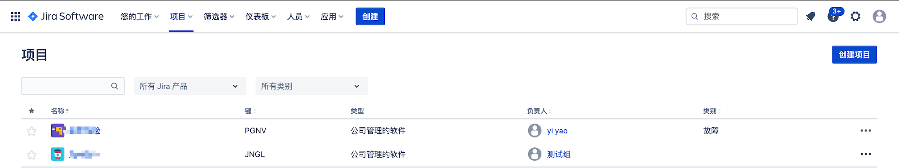

- 第三步：添加个人平台账号。

点击服务集成页面右下角的`马上添加`进行设置。

该信息为通过 Jira 提交缺陷的用户认证信息，若未填写，则使用组织中配置的默认信息.点击`第三方平台账号`设置`Jira 信息`，如果不设置个人平台账号，则所有使用 MeterSphere 提交缺陷的用户，此缺陷推送到配置的服务平台上账号都是服务配置中设定的账号信息。
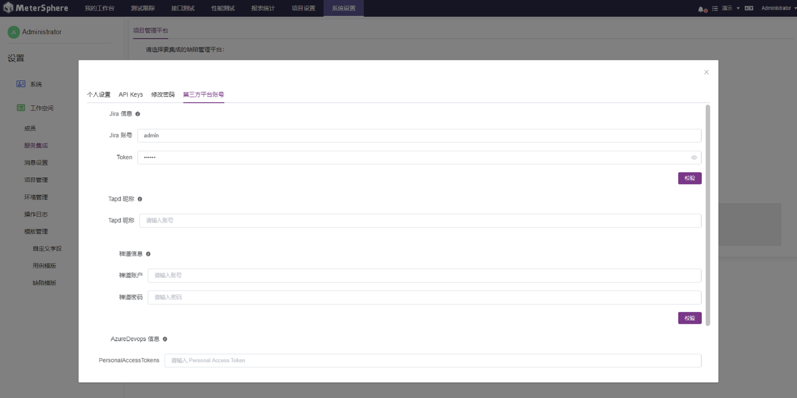

以上配置完成后，在 Metersphere 系统中测试用例里，就可以关联JIRA 的相关需求，或同步相关缺陷。  

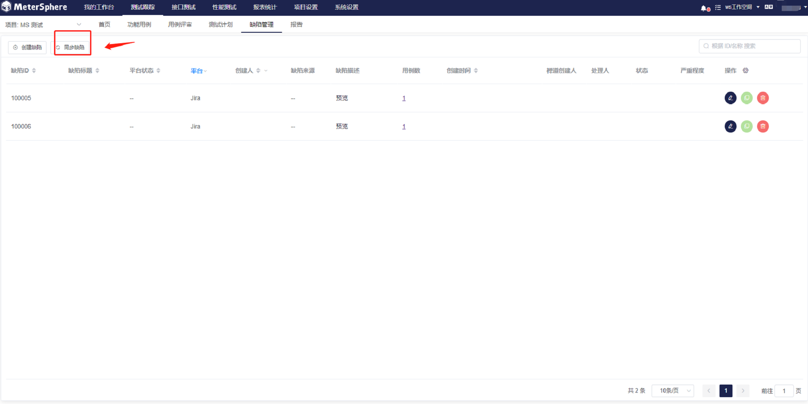

- 第四步：自定义字段同步设置 （MS1.16 版本前）

MeterSphere 版本 1.16 之前的版本需要单独设置。或者项目配置中没有勾选`使用 Jira 缺陷模板`，则需要手动配置 MeterSphere 和 JIRA 缺陷模板的对应关系。在模版管理模块，创建自定义字段，使用场景可以分别选择添加到用例模版或缺陷模版。

以`经办人`字段为例，字段类型选择`单选下拉列表`；选项值需要到 JIRA 中的`人员`入口点击`搜索人员和团队`，然后选择需要添加为经办人的人员。
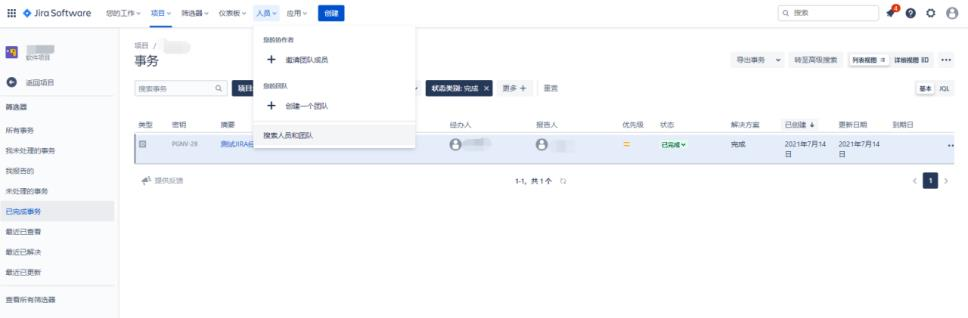

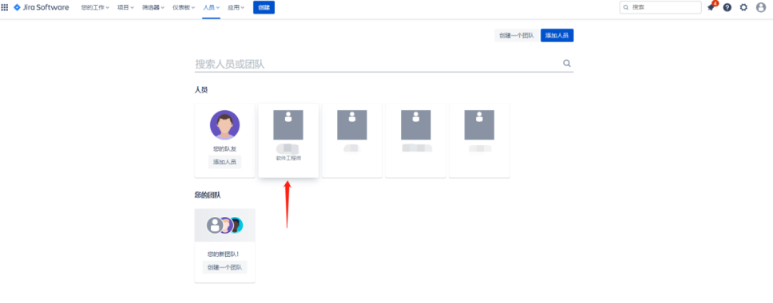

选中经办人后，把经办人的名称填写到 Metersphere 的`选项内容`里；以及可以通过 URL 查看 ID 填写到 Metersphere 的`选项值`里。
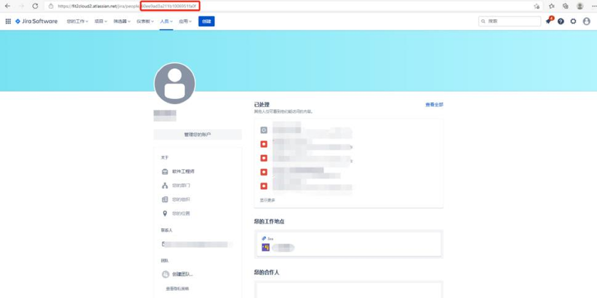

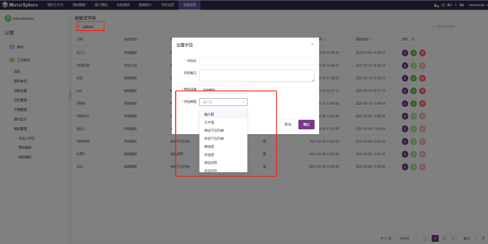

自定义字段创建成功后，进入缺陷模版模块，在模版列表里选择进入JITA 模版页面，点击`添加字段`按钮。
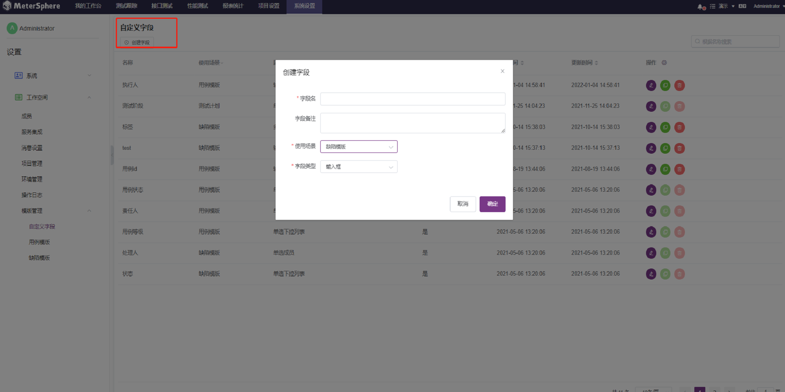

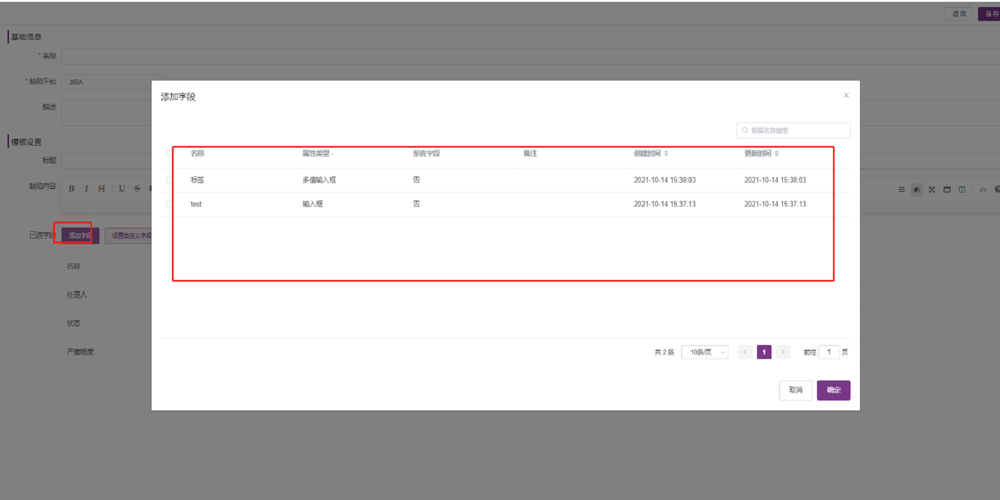

添加的自定义字段会出现在已选字段的列表，选择字段值以及通过访问这个地址来查询经办人的API字段名，填写到 Metersphere 里。
https://developer.atlassian.com/cloud/jira/platform/rest/v3/api-group-issues/#api-rest-api-3-issue-post
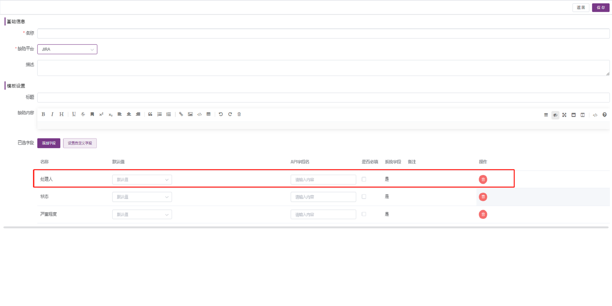

保存成功后，该自定义字段就会出现在 Metersphere 创建缺陷的页面里。
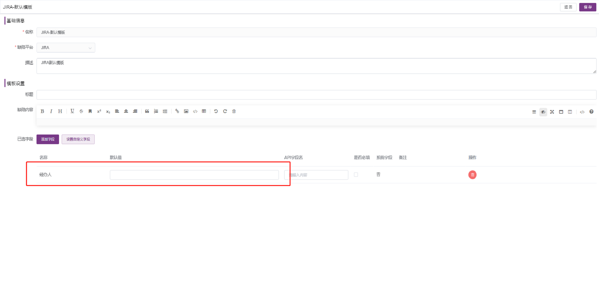

保存并提交缺陷后，缺陷同步到 JIRA 中就会出现经办人字段。
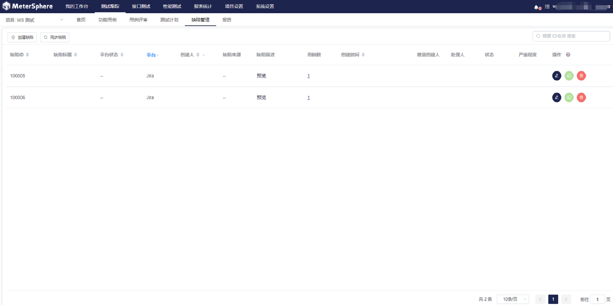

#### 1.2.2  与TAPD集成 
- 第一步：服务集成配置。

参数说明：API 账号和口令：是 Tapd Basic Auth 账号信息在 "公司管理-安全与集成-开放平台" 中查询。

- 第二步：关联项目配置。

配置完服务集成后，还需要配置项目中引用TAPD项目的设置，即关联项目。点击页面右下角的 “马上关联项目” 进行设置。

打开项目，编辑项目里“TAPD 项目 ID”，以及缺陷模板等相关信息。

同时，还需要配置项目中的 TAPD 缺陷模板设置，`缺陷模板` 需要选择 `TAPD-默认模板`。

- 第三步：添加个人平台账号。

点击服务集成页面右下角的`马上添加`进行设置。
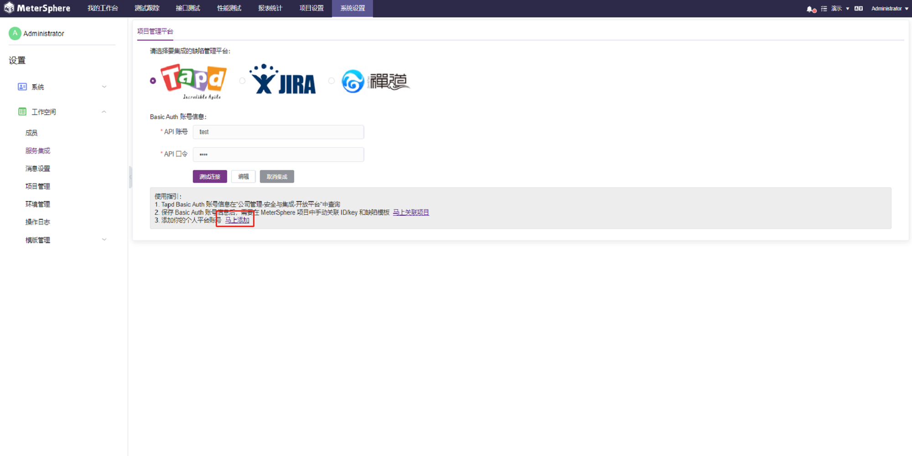

该信息为通过 TAPD 提交缺陷的用户认证信息，若未填写，则使用组织中配置的默认信息。

选择`第三方平台账号`设置`Tapd`信息，如果不设置个人平台账号，则所有使用 MeterSphere 提交缺陷的用户，此缺陷推送到配置的服务平台上账号都是服务配置中设定的账号信息。

参数说明：TAPD 昵称是 TAPD 个人设置里查看。

以上配置完成后，在 Metersphere 系统中测试用例里，就可以关联TAPD 的相关需求。

在缺陷管理提交缺陷后，数据会同步到TAPD系统中。

在 TAPD 缺陷中可以查询到同步过来的缺陷数据。

- 第四步：自定义字段同步设置。

缺陷模板支持自定义字段，（自定义字段的设置同上文与 JIRA 集成第四步），设置好的字段会出现在字段的列表中，选择字段名并设置 API 字
段名。API 字段名通过 TAPD 接口链接查询 `https://www.tapd.cn/<项目号>/dashboard/workspace/view`。

#### 1.2.3  与禅道集成 
- 第一步：服务集成配置。

禅道目前存在 GET 和 PATH_INFO 两种接口调用方式（即其requestType 参数）对于禅道接口的调用使用的是 PATH_INFO 方式和 GET 请求方式的支持，用户可以根据自己使用的禅道系统的配置情况自主选择请求方式。

	说明：

	1. 账号密码为具有相应权限的 Zentao 账号，账号需要具有超级 model 调用接口权限。
    2. 请求方式：在禅道里具体查看：参考禅道配置文件中$config->requestType 的值；配置文件参考路径：/opt/zbox/app/zentao/config/my.php 。
	3. 如果提示因为安全问题 api 禁用，需要修改禅道服务器配置文件，加上 '$config->features->apiGetModel = true;' 这个配置。

- 第二步： 关联项目配置

配置完服务集成后，还需要配置项目中引用禅道项目的设置，即关联项目。点击页面右下角的`马上关联项目`进行设置。

打开项目，编辑项目里`禅道项目ID`，以及缺陷模板等相关信息。

参数说明：Zentao（禅道）项目 ID：如果 禅道 bug 是附属在项目上，则关联的Zentao ID 为项目 ID；如果 禅道 Bug 是附属在产品上，则关联的 ZentaoID 为产品 ID。

- 第三步：添加个人平台账号

点击服务集成页面右下角的`马上添加`进行设置。

该信息为通过禅道提交缺陷的用户名、密码，若未填写，则使用组织中配置的默认信息。

选择`第三方平台账号`设置`禅道信息`，如果不设置个人平台账号，则所有使用 MeterSphere 提交缺陷的用户，此缺陷推送到配置的服务平台上账号都是服务配置中设定的账号信息。

以上配置完成后，在 Metersphere 系统中测试用例里，就可以关联禅道的相关需求。

在缺陷管理提交缺陷后，数据会同步到禅道系统中。

- 第四步：自定义字段同步设置

缺陷模板支持自定义字段，（自定义字段的设置同上文与 JIRA 集成第四步），设置好的字段会出现在字段的列表中，选择字段名并设置 API 字段名。API 字段名通过禅道接口链接查询 http://<IP>/zentao/dev-api-bug.html。
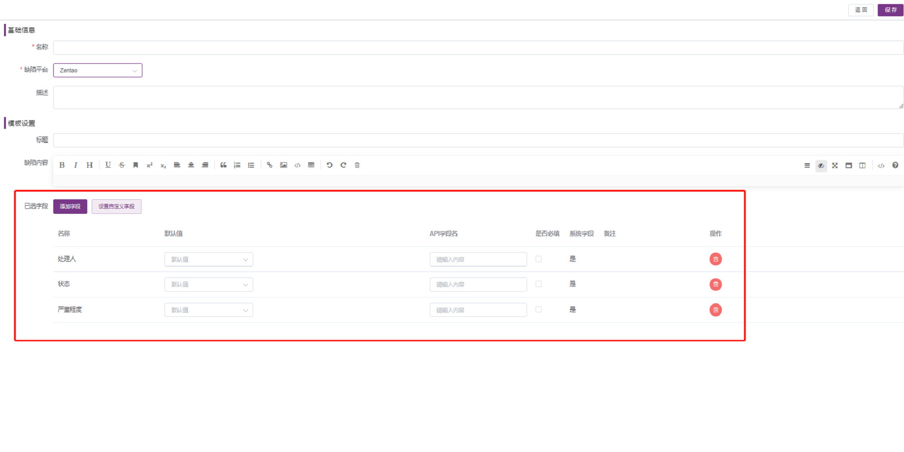

#### 1.2.4  与Azure Devops集成 
操作步骤和`禅道集成`一样。

### 1.3 项目管理
工作空间下对所有项目及项目使用到的 Jar 包进行统一管理。

- 创建项目

点击页面左侧`项目管理`，点击`创建项目`，填写相关项目基本信息

根据项目实际情况，选择对应的第三方集成平台以及用例模板和缺陷模板，点击保存即可。

    参数说明：
          1、 第三方集成平台：目前只支持以上几种集成平台，可参考上面【工作空间>>服务集成】进行配置。
          2、 用例模板：可参考【项目设置>>模板管理>>用例模板】进行自定义用例模板。
          3、 缺陷模板：可参考【项目设置>>模板管理>>缺陷模板】进行自定义缺陷模板。

自动生成 Jira 缺陷模版 (X-Pack)

`创建项目`，填写第三方集成平台为 Jira 后，勾选下面的`使用 Jira 缺陷模板`，填写好其他配置信息，点击`保存`即可

- 编辑项目

点击`编辑`按钮，可编辑项目相关信息后，点击`确定`按钮即可

- 删除项目

点击`删除`按钮，填写上方提示内容，点击`确定`按钮，该项目即可被删除

- 环境配置

点击`环境配置`按钮，填写环境相关信息即可，具体情况可参考【工作空间>>环境管理】

- 资源文件

点击`资源文件`按钮，将该项目所要使用的资源文件上传，可在`项目设置-文件管理`下面查看到资源文件。

- 上传jar包

点击`上传jar包`按钮，填写 jar 包名称和描述，可修改上传文件大小，将 jar 包拖拽或点击上传后，点击`添加`按钮即可，此处上传的 jar 包作用范围是该工作空间，可在`项目设置-文件管理`查看到 jar 包。

### 1.4 配额管理 (X-Pack)

进入`配额管理`页面，可`编辑`上方的项目默认配额，编辑完成后，在配额列表中使用默认配置的，将同步更新编辑的数据。

点击项目的`编辑`按钮，可对单个项目进行配额管理设置

点击`删除`按钮，即可删除已配置好的内容，恢复到最初状态，使用默认配额的状态也由"是"变成"否"

### 1.5 环境管理

工作空间下所有测试相关环境统一管理。此环境配置管理即是当前工作空间的 所有项目的 所有环境信息，可对当前工作空间的环境进行添加、修改及移除的操作。并且支持各个环境配置信息的导入和导出，方便客户快速新建和维护测试环境。

点击页面左侧`工作空间`，点击`环境配置`，即可查看当前工作空间中的所有项目的所有环境列表。

#### 1.5.1  环境列表 
- 创建环境

点击页面列表信息左上角的`创建环境`，可新增此工作空间下任意项目的测试环境。

在工作空间下创建环境，需要指定此环境是用于哪个项目，其他环境设置信息同项目管理里的新增环境。

	参数说明：
      1、 选择项目：指定环境所属的项目，此项目是当前工作空间下，有权限的项目列表。
      2、 环境名称：为新创建的环境命名。
      3、 其他设置“通用配置”“HTTP 配置”等等，可参考上面【工作空间>>项目管理】的环境配置。

- 导入环境

点击`导入`按钮导入环境，仅支持通过metershpere导出的json文件。

导入支持为一个项目批量创建不同的环境。

- 导出环境

点击`导出环境`按钮导出环境，将环境导出的json文件。

- 编辑环境

点击`编辑出环境`按钮编辑环境，可修改环境配置。

- 复制环境

点击`复制环境`按钮编辑环境，可复制环境配置。

- 删除环境

点击`删除环境`按钮编辑环境，可删除环境配置。

#### 1.5.2  环境组 
- 创建环境组

MeterSphere 支持跨项目进行接口、接口用例、场景用例等自动化脚本引用，可以根据不同项目、已经不同环境组合成一个环境组，当自动化执行时，可以直接选择该环境组。

点击“创建环境组”，选择不同项目、不同环境信息。

- 编辑环境组

点击`编辑环境组`按钮编辑环境组，可修改、添加、删除环境。

- 复制环境组

点击`复制环境组`按钮复制环境组。

- 删除环境组

点击`复制环境组`按钮复制环境组。

### 1.6 操作日志
> 同系统下操作日志

显示登录用户所处`工作空间`下的所有有权限`项目`的测试资源日志信息。

