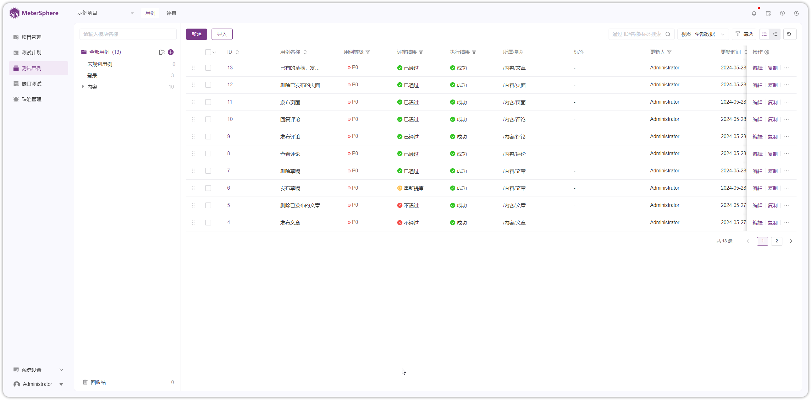
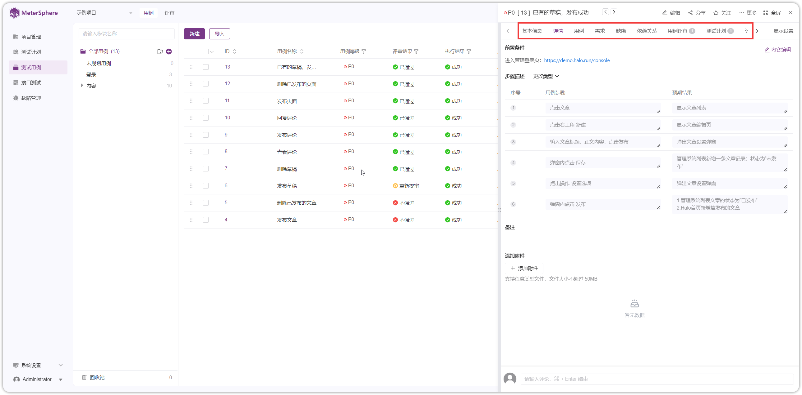
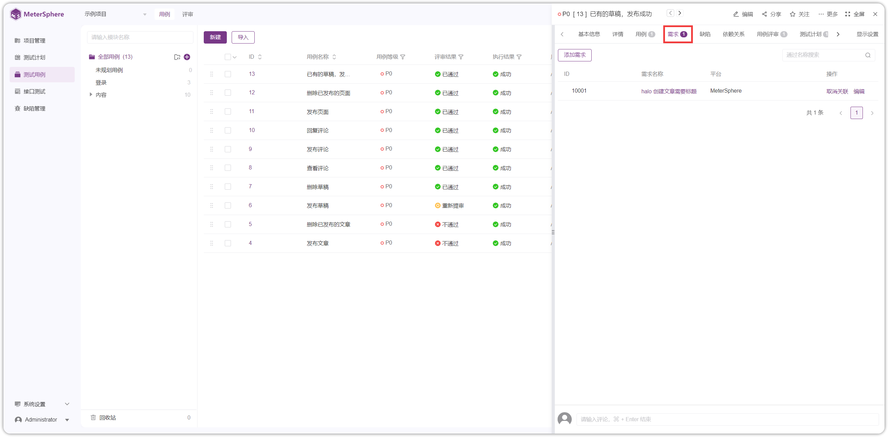
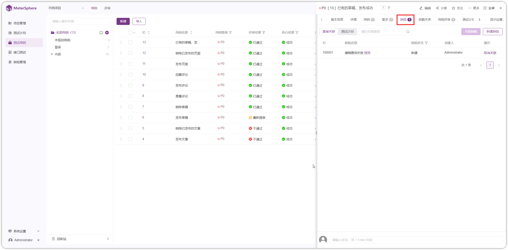
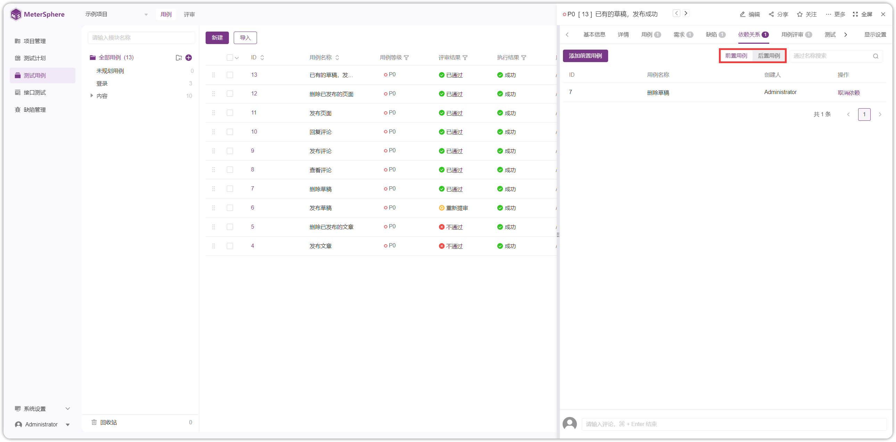
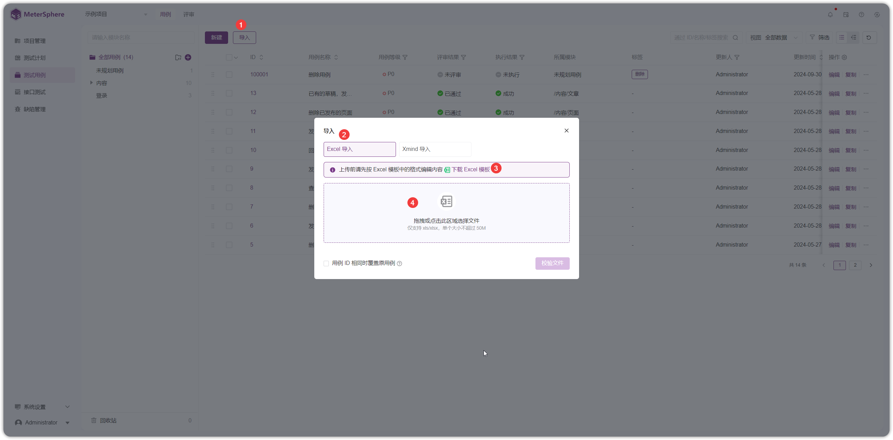
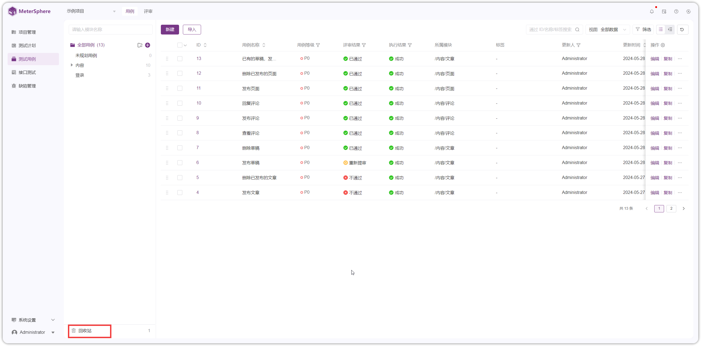

## 1 创建用例
!!! ms-abstract ""

    进入【测试用例-用例】界面，系统预置了以 Halo 建站平台测试为例做参考。点击【新建】按钮创建测试用例。
{ width="900px" }

!!! ms-abstract ""
    在新建用例详情页面中，填写用例名称、前置条件、步骤信息、添加备注、上传附件、用例模块、用例等级、执行人、标签等字段，点击【创建】新建用例。 
{ width="900px" }

##  2 用例更多操作
!!! ms-abstract ""
    在用例列表中，点击用例ID，可对用例设置关联用例、需求、缺陷、依赖关系信息，并查看关联的用例评审、测试计划、评论、变更历史等信息。
    
{ width="900px" }

!!! ms-abstract "操作说明"

     - 【详情】：查看用例，点击编辑内容编辑按钮修改用例内容，点击【保存】按钮生效。
     -  【用例】：为当前用例添加接口测试相关业务用例。    
     - 【需求】：为当前用例关联需求信息，可以关联第三方平台需求，使用前需在【项目管理-应用设置-测试用例】配置第三方平台需求信息 。参考 [项目-关联需求](../project_management/project_permissions.md#22)。     
     - 【缺陷】：为当前用例关联缺陷信息，可以关联第三方平台缺陷，使用前需在【项目管理-应用设置-缺陷管理】配置第三方平台缺陷信息 。参考 [项目-关联缺陷](../project_management/project_permissions.md#21)。    
    -  【依赖关系】：为当前用例添加前后置用例关系。   
    - 【用例评审】：查看当前用例关联的用例评审计划。   
    -  【测试计划】：查看当前用例关联的测试计划。 
    -   【评论】：查看当前用例下针对用例、用例评审留下的评论信息。   
    -  【变更历史】：查看用例修改历史信息。

### 2.1 关联测试
!!! ms-abstract ""
    测试用例可以和平台已有的自动化用例进行测试关联。点击【关联测试】按钮，进入对应用例列表选择并关联。 
{ width="900px" }

### 2.2 关联需求
!!! ms-abstract ""
    通过添加需求或关联第三方需求的方式实现用例和需求的关联。 
{ width="900px" }

### 2.3 关联缺陷
!!! ms-abstract ""
    
    新建测试用例和缺陷关联。【关联缺陷】可关联缺陷列表的所有缺陷。也可直接【创建缺陷】。
{ width="900px" }

### 2.4 创建依赖关系
!!! ms-abstract ""
    通过前置或后置用例来描述用例之间的逻辑关系。 
{ width="900px" }

### 2.5 更多操作

!!! ms-abstract ""
    用例详情页面还支持【编辑】、【分享】、【关注】、【复制】、【删除】用例等操作。
{ width="900px" }

!!! ms-abstract "操作说明"

    -  【编辑】：编辑用例，页面同新建用例详情页面，修改用例基本信息。 
    -  【分享】：点击分享，复制当前用例链接，分享给他人。 
    -  【关注】：当前用例存在变更， 会有消息通知发送给关注人。 
    -  【复制】：复制当前用例内容到用例详情编辑页面编辑。 
    -  【删除】：删除当前用例，进入回收站。

<!--
## 3 基于脑图视图新建用例（未实现）
!!! ms-abstract ""
    
    在用例列表页面点击【脑图】切换以脑图形式展现用例。脑图父主题为模块名称，子主题为模块下测试用例，孙主题为测试用例步骤详情或备注信息。各级主题使用标签方式区分文本内容，支持使用标签方式标记用例优先级。 
{ width="900px" }

!!! ms-abstract ""
    右键主题区域触发功能键。 
{ width="900px" }

!!! ms-abstract "操作说明"

    - 【收起】按钮，点击可以收起该主题下属子主题。
    - 【上级】按钮，点击创建该主题的上级主题。
    - 【下级】按钮，点击创建该主题的下级主题。
    - 【同级】按钮，点击创建该主题的同级主题。
    - 【后移】按钮，点击将该主题移入其下级主题。
    - 【前移】按钮，点击将该主题移入其上级主题。
    - 【删除】按钮，点击删除该主题。
    - 【导出】操作，支持导出全部模块及视图内全部已展开的用例。支持导出为 json、png、svg、txt、md、mm 等格式的文件。
    - 【优先级/标签】操作，支持为该主题添加优先级及文本标签。
-->

## 3 导入用例
!!! ms-abstract ""
    选择【 Excel 导入】导入本地用例，下载 Excel 模板按照模板字段填写用例，导入到平台。
{ width="900px" }
{ width="900px" }

!!! ms-abstract "操作说明"
    
    - 【用例 ID 相同时覆盖原用例】，勾选，ID相同时覆盖原用例；不勾选，ID已存在时，跳过该用例

## 4 回收站
!!! ms-abstract ""
    被删除的测试用例会先存在在回收站，在回收站中可对以删除的用例执行【恢复】和【彻底删除】操作。
{ width="900px" }
{ width="900px" }