!!! ms-abstract ""
    进入【测试用例-用例】界面，系统预置了以 Halo 建站平台测试为例做参考，默认展示是列表形式。
{ width="900px" }

## 1 创建用例
!!! ms-abstract ""
    点击【新建】按钮创建测试用例，在新建用例详情页面中，填写用例名称、前置条件、步骤信息、添加备注、上传附件、用例模块、用例等级、执行人、标签等字段，点击【创建】新建用例。 
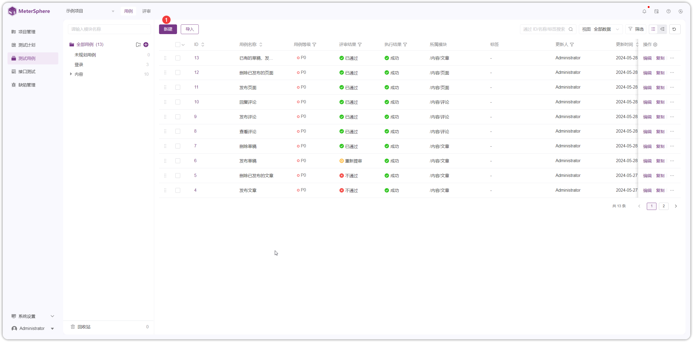{ width="900px" }

{ width="900px" }

##  2 用例更多操作
!!! ms-abstract ""
    在用例列表中，点击用例ID，可对用例设置关联用例、需求、缺陷、依赖关系信息，并查看关联的用例评审、测试计划、评论、变更历史等信息。
{ width="900px" }

!!! ms-abstract "操作说明"

    - 【详情】：查看用例，点击编辑内容编辑按钮修改用例内容，点击【保存】按钮生效。
    - 【用例】：为当前用例添加接口测试相关业务用例。    
    - 【需求】：为当前用例关联需求信息，可以关联第三方平台需求，使用前需在【项目管理-应用设置-测试用例】配置第三方平台需求信息 。参考 [项目-关联需求](../project_management/project_permissions.md#22)。     
    - 【缺陷】：为当前用例关联缺陷信息，可以关联第三方平台缺陷，使用前需在【项目管理-应用设置-缺陷管理】配置第三方平台缺陷信息 。参考 [项目-关联缺陷](../project_management/project_permissions.md#21)。    
    - 【依赖关系】：为当前用例添加前后置用例关系。   
    - 【用例评审】：查看当前用例关联的用例评审计划。   
    - 【测试计划】：查看当前用例关联的测试计划。 
    - 【评论】：查看当前用例下针对用例、用例评审留下的评论信息。   
    - 【变更历史】：查看用例修改历史信息。

### 2.1 关联测试
!!! ms-abstract ""
    测试用例可以和平台已有的自动化用例进行测试关联。点击【关联测试】按钮，进入对应用例列表选择并关联。 
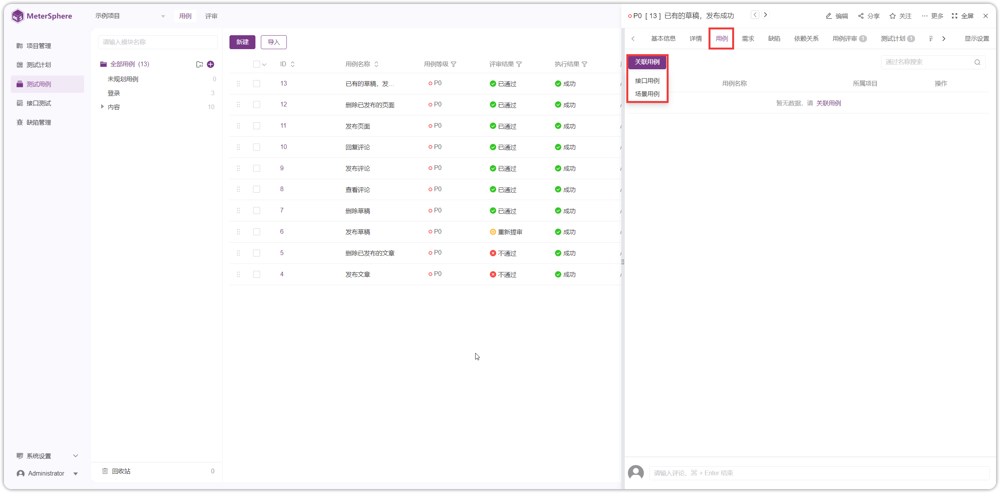{ width="900px" }

### 2.2 关联需求
!!! ms-abstract ""
    通过添加需求或关联第三方需求的方式实现用例和需求的关联。 
{ width="900px" }

### 2.3 关联缺陷
!!! ms-abstract ""
    
    新建测试用例和缺陷关联。【关联缺陷】可关联缺陷列表的所有缺陷。也可直接【创建缺陷】。
{ width="900px" }

### 2.4 创建依赖关系
!!! ms-abstract ""
    通过前置或后置用例来描述用例之间的逻辑关系。 
{ width="900px" }

### 2.5 更多操作

!!! ms-abstract ""
    用例详情页面还支持【编辑】、【分享】、【关注】、【复制】、【删除】用例等操作。
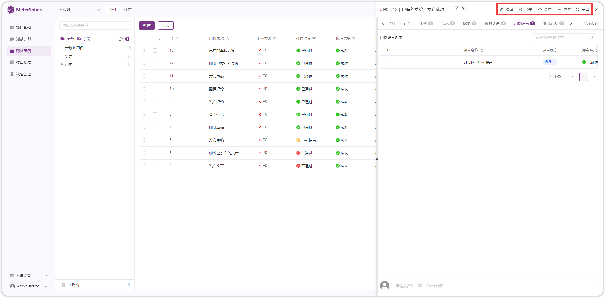{ width="900px" }

!!! ms-abstract "操作说明"

    -  【编辑】：编辑用例，页面同新建用例详情页面，修改用例基本信息。 
    -  【分享】：点击分享，复制当前用例链接，分享给他人。 
    -  【关注】：当前用例存在变更， 会有消息通知发送给关注人。 
    -  【复制】：复制当前用例内容到用例详情编辑页面编辑。 
    -  【删除】：删除当前用例，进入回收站。

## 3 基于脑图视图
### 3.1 新建用例
!!! ms-abstract ""
    如下图点击按钮，即可切到脑图模式展示用例。
{ width="900px" }

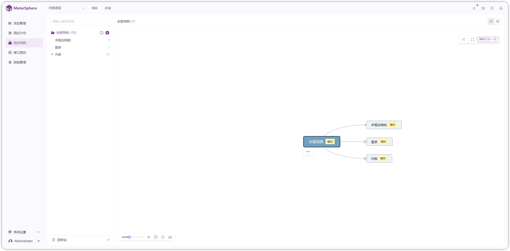{ width="900px" }

!!! ms-abstract ""
    脑图父主题为模块名称，子主题为模块下测试用例，孙主题为测试用例的前置条件、步骤描述、预期结果等内容。
{ width="900px" }

!!! ms-abstract ""
    如图点击【模块】即可在模块下创建用例
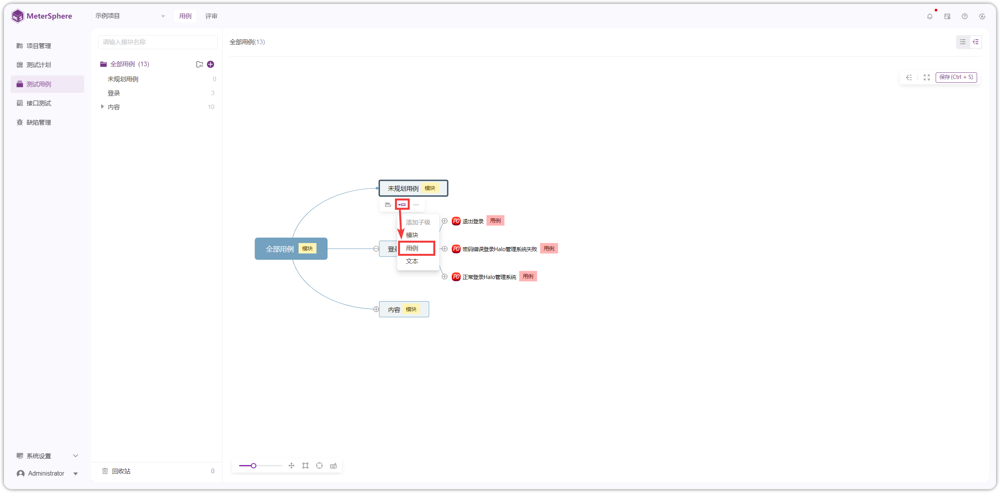{ width="900px" }

!!! ms-abstract ""
    双击【用例】直接编辑内容，也可以选中【用例】点击【详情】即可在右侧编辑用例名称、标签内容。
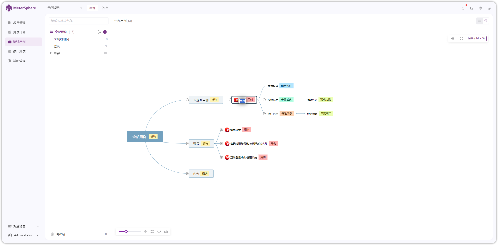{ width="900px" }

{ width="900px" }

!!! ms-abstract ""
    可以添加用例的前置条件、步骤描述、文本描述、备注信息等内容。
{ width="900px" }

!!! ms-abstract ""
    创建用例，设置用例优先级后，点击【保存】即可。
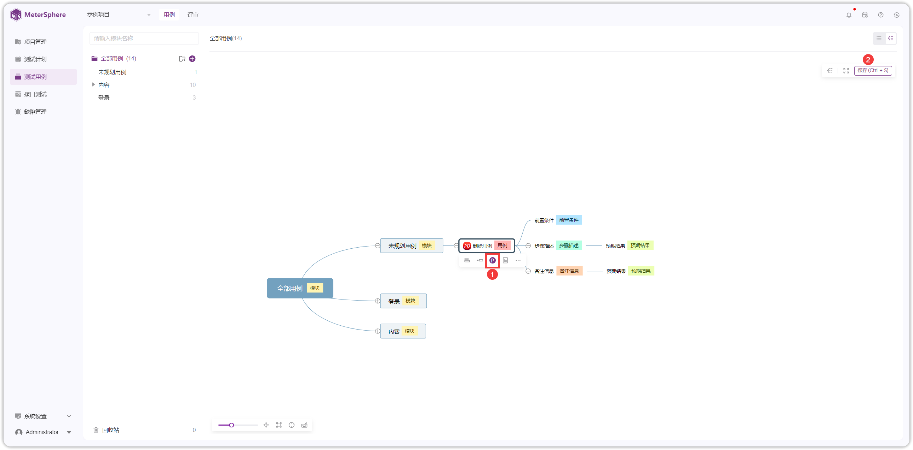{ width="900px" }

!!! ms-abstract ""
    选中用例，点击【详情】按钮，用例可以上传附件、评论、关联缺陷或创建缺陷。
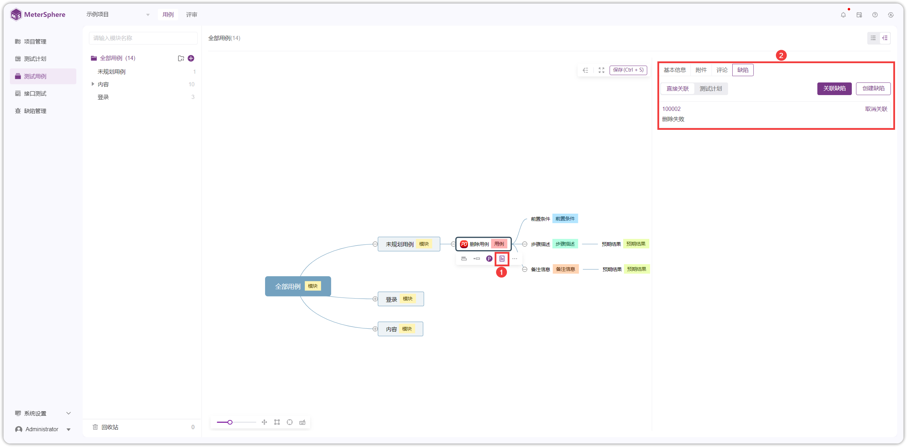{ width="900px" }

!!! ms-abstract ""
    切到列表模式，可以显示刚创建的脑图用例。
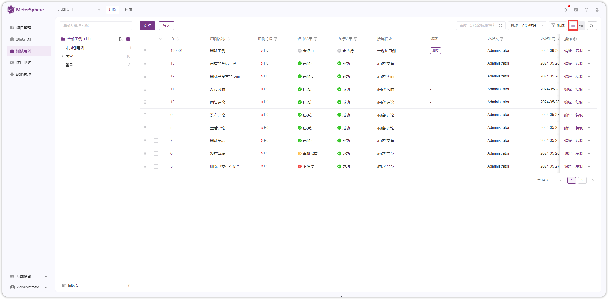{ width="900px" }

### 3.2 模块更多操作
!!! ms-abstract ""
    【模块】可以进行添加同级模块，添加子级（模块、用例、文本），进入当前节点、复制、剪切、删除等操作
{ width="900px" }

!!! ms-abstract ""
    点击【剪切】，选中其他模块点击【粘贴】，即可将剪切内容添加到该模块。
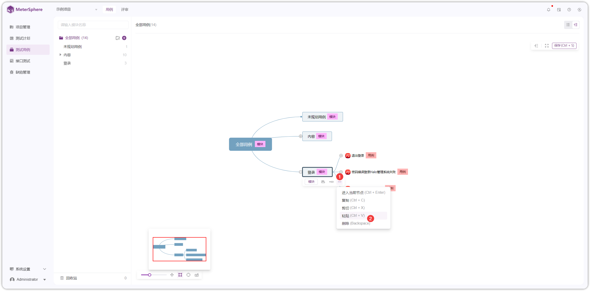{ width="900px" }

{ width="900px" }

!!! ms-abstract ""
    点击【进入当前节点】进入当前模块里进行创建用例，创建完成后点击【保存】，点击【全部模块】即可回到全部模块模式下。
{ width="900px" }

### 3.3 用例更多操作
!!! ms-abstract ""
    【用例】可以添加同级模块、添加子级（前置条件、步骤描述、文本描述、备注信息）、设置用例等级、添加详情，复制、剪切、粘贴、删除等操作。
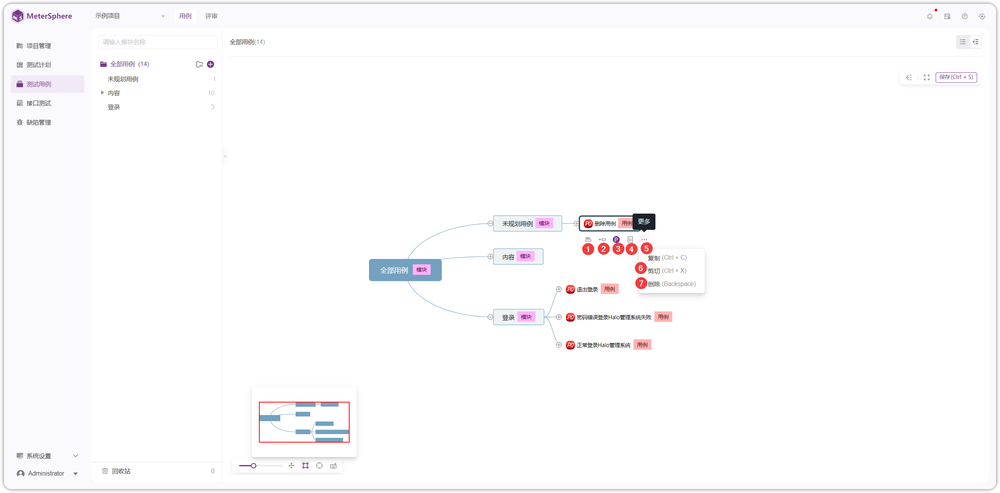{ width="900px" }

### 3.4 快捷键操作
!!! ms-abstract "快捷键说明"    

    - 【展开/收起】/
    - 【添加同级】⏎
    - 【添加子级】Tab
    - 【进入当前节点】Ctrl ⏎
    - 【复制】Ctrl C
    - 【粘贴】Ctrl V
    - 【剪切】Ctrl X
    - 【删除】⌫
    
{ width="900px" }
    
## 4 导入用例
!!! ms-abstract ""
    选择【 Excel 导入】导入本地用例，下载 Excel 模板按照模板字段填写用例，导入到平台。
{ width="900px" }

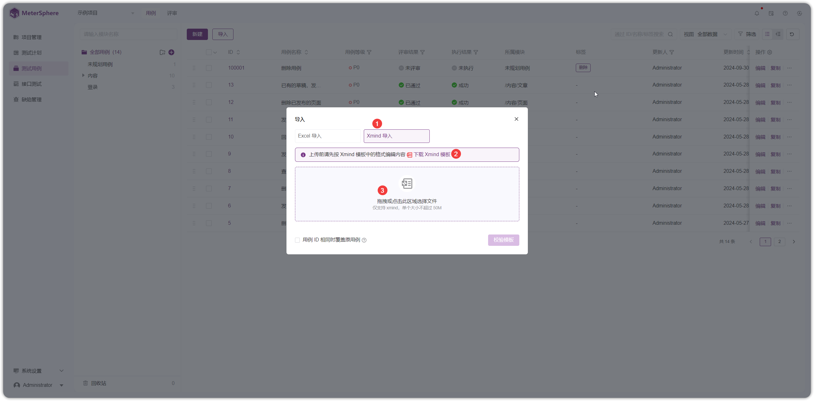{ width="900px" }

!!! ms-abstract "操作说明"

    - 【用例 ID 相同时覆盖原用例】，勾选，ID相同时覆盖原用例；不勾选，ID已存在时，跳过该用例

## 5 导出用例
!!! ms-abstract ""
    勾选用例，点击【导出】，可导出 Excel 格式和思维导图格式。
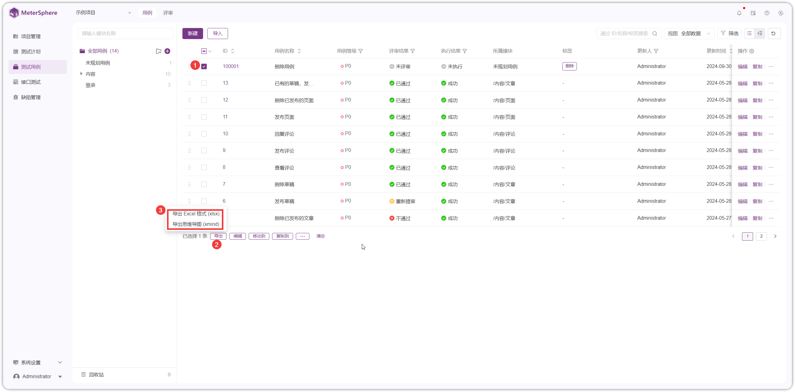{ width="900px" }

!!! ms-abstract "导出 Excel 格式"
    勾选系统字段和其他字段，选择导出格式为默认或单元格拆分，进行导出。
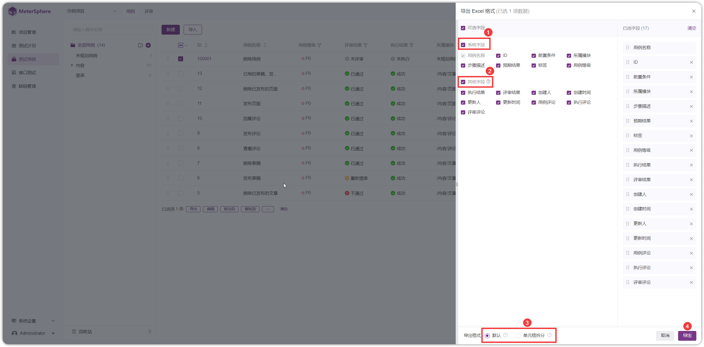{ width="900px" }

!!! ms-abstract "注意"

    - 默认：1 条用例占 1 行，多个步骤在 1 个单元格内
    - 单元格拆分：1 个步骤占用 1 个单元格，1 条用例占用多行

!!! ms-abstract "导出思维导图格式"
    勾选系统字段后，进行导出。
{ width="900px" }

## 6 批量操作
!!! ms-abstract ""
    勾选多条用例，可进行导出用例、编辑用例、将用例移动到其他模块、复制到其他模块、用例添加需求、删除等操作。
{ width="900px" }

## 7 回收站
!!! ms-abstract ""
    被删除的测试用例会先存在在回收站，在回收站中可对以删除的用例执行【恢复】和【彻底删除】操作。
{ width="900px" }

{ width="900px" }