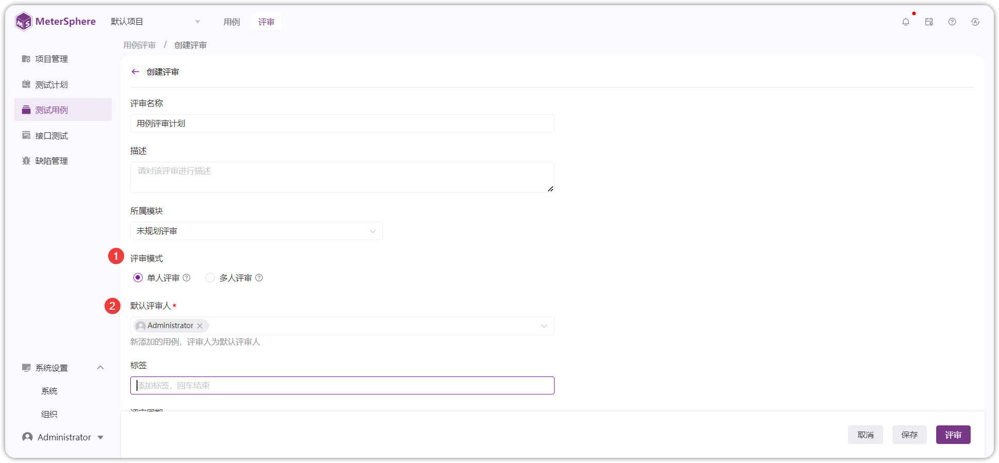
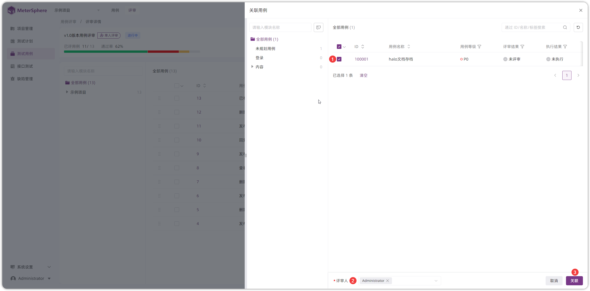
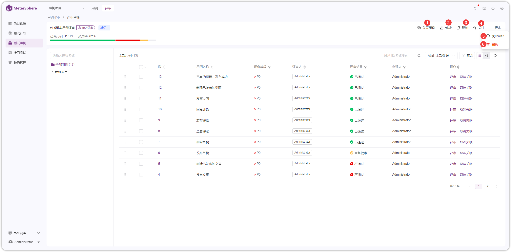
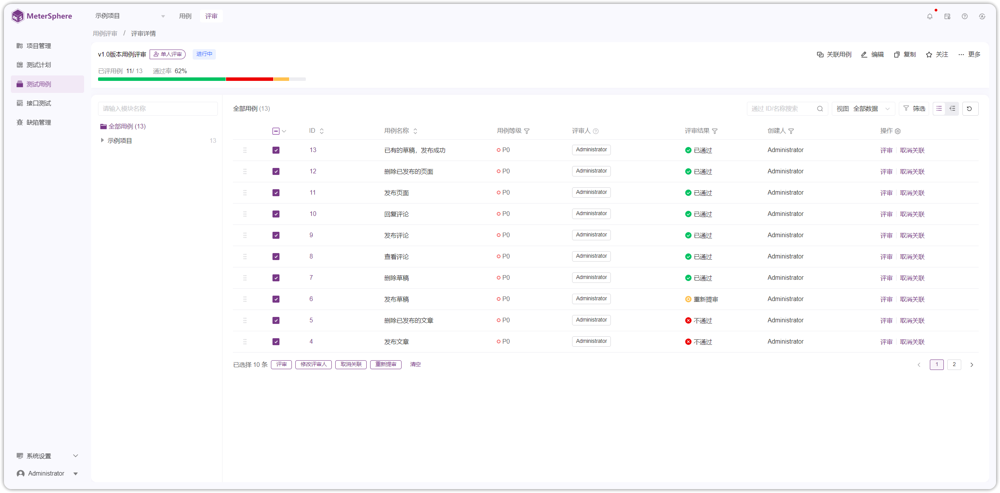
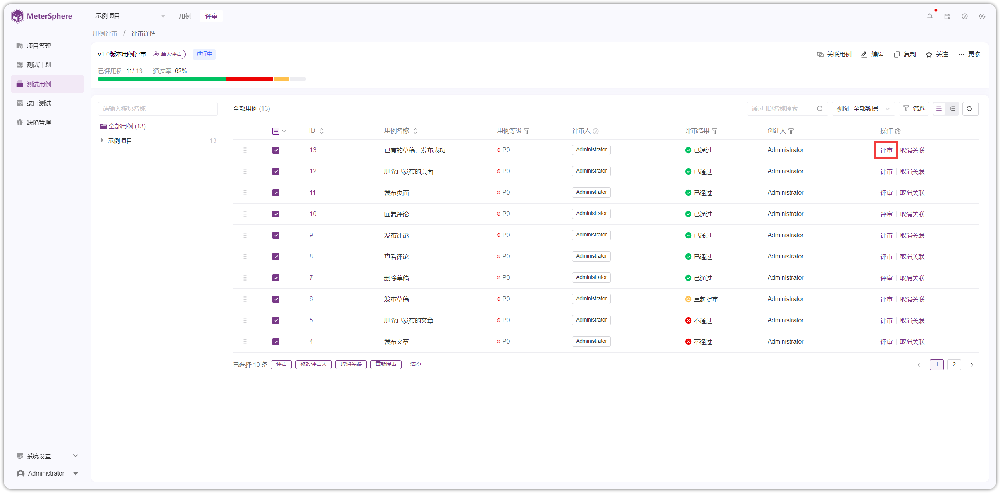
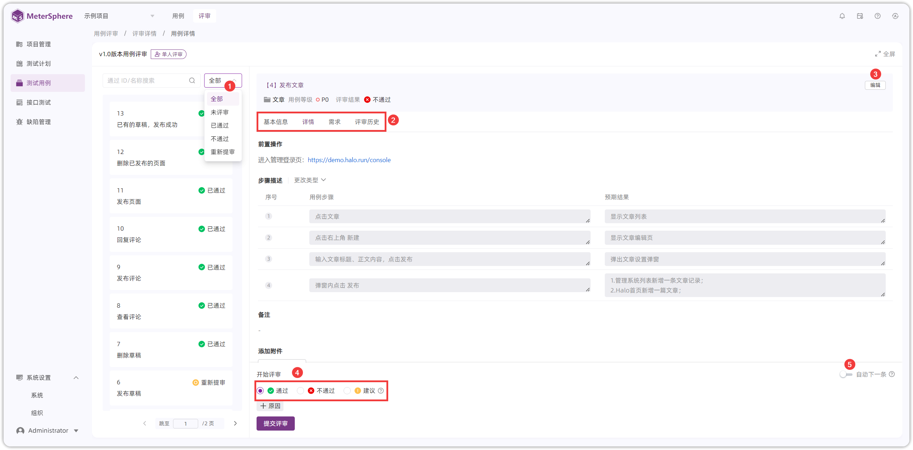
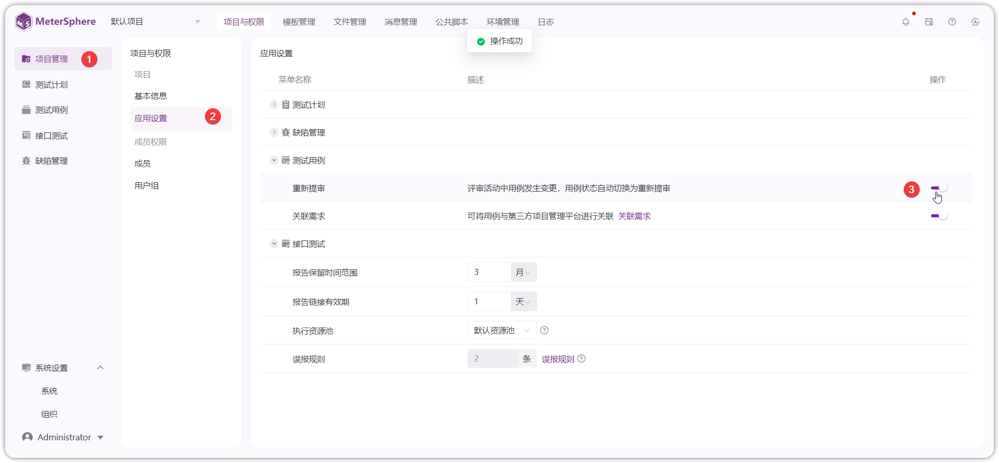

!!! ms-abstract ""
    用例评审支持创建评审计划、关联测试用例、在线评审。  点击【测试用例-评审-新建】新建用例评审计划，评审人可查看当前项目中用例评审计划。
{ width="900px" }

## 1 创建用例评审

!!! ms-abstract ""
    创建评审详情，输入评审名称、评审模式、评审人、评审周期、关联用例等信息后，点击【保存】按钮创建用例评审计划。
{ width="900px" }

!!! ms-abstract "说明"

     - 【评审模式】：单人评审：最后一次评审结果，为最终审结果；多人评审：所有评审人评审通过则通过，任意评审人不通过，则不通过。 
     - 【评审人】：只有评审人才可进行评审操作。新添加的用例，评审人为项目配置的评审人。 
     - 【评审周期】：评审预计时间，超过时间也可评审。 
     - 【关联用例】：选择需要评审的用例关联到评审计划中评审。
  

## 2 用例评审关联用例
!!! ms-abstract ""
    在【评审】列表页面，点击评审计划 ID 进入评审详情页面。点击【关联用例】 按钮，在关联用例列表选择要评审的用例到评审任务中，点击【关联】按钮保存。
{ width="900px" }
{ width="900px" }

!!! ms-abstract "操作说明"
     - 【评审人】：可以为关联的用例指定评审人，默认勾选评审计划选择的评审人。
     -  【关联用例】：显示当前项目下的用例，可按 ID 、名称、标签筛选。

### 2.1 评审详情页面操作
!!! ms-abstract ""
    在评审详情页面支持【只看我的】、【关联用例】、【编辑】、【复制】、【关注】、【快捷创建】、【删除】操作，多选用例可以进行【批量操作】。
{ width="900px" }

{ width="900px" }

!!! ms-abstract "操作说明"
     -  【评审通过率】：已通过用例/全部用例*100%。
     - 【只看我的】：勾选后，列表只展示评审人为当前用户的待评审用例数据。
     - 【关联用例】：为评审计划关联需要评审的用例。
     -  【编辑】：编辑评审计划，内容同新建。
     -  【复制】：复制当前的评审计划及其关联的用例，新复制的计划用例评审状态重置。
     -  【关注】：关注评审计划，评审计划内容变更将发送消息给关注人。
     -  【快捷创建】：快捷创建用例，跳转到新建用例界面，创建完成后直接关联到评审计划中。
     -  【删除】：删除评审计划。
     -  【批量操作】：多选用例出现批量操作：支持批量评审并给出评审意见、修改评审人、取消关联用例，重新提审用例等操作。
  

## 3 用例评审

!!! ms-abstract ""
    评审详情列表展示待评审用例，点击某个测试用例 ID 或【评审】按钮，进入【用例评审详情】页面。
{ width="900px" }

!!! ms-abstract ""
    在【用例详情】对测试用例进行评审。选择评审结果标记用例状态，评审计划每条用例都标记状态后，计划评审完成。支持筛选用例评审状态。
{ width="900px" }

!!! ms-abstract "操作说明"

     - 【评审标记】：选择评审结果，标记并提交，可选择通过、失败、建议等状态。 
     - 【编辑】：评审过程存在用例需要修改，有编辑用例权限的用户可以点击【编辑】按钮操作。 
     - 【自动下一条】:勾选后，提交评审结果自动进入下一条评审。 
     - 【需求】：可查看用例关联的需求。 
     - 【评审历史】：查看历史评审意见。
    

## 4 重新提审
!!! ms-abstract ""
    【项目管理-项目与权限-应用设置-测试用例】开启重新提审。当评审活动中的用例发生内容变更后，用例状态会自动切换为【重新提审】状态。
{ width="900px" }

!!! ms-abstract ""
    当用例状态修改，如：编辑用例里面的字段，用例评审计划里面关联的用例评审状态自动变为重新提审。
{ width="900px" }

