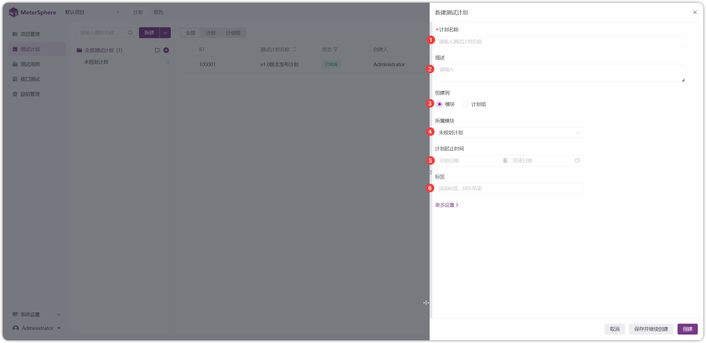

## 1 创建计划
!!! ms-abstract ""
    进入【测试计划-计划】界面，点击【新建】新建测试计划。
{ width="900px" }

!!! ms-abstract ""
    在新建测试计划页面中，依次填写测试计划名称、描述、所属模块、计划起止时间、标签等信息。
{ width="900px" }

!!! ms-abstract ""
    如下图，点击【关联用例】选择相应的功能用例关联到测试计划中。
{ width="900px" }

{ width="900px" }

!!! ms-abstract ""
    点击【更多设置】设置【是否允许关联重复用例】和【通过阈值】，点击【创建】创建测试计划。
{ width="900px" }

!!! ms-abstract "说明"
    - **是否允许关联重复用例**：开启后可重复关联一个测试用例，可复制用例，复制时不复制执行结果和执行人。
    - **通过阀值**：通过率达到设置的阀值时，报告结果为通过。

##  2 测试计划详情
!!! ms-abstract ""
    点击【测试计划ID】或者【执行】进入【测试计划详情】页面，可以进行查看计划概览、关联用例、修改计划、执行用例、取消关联、复制用例、生成报告、关注计划、删除计划、批量执行、批量修改执行人和批量取消关联等操作。
{ width="900px" }

{ width="900px" }
    
##  3 测试计划执行
!!! ms-abstract ""
    如图，点击【执行】进入【用例详情】在步骤描述处填写【实际结果】和【步骤执行结果】，修改当前用例【执行状态】和【评论】后，点击【提交结果】完成当前用例执行。
{ width="900px" }

{ width="900px" }

!!! ms-abstract ""
    如果用例执行失败，如下图缺陷处点击【+】，选择【新建】或者【关联】缺陷，给当前用例创建缺陷。
{ width="900px" }

{ width="900px" }

##  4 其他操作
!!! ms-abstract ""
    点击【编辑】在测试计划中快捷修改用例信息。
{ width="900px" }

!!! ms-abstract ""
    在用例信息【基本信息】处查看当前用例的基本信息。
{ width="900px" }

!!! ms-abstract ""
    在用例信息【缺陷列表】处查看当前用例的缺陷列表。
{ width="900px" }

!!! ms-abstract ""
    在用例信息【执行历史】处查看当前用例的执行历史。
{ width="900px" }
