## 1 计划
### 1.1 创建
!!! ms-abstract ""
    进入【测试计划-计划】界面，点击【新建】新建测试计划。
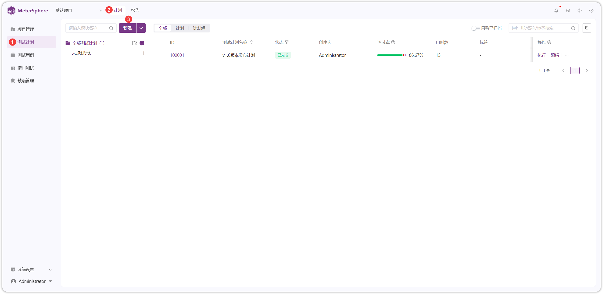{ width="900px" }

!!! ms-abstract ""
    在新建测试计划页面中，依次填写测试计划名称、描述、创建类型、所属模块、计划起止时间、标签等信息。
{ width="900px" }

!!! ms-abstract ""
    点击【更多设置】设置【允许关联重复用例】和【通过阈值】，点击【创建】创建测试计划。
{ width="900px" }

!!! ms-abstract "说明"
    - **允许关联重复用例**：开启后可重复关联一个测试用例，可复制用例，复制时不复制执行结果和执行人。
    - **通过阀值**：通过率达到设置的阀值时，报告结果为通过。

### 1.2 配置
!!! ms-abstract ""
    创建测试计划完成后，自动跳转测试计划详情页面，或者点击测试计划列表【ID】进入【测试计划详情】页面。
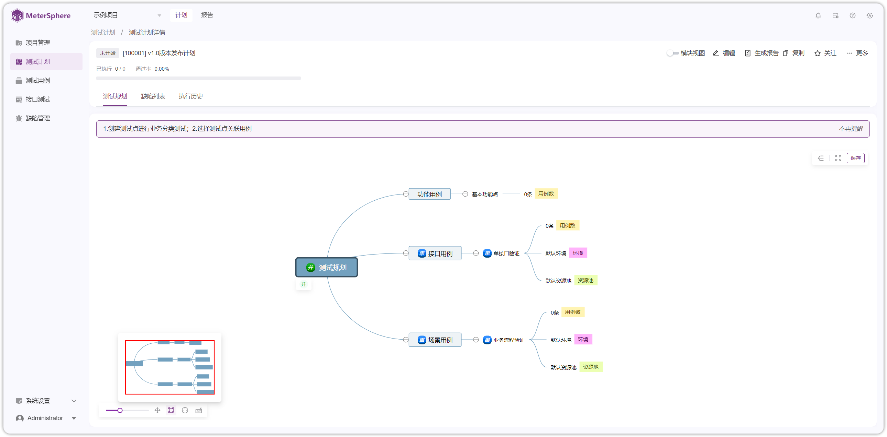{ width="900px" }

!!! ms-abstract ""
    测试规划页面默认展示【功能用例】、【接口用例】、【场景用例】三种类型测试，以【场景用例】为例。
{ width="900px" }

!!! ms-abstract ""
    点击【场景用例】，右侧显示场景用例的【配置】页面，可对场景使用的资源池、环境、串行/并行、是否开启失败停止进行配置。
{ width="900px" }

!!! ms-abstract ""
    点击【场景用例】，可以进行【添加测试点】、【运行方式】、【配置】功能操作。
{ width="900px" }

!!! ms-abstract ""
    点击【添加测试点】，在【场景用例】处会新建测试点。
{ width="900px" }

!!! ms-abstract ""
    点击【保存】，即可保存新添加的测试点。
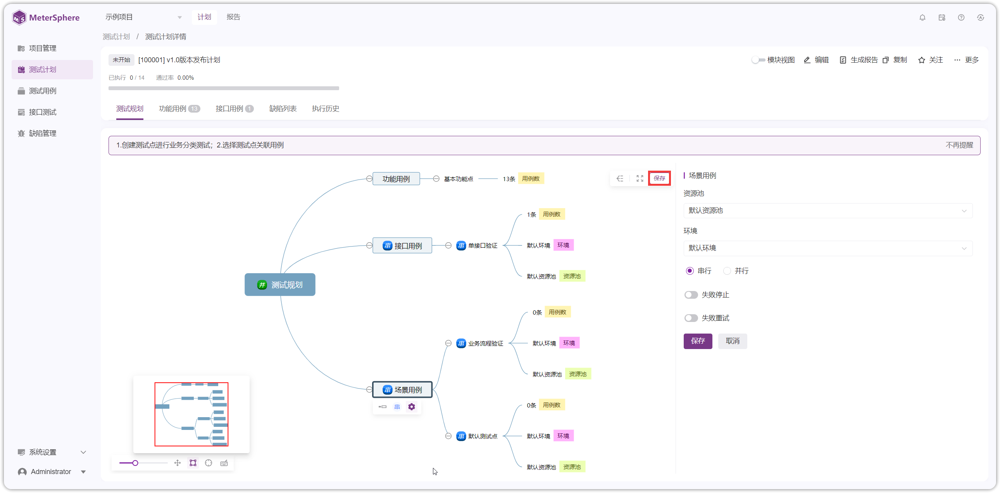{ width="900px" }

!!! ms-abstract ""
    选中【测试点】，右侧默认显示测试点的【配置】页面，可对测试点的关联用例、是否开启继承上级配置进行配置。
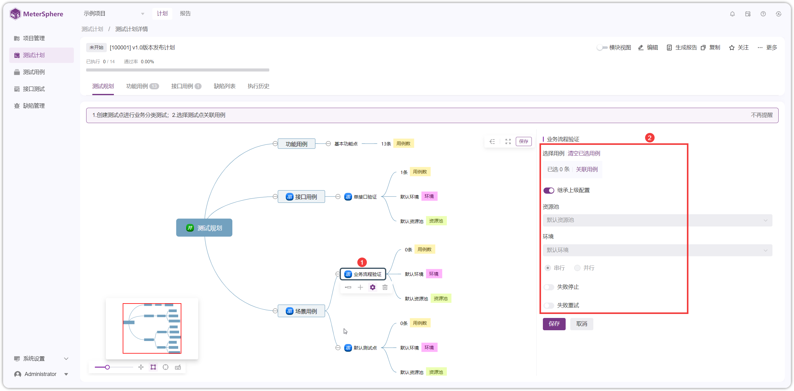{ width="900px" }

!!! ms-abstract ""
    选中【测试点】，可以进行【添加测试点】、【关联用例】、【选择运行方式】、【配置】、【删除】操作。
{ width="900px" }

!!! ms-abstract ""
    点击【关联用例】，选择要场景用例进行关联即可。
{ width="900px" }

!!! ms-abstract ""
    关联完成后，在测试点处显示个数，也可切到场景用例处显示具体关联的场景，场景用例可进行【执行】或【取消关联】操作。
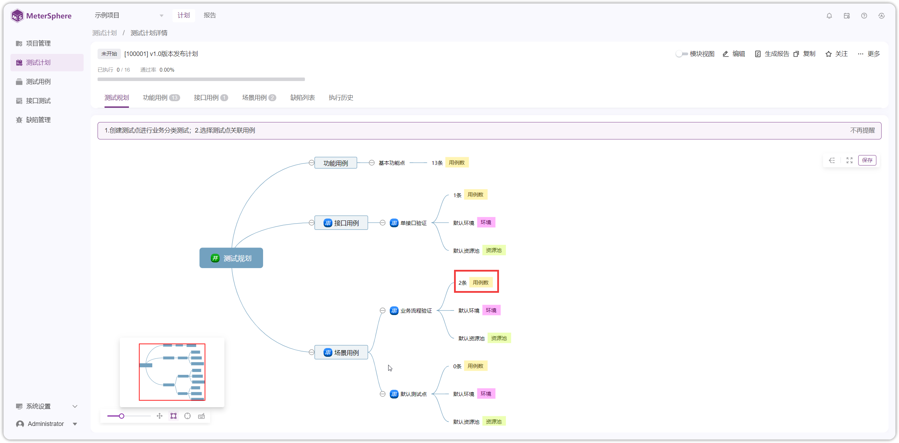{ width="900px" }

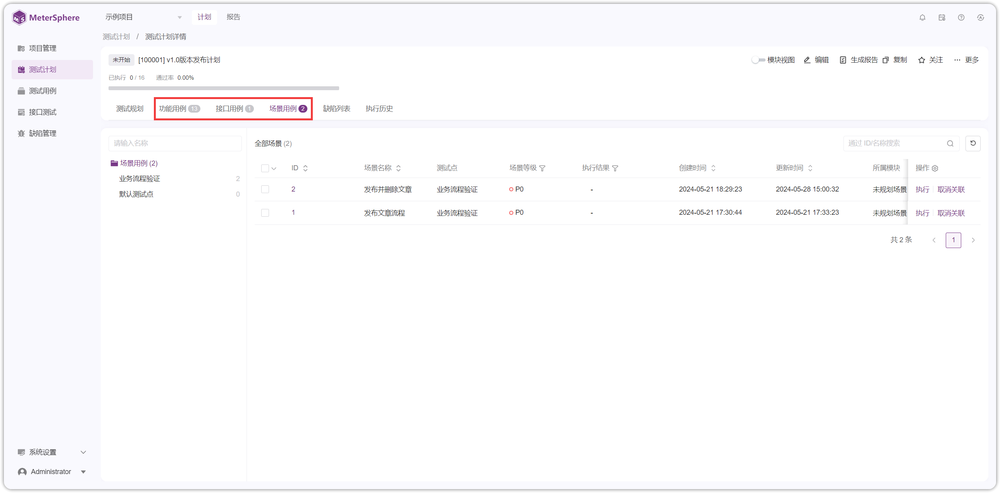{ width="900px" }

### 1.3 执行
!!! ms-abstract ""
    如图，点击【执行】即可触发场景运行。
{ width="900px" }

!!! ms-abstract ""
    若关联了功能用例，可切到功能用例处查看具体关联的功能用例，功能用例可进行【执行】或【取消关联】操作。
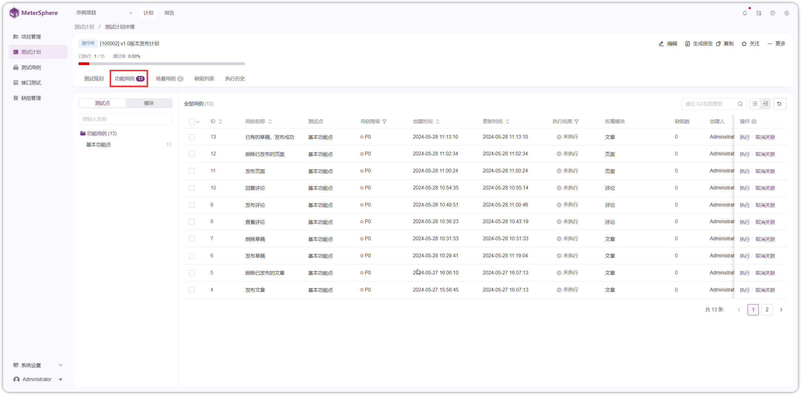{ width="900px" }

!!! ms-abstract ""
    如图，点击【执行】进入【用例详情】在步骤描述处填写【实际结果】和【步骤执行结果】，修改当前用例【执行状态】和【评论】后，点击【提交结果】完成当前用例执行。
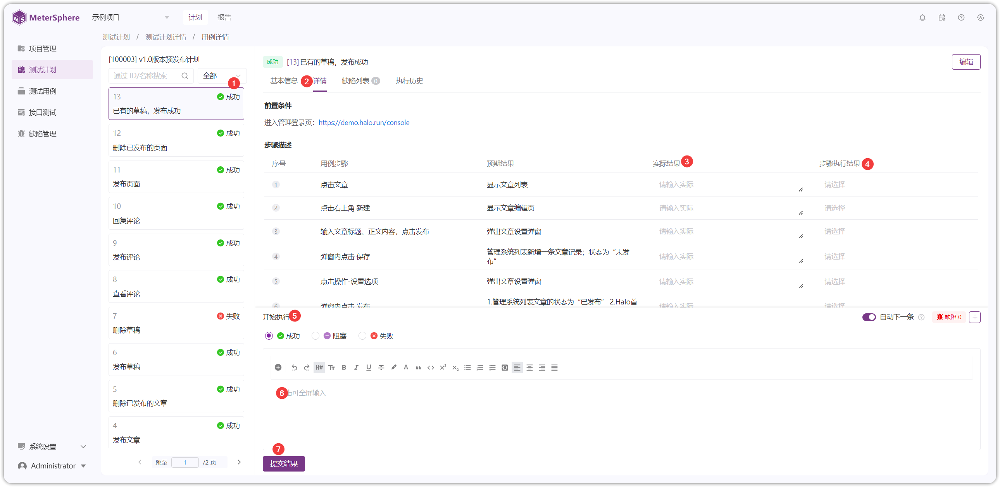{ width="900px" }

!!! ms-abstract ""
    如果用例执行失败，如下图缺陷处点击【+】，选择【新建】或者【关联】缺陷，给当前用例创建缺陷。
{ width="900px" }

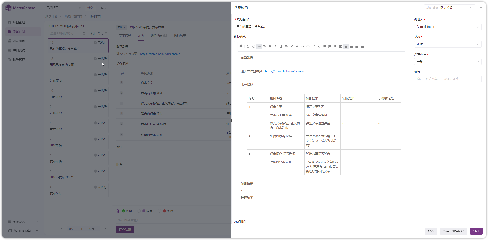{ width="900px" }

!!! ms-abstract ""
    返回【功能用例】页面，功能用例已显示执行结果，且测试计划通过率实时更新。
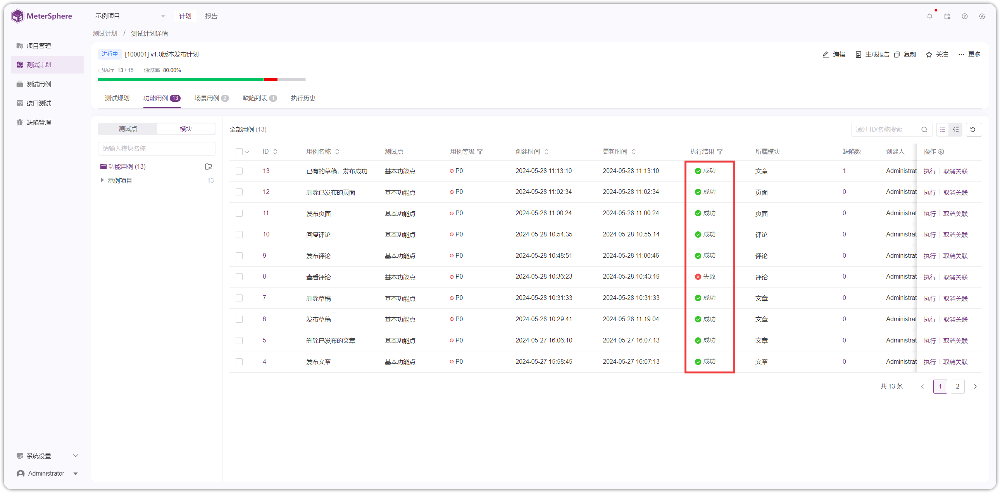{ width="900px" }

!!! ms-abstract ""
    关联场景完成后，点击【生成报告】，可在【执行历史】页面或者【报告】页面看的详细报告。
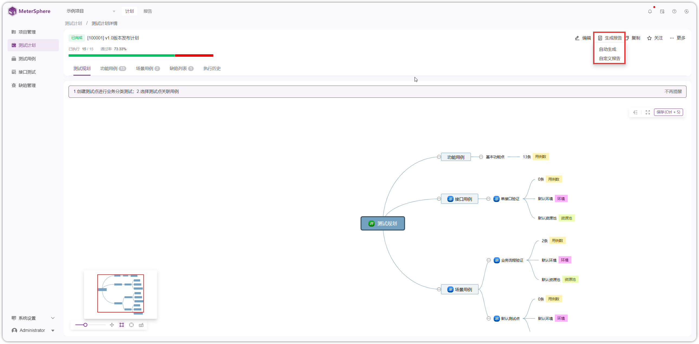{ width="900px" }

{ width="900px" }

!!! ms-abstract ""
    测试计划详情页面，可以开启模块视图、编辑、生成报告、复制、关注、删除、执行、移动、取消关联、清空等操作。
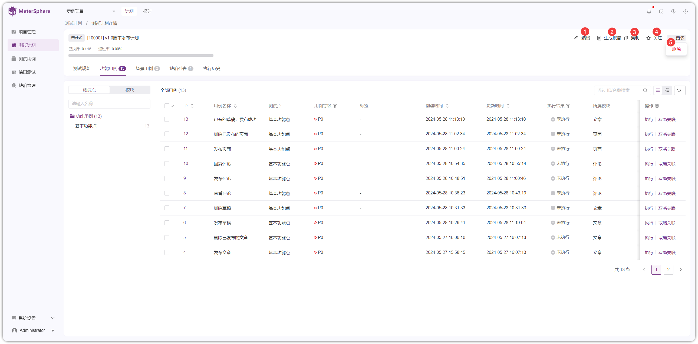{ width="900px" }

!!! ms-abstract "操作说明"

    - 【开启模块视图】开启后，功能用例/场景用例页面，左侧模块树以模块形式展示，不开启，左侧模块树以测试点显示。
    - 【编辑】编辑计划。
    - 【生成报告】将计划执行结果生成报告，可在报告页面查看。
    - 【复制】复制计划。
    - 【关注】关注计划。
    - 【删除】删除计划。
    - 【执行】单个或批量执行用例。
    - 【移动】单个或批量移动用例到其他测试点。
    - 【取消关联】取消关联测试点的用例。
    - 【清空】清空所选项。

### 1.4 其他功能
!!! ms-abstract ""
    计划列表页面提供【执行】、【编辑】、【复制】、【创建定时任务】、【删除】、【只看已归档】等操作。
{ width="900px" }

!!! ms-abstract "操作说明"

    - 【执行】执行计划，会产生报告，可在报告页面查看。
    - 【编辑】编辑计划。
    - 【复制】复制计划。
    - 【创建定时任务】设置定时任务完成后，会在【任务中心-定时任务】显示。
    - 【删除】删除计划。
    - 【只看已归档】开启后，页面只显示已归档的计划，不开启，页面显示所有计划。

## 2 计划组
!!! ms-abstract ""
    点击【计划组-新建计划组】进入新建页面，填写计划组名称、所属模块、标签内容进行创建。
{ width="900px" }

!!! ms-abstract ""
    进入【测试计划-计划】界面，点击【新建】新建测试计划，进入新建页面测试计划页面，创建到选择计划组。
{ width="900px" }

{ width="900px" }

!!! ms-abstract ""
    勾选计划点击移动，选择指定的计划组进行移动。
{ width="900px" }

{ width="900px" }

!!! ms-abstract ""
    计划组可以展开，看到其包含的具体计划。
{ width="900px" }

!!! ms-abstract ""
    计划组列表页面提供【执行】、【编辑】、【复制】、【定时任务】、【删除】、【只看已归档】等操作。
{ width="900px" }

