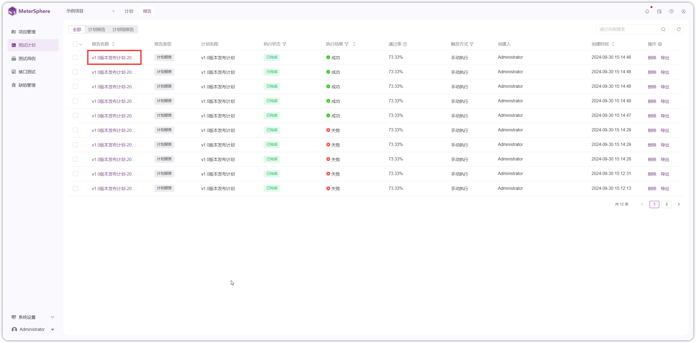

## 1 生成报告
!!! ms-abstract ""
    测试计划执行完成后，在【测试计划详情】页点击【生成报告】生成测试计划报告。
{ width="900px" }

## 2 查看报告
### 2.1 计划报告
!!! ms-abstract ""
    在【计划报告】页面，点击【报告ID】查看报告详情，输入【报告总结】进行保存。
{ width="900px" }    

{ width="900px" }    

### 2.2 计划组报告
!!! ms-abstract ""
    在【计划组报告】页面，点击【报告ID】查看报告详情，输入【报告总结】进行保存。
{ width="900px" }

{ width="900px" }

## 3 分享报告
!!! ms-abstract ""
    点击【分享】获取报告分享链接。
{ width="900px" }    

