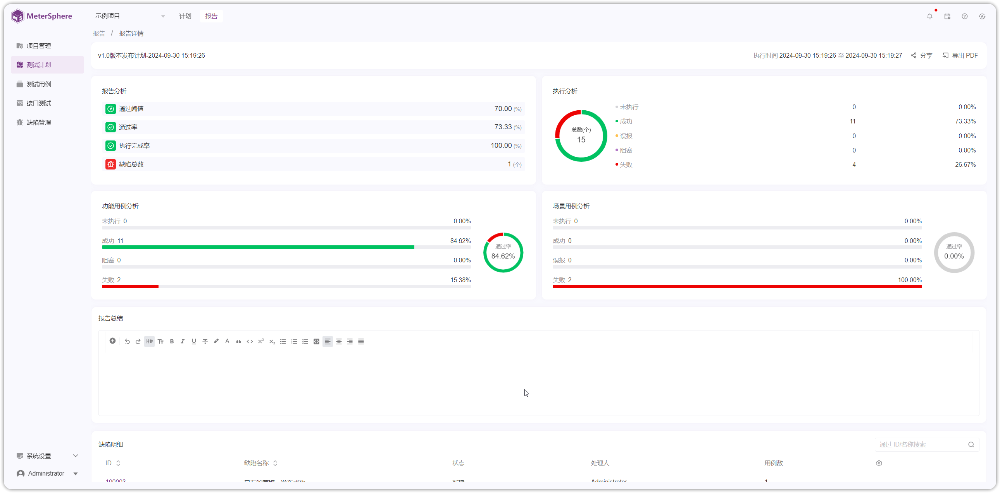

## 1 生成报告
!!! ms-abstract ""
    在【测试计划】页点击【执行】生成测试计划报告。
{ width="900px" }

## 2 查看报告
### 2.1 计划报告
!!! ms-abstract ""
    在【计划报告】页面，点击【报告ID】查看报告详情，输入【报告总结】进行保存。
{ width="900px" }    

{ width="900px" }    

!!! ms-abstract "报告筛选"
    在报告页面，拖拽到用例明细处，可开启测试点功能，页面按“测试点”维度展示列表数据。
{ width="900px" }

{ width="900px" }

### 2.2 计划组报告
!!! ms-abstract ""
    在【计划组报告】页面，点击【报告ID】查看报告详情，输入【报告总结】进行保存。
{ width="900px" }

{ width="900px" }

## 3 分享报告
!!! ms-abstract ""
    点击【分享】获取报告分享链接。
{ width="900px" }   

## 4 导出报告
!!! ms-abstract ""
    点击【导出 PDF】可下载 pdf 格式的报告。
{ width="900px" }    

