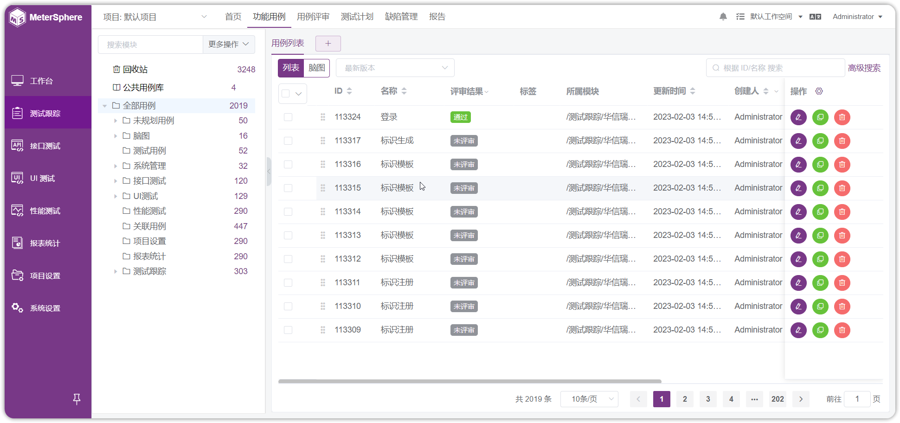
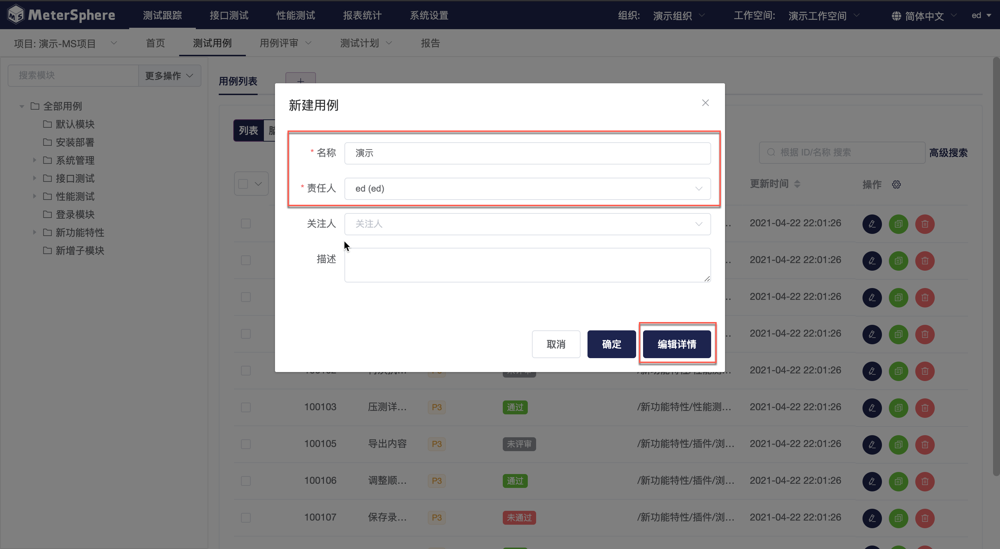
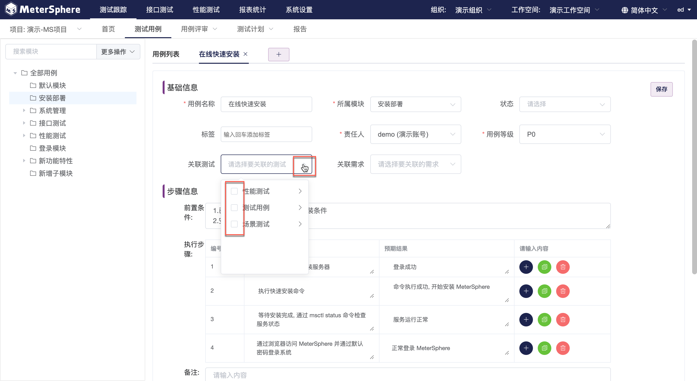
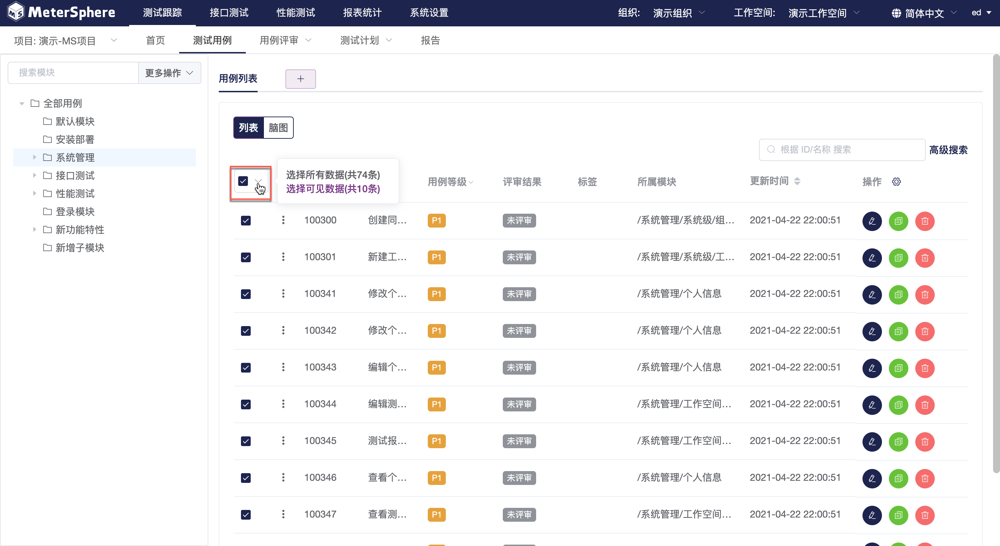

进入`测试用例`界面。左上方显示当前项目，项目下方显示此项目的全部测试用例。测试用例以模块为单位进行统一管理；模块树支持添加、修改、删除以及拖拽操作。页面右侧显示选定模块下的测试用例列表，可以对测试用例进行新建、查询、编辑、复制、删除操作。

##新建测试用例

- 表单新建测试用例

点击模块树上方`更多操作`下拉菜单选择`新建用例`。

在弹出的用例创建页面中编辑用例信息，点击`编辑详情`按钮进入新建用例详情页面。或点击`+`按钮直接进入新建用例详情页面。

在新建用例详情页面填写用例基础信息、步骤信息，点击`保存`保存此条用例。

新建用例将在用例列表中呈现，点击此条用例或点击此条用例后的`编辑`按钮可重新进入用例详情页面进行编辑。

- 脑图新建测试用例

在用例列表页面点击`脑图`切换以脑图形式展现用例。脑图父主题为模块名称，子主题为模块下测试用例名称，孙主题为测试用例步骤信息。双击主题键入文本信息，使用标签方式区分文本内容。

- 关联测试用例

新建测试用例可以和平台已有的接口测试用例、性能测试用例进行关联。进入测试用例详情页面，点击`关联测试`下拉菜单，选择希望与本条用例进行关联的用例。

##导入测试用例

点击点击模块树上方`更多操作`下拉菜单选择`导入`。在弹出页面中选择使用表格文件或思维导图文件导入用例。

## 导出测试用例

使用用例选框选中希望导出的测试用例。点击用例列表下拉选框，支持切换当前模块下全部用例或当前页面全部用例。

用例选中后，点击点击模块树上方`更多操作`下拉菜单选择`导出`，所选用例将以 Excel 格式文件导出。

