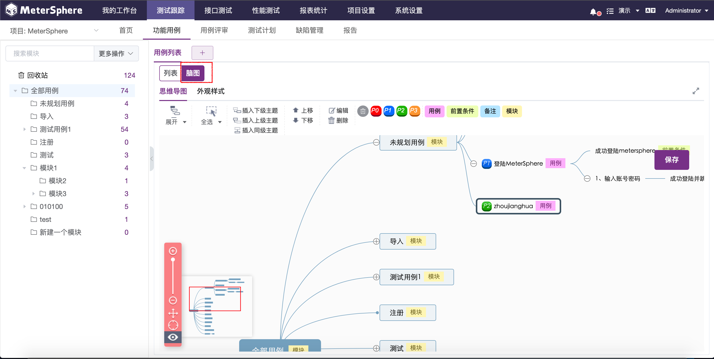
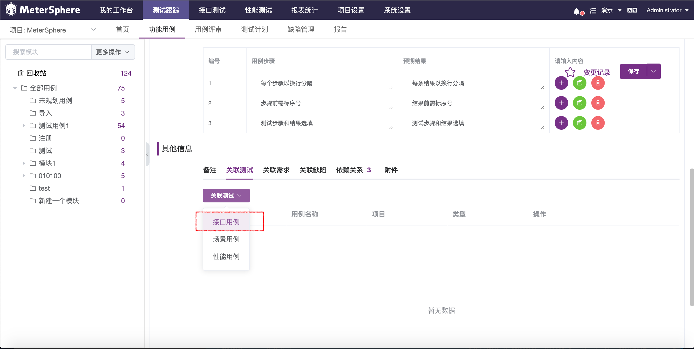
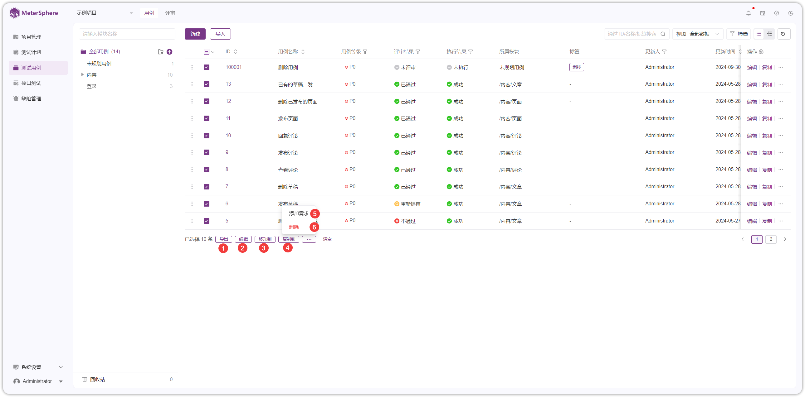

测试用例，主要用于对功能用例进行统一管理，支持用例的快捷创建及导入导出操作。

入`测试用例`界面。左上方显示当前项目，项目下方显示此项目的全部测试用例模块。所属某一项目的测试用例以模块为单位进行统一管理，页面右侧显示选定模块下的测试用例列表，支持对测试用例进行新建、查询、编辑、复制、删除等操作。

## 模块树管理

每个用例都需要属于一个特定模块，在创建用例前需要先规划并创建模块树。

### 切换项目

在模块树上方的项目切换下拉菜单中进行项目切换，展示所属该项目下的用例列表。

!!! info "说明"
    不同项目间模块树相互独立，当切换项目后需要重新创建模块树。

### 创建一级模块

选中模块树列表`全部用例`，点击`+`号按钮在模块总目录下创建一级模块。选中任意上级模块即可在该模块下创建次级模块。

!!! info "说明"
    模块树支持最多 8 层的树状结构。

### 模块操作

!!! info "操作说明"

    1. `重命名` 按钮，鼠标悬停在要操作的模块时出现，点击可以重命名该模块。
    2. `添加子模块` 按钮，鼠标悬停在要操作的模块时出现，点击可以在该模块下添加子模块。
    3. `删除` 按钮，鼠标悬停在要操作的模块时出现，点击将删除该模块和其所有子模块。
    4. `展开/收起` 操作，当模块下存在子模块时出现，点击将展开/收起该模块下的所有子模块。

!!! error "注意"
    删除某个模块不仅会删除该模块及其所有子模块，被删除模块中的接口及接口用例也将被移入回收站中，请谨慎使用该功能。

模块树还支持鼠标拖拽操作，用户可以根据需求调整模块顺序及其层级关系。

##用例管理

###切换用例视图

目前，平台提供两种用例呈现方式，进入`测试用例`页面后，默认打开`列表`视图，点击`脑图`标签切换至脑图视图。

### 基于列表视图新建用例

选择新建用例所属模块，点击模块树上方`更多操作`下拉菜单选择`新建用例`。

在弹出的`新建用例`页面中编辑用例基础信息，点击`确认`保存至用例列表；用户也可以直接点击`编辑详情`进入用例详情页面进行编辑。

选定新建用例所属模块后，同时支持用户在用例列表视图点击`+`按钮直接进入新建用例详情页面，填写基础信息后即可将用例保存至用例列表。

在新建用例详情页面中，进一步填写用例步骤信息，为用例添加备注、附件和评论，支持为用例关联测试、关联缺陷、关联缺陷。编辑完成后，点击`保存`将此条用例保存至列表。

新建用例将在用例列表中呈现，点击此条用例或点击此条用例后的`编辑`按钮可重新进入用例详情页面进行编辑。

####  为用例关联测试 

新建测试用例可以和平台已有的接口测试用例、接口场景用例、性能测试用例进行关联。进入测试用例详情页面，点击`关联测试`标签，选择希望与本条用例进行关联的用例关联测试测试类型，进入该类型的用例列表进行关联。

以接口测试用例为例。进入接口测试用例列表，选中希望关联的用例，点击`确认`完成添加。

关联后的测试用例将在关联列表中显示，可以使用`锁定`按钮快捷取消关联。

####  为用例关联需求 

新建测试用例可以和需求关联。点击`关联需求`标签，下拉选框中选择希望与本条用例进行关联的需求。

####   为用例关联缺陷 

新建测试用例可以和缺陷关联。点击`关联缺陷`标签，关联已有缺陷或创建新的缺陷并进行关联。

### 基于脑图视图新建用例

在用例列表页面点击`脑图`切换以脑图形式展现用例。脑图父主题为模块名称，子主题为模块下测试用例，孙主题为测试用例步骤详情或备注信息。各级主题使用标签方式区分文本内容，支持使用标签方式标记用例优先级。

双击主题区域触发功能键，

!!! info "操作说明"
    1. `收起` 按钮，点击可以收起该主题下属子主题。
    2. `上级` 按钮，点击创建该主题的上级主题。
    3. `下级` 按钮，点击创建该主题的下级主题。
    4. `同级` 按钮，点击创建该主题的同级主题。
    5. `后移` 按钮，点击将该主题移入其下级主题。
    6. `前移` 按钮，点击将该主题移入其上级主题。
    7. `删除` 按钮，点击删除该主题。
    8. `导出` 操作，支持导出全部模块及视图内全部已展开的用例。支持导出为json、png、svg、txt、md、mm等格式的文件。
    9. `优先级/标签` 操作，支持为该主题添加优先级及文本标签。

### 导入用例

点击点击模块树上方`更多操作`下拉菜单选择`导入`。在弹出页面中切换表格文件或思维导图格式导入用例。

!!! info "操作说明"
    1. `导入新建` ，导入的用例自动保存为新用例。
    2. `导入更新` ，导入的用例自动覆盖已有用例。

### 导出用例

批量选中希望导出的测试用例，点击模块树上方`更多操作`下拉菜单选择`导出`，快捷导出Excel 格式的用例文件。

### 对用例的其他操作

- 删除用例

在用例列表中点击`删除`按钮删除用例。

- 查看用例日志

在测试用例详情页面，点击左上角`变更历史`可以查看此用例所有的变更详情。

- 用例的批量操作

批量选中用例，可对用例进行批量编辑、批量删除、批量移动等操作，其中`批量编辑`支持用户快捷更改用例属性及属性值。

### 关闭标签

鼠标悬浮至`+`按钮，在触发的下拉框中点击`关闭所有标签`可一键关闭所有窗口。

