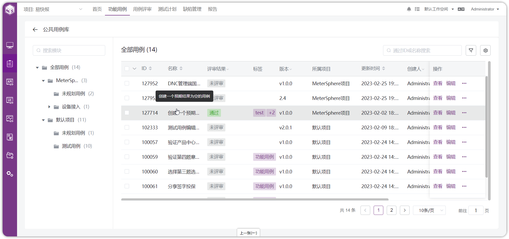
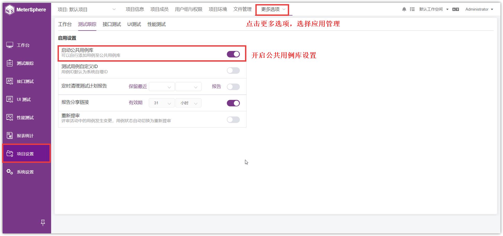

!!! ms-abstract ""
    公共用例库为同一工作空间下的不同项目均可共享使用的【公共用例】，不同项目可【添加】用例至公共用例库，和【复制】公共用例库中的用例。
{ width="900px" }

!!! ms-abstract ""
    公共用例库列表字段不展示自定义的模板字段
{ width="900px" }

## 1 启动公共用例库
!!! ms-abstract ""
    项目管理员可到【项目设置】-【更多选项】-【应用管理】页面下，开启【启动公共用例库】设置。
{ width="900px" }

## 2 添加用例至公共用例库
!!! ms-abstract ""
    点击用例【ID】或者【编辑】按钮，点击【添加到公共用例库】。
{ width="900px" }

## 3 从公共用例库中复制用例
!!! ms-abstract ""
    复制公共用例库中的用例到自己的项目模块中。
{ width="900px" }