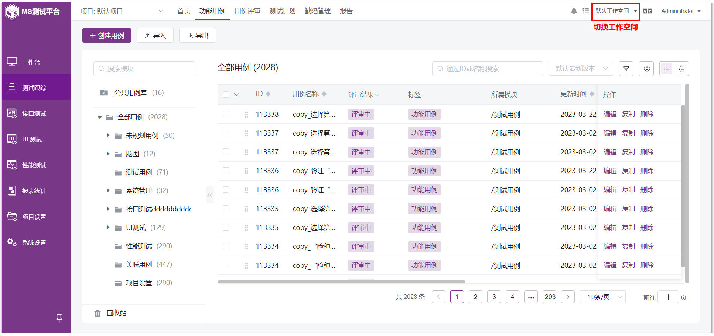

!!! ms-abstract ""
    功能用例，主要用于对功能用例进行统一管理，支持用例的快捷创建及导入导出操作。 
    进入【功能用例】界面。左上方显示当前项目，项目下方显示此项目的全部测试用例模块。所属某一项目的测试用例以模块为单位进行统一管理，页面右侧显示选定模块下的测试用例列表，支持对测试用例进行新建、查询、编辑、复制、删除等操作。
{ width="900px" }

## 1 切换工作空间
!!! ms-abstract ""
    在右上角的工作空间处切换下拉菜单中进行工作空间切换，展示所属该工作空间及对应项目下的用例列表。
{ width="900px" }

## 2 切换项目
!!! ms-abstract ""
    在模块树上方的项目切换下拉菜单中进行项目切换，展示所属该项目下的用例列表。
{ width="900px" }

!!! ms-abstract "说明"
    不同项目间模块树相互独立，当切换项目后需要重新创建模块树。