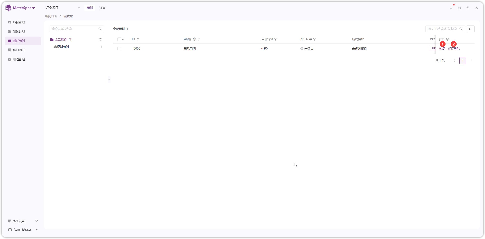

## 1 用例版本管理 (X-Pack)
平台可为不同版本系统测试的用例进行管理
{ width="900px" }

## 2 切换用例视图
目前，平台提供两种用例呈现方式，进入【测试用例】页面后，默认打开【列表】视图，点击【脑图】标签切换至脑图视图。 
{ width="900px" }

{ width="900px" }

## 3 基于列表视图新建用例
选择新建用例所属模块，点击列表左上方【创建用例】，弹出一个新的窗口展示用例详情页面进行编辑。
{ width="900px" }

在新建用例详情页面中，进一步填写用例名称、前置条件、步骤信息、添加备注、上传附件等，还可以为用例设置模块、用例等级、版本、关联需求、标签等，编辑完成后，点击【保存】将此条用例保存至列表。 
{ width="900px" }

新建用例将在用例列表中呈现，点击用例【ID】或点击此条用例后的【编辑】按钮可重新进入用例详情页面进行编辑，可关联测试用例、关联缺陷、设置依赖关系、添加评论、查看变更、创建新版本、版本对比、设置关注、添加到公共用例库、复制等操作。 
{ width="900px" }

### 3.1 为用例关联测试
新建测试用例可以和平台已有的接口测试用例、接口场景用例、性能测试用例进行关联。进入测试用例详情页面，点击【关联测试】标签，选择希望与本条用例进行关联的用例关联测试测试类型，进入该类型的用例列表进行关联。 
{ width="900px" }

以接口测试用例为例。进入接口测试用例列表，选中相关联的用例，点击【确定】完成关联。
{ width="900px" }

关联后的测试用例将在关联列表中显示，点击【取消关联】可取消关联的测试用例。
{ width="900px" }

### 3.2 为用例关联需求
新建测试用例可以和需求关联。如果关联第三方缺陷平台的话，在【用例详情】右侧，点击【关联需求】选项，下拉选框中选择希望与本条用例进行关联的第三方缺陷平台的需求。 
{ width="900px" }

### 3.3 为用例关联缺陷
新建测试用例可以和缺陷关联。点击【关联缺陷】标签，关联已有缺陷或创建新的缺陷并进行关联。 
{ width="900px" }

### 3.4 为用例创建依赖关系
- 依赖关系设置

系统支持用户，从测试的角度来设置该测试用例的前后置依赖测试用例。
点击测试用例的【依赖关系】页签
{ width="900px" }

- 依赖关系图 (X-Pack)

点击【依赖关系图】，可看到该用例的前置/后置之间的相互联系
{ width="900px" }

## 4 基于脑图视图新建用例
在用例列表页面点击【脑图】切换以脑图形式展现用例。脑图父主题为模块名称，子主题为模块下测试用例，孙主题为测试用例步骤详情或备注信息。各级主题使用标签方式区分文本内容，支持使用标签方式标记用例优先级。 
{ width="900px" }

右键主题区域触发功能键 
{ width="900px" }

!!! info "操作说明"
    1. 【收起】按钮，点击可以收起该主题下属子主题。
    2. 【上级】按钮，点击创建该主题的上级主题。
    3. 【下级】按钮，点击创建该主题的下级主题。
    4. 【同级】按钮，点击创建该主题的同级主题。
    5. 【后移】按钮，点击将该主题移入其下级主题。
    6. 【前移】按钮，点击将该主题移入其上级主题。
    7. 【删除】按钮，点击删除该主题。
    8. 【导出】操作，支持导出全部模块及视图内全部已展开的用例。支持导出为 json、png、svg、txt、md、mm 等格式的文件。
    9. 【优先级/标签】操作，支持为该主题添加优先级及文本标签。

## 5 批量操作
具体操作请参考 [通用功能->批量操作](../../../general/#4)。
在列表对用例进行勾选，点击【…】按钮，可以对多条用例进行批量操作，包括批量编辑、批量移动、批量复制、批量删除、批量关联需求、生成依赖关系 (X-Pack)、批量添加到公共用例库 (X-Pack) 等操作。
{ width="900px" }

## 6 导入用例
点击左上方【导入】按钮，在下拉菜单中选择【从Excel表格导入测试用例】或【从思维导图导入测试用例】。
{ width="900px" }

可先下载模板，下载的模板中会出现自定义的字段，填写内容后，进行上传。自定义字段也正常展示到页面中。
{ width="900px" }

!!! info "操作说明"
    1.【导入新建】，导入的用例自动保存为新用例。
    2.【导入更新】，导入的用例自动覆盖已有用例。

## 7 导出用例
点击左上方【导出】按钮，在下拉菜单选择【导出Excel表格】或【导出思维导图】文件，导出 Excel 表格时可选择基础字段、自定义字段、其他字段等，左上方【导出】默认导出全部用例。
{ width="900px" }

导出部分用例需点击列表下方更多操作【...】按钮。
{ width="900px" }

## 8 回收站
所有被删除的测试用例都会放在回收站里保存。
{ width="900px" }

在回收站里可进行【恢复】和【彻底删除】操作。
{ width="900px" }

## 9 查看变更记录
在测试用例详情页面最右侧菜单【变更记录】下，可以查看此用例所有的变更详情。
{ width="900px" }

## 10 版本管理
点击用例详情左上方，【XX版本】可进行用例版本切换、不同版本用例创建、删除版本用例、版本对比等功能。
{ width="900px" }
