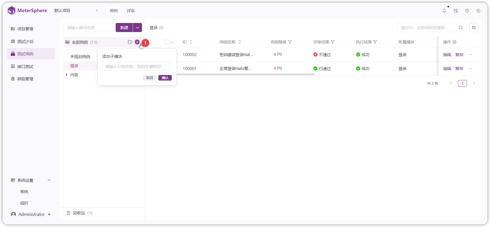

!!! ms-abstract ""
    功能用例提供模块功能，可根据不同的功能设置不同的模块，并可根据各功能依赖关系设置子模块。点击页面左侧【全部用例】，点击【添加子模块】，填写模块名称，即可完成用例模块添加。 
{ width="900px" }

## 1 创建子模块
!!! ms-abstract ""
    选中模块树列表【全部用例】，点击【+】号按钮在模块总目录下创建子模块。选中任意上级模块即可在该模块下创建次级模块，模块树支持最多 8 层的树状结构。 
{ width="900px" }

## 2 模块操作
{ width="900px" }

!!! ms-abstract "操作说明"

    - 【重命名】按钮，鼠标悬停在要操作的模块时出现，点击可以重命名该模块。
    - 【添加子模块】按钮，鼠标悬停在要操作的模块时出现，点击可以在该模块下添加子模块。
    - 【删除】按钮，鼠标悬停在要操作的模块时出现，点击将删除该模块和其所有子模块。删除某个模块不仅会删除该模块及其所有子模块，被删除模块中的接口及接口用例也将被移入回收站中，请谨慎使用该功能。
    - 【展开/收起】操作，当模块下存在子模块时出现，点击【展开/收起】该模块下的所有子模块。

!!! ms-abstract ""
    模块树还支持鼠标拖拽操作，用户可以根据需求调整模块顺序及其层级关系。
{ width="900px" }