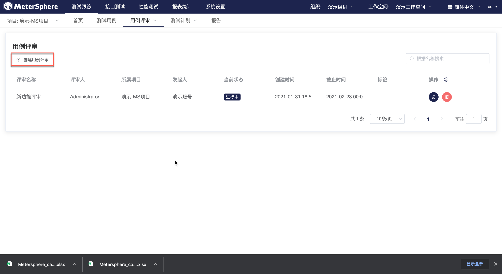
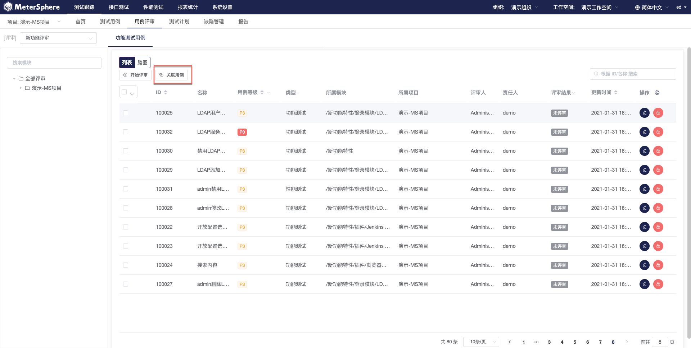
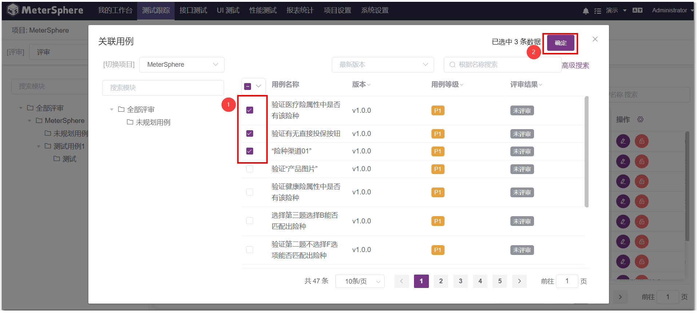
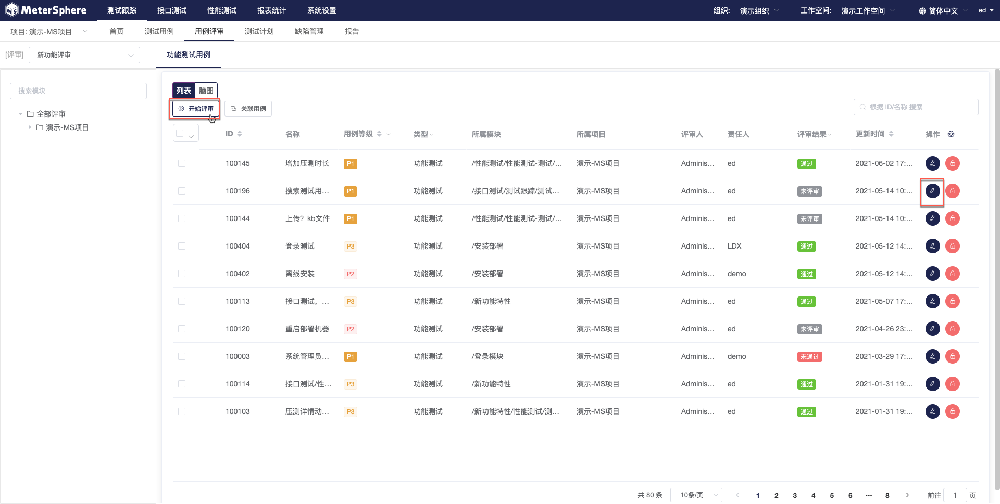
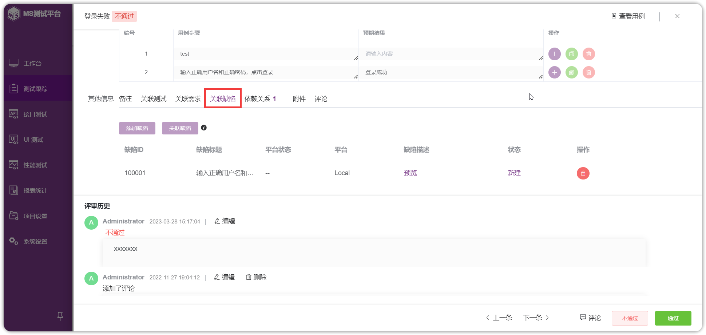
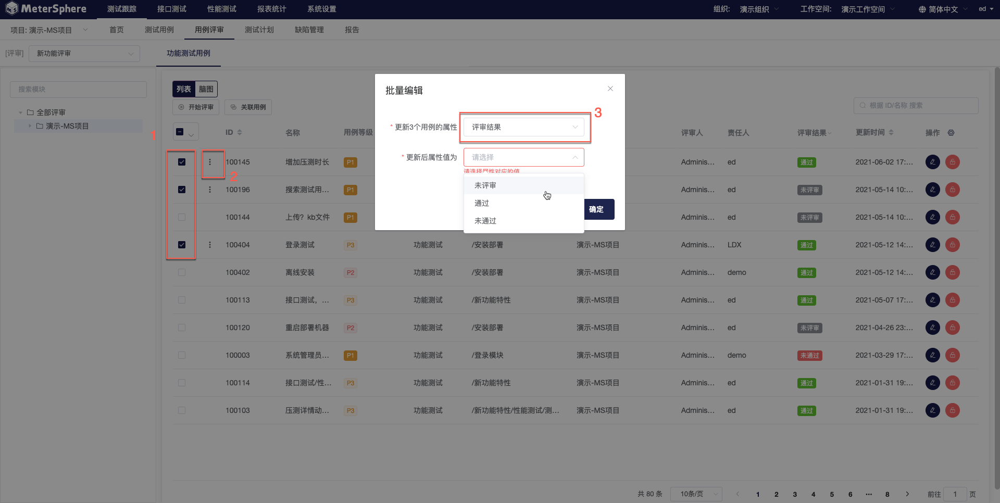

## 创建用例评审任务

进入用例评审主页，此页面展示所选项目下全部评审任务。点击`创建用例评审`创建新的评审任务。

在弹出页面中编辑评审任务基础信息，点击`确认`保存至评审任务列表，用户可以在用例评审主页点击选定评审任务的`编辑`按钮重新进入编辑窗口。在任务创建页面，点击`规划&执行`将直接进入评审任务执行主页。

在评审任务执行主页，点击右侧列表上方的 `关联用例` 按钮为评审任务关联用例。

在弹出的用例选择列表中，选择要添加到此次用例评审任务中的测试用例，点击`确认`完成添加。

### 基于列表视图评审用例

为评审任务添加完用例后，点击`开始评审`按钮进入用例详情页，默认从任务列表的第一条用例面实施评审，用户也可以点击任意一条用例的`编辑`按钮，从该条用例开始实施评审。

进入用例评审详情页面，使用`翻页`按钮快速切换用例，使用标签快捷标注用例评审结果，标注后的评审结果将会在用例列表中显示。同时支持用户为此次评审发表评论。

#### 为用例关联缺陷 

用户可以为未通过评审的用例添加新建缺陷或关联已有缺陷。

#### 批量更改评审结果 

当多个用例的评审结果相同或发生相同变更，可以选中相应用例，进入`批量编辑`弹窗，对评审结果进行统一编辑。

###基于脑图视图评审用例

除了通过列表及表单方式评审用例外，用户还可以通过脑图方式实现此功能。在用例列表页面点击 `脑图` 切换到脑图展示模式，选中待评审用例，通过添加标签的方式来标记用例评审结果。
