!!! ms-abstract ""
    用例评审支持创建评审，关联及取消关联测试用例，在线评审并反馈评审是否通过及评审具体意见建议。 
    点击【用例评审】可查看当前项目中所有的测试用例评审。
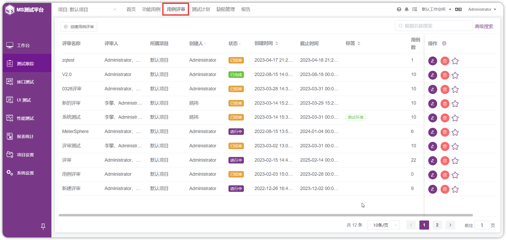

!!! ms-abstract ""
    进入测试用例评审详情页时，系统提供了两种用例显示模式：列表和脑图。
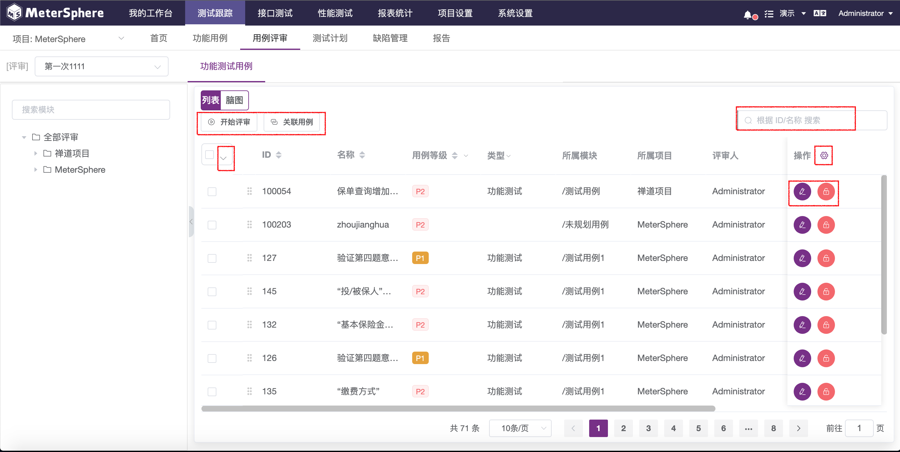

!!! ms-abstract ""
    同时可创建、编辑、删除、开启用例评审、查询等等相关操作。
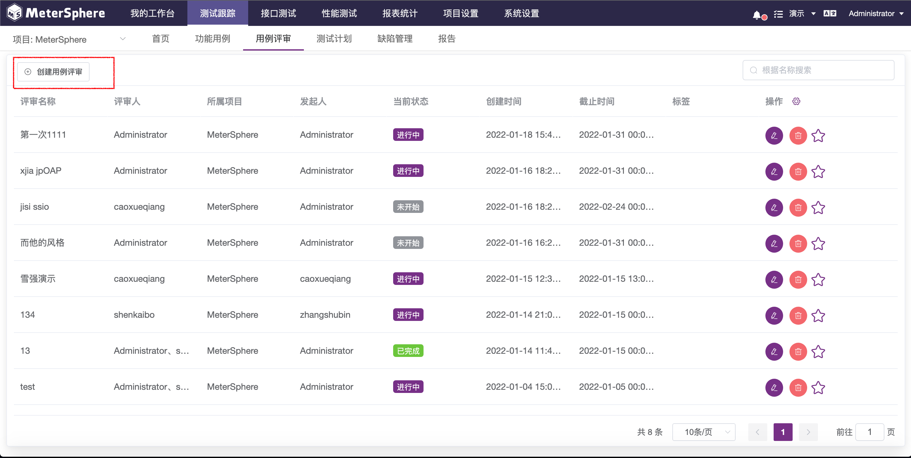

## 1 创建用例评审任务

!!! ms-abstract ""
    点击【创建用例评审】按钮，创建一个用例评审。

!!! ms-abstract "评审通过标准"

    - 【全部通过】：所有评审人都通过才通过。 
    - 【单人通过】：任意评审人通过则通过。

!!! ms-abstract ""
    在评审任务执行主页，点击右侧列表上方的【关联用例】按钮为评审任务关联用例。

!!! ms-abstract ""
    在弹出的用例选择列表中，选择要添加到此次用例评审任务中的测试用例，点击【确定】完成添加。

## 2 编辑评审
!!! ms-abstract ""
    在测试用例评审记录中，鼠标点击某条记录，或点击【编辑】按钮，进入该评审记录的维护信息页面。
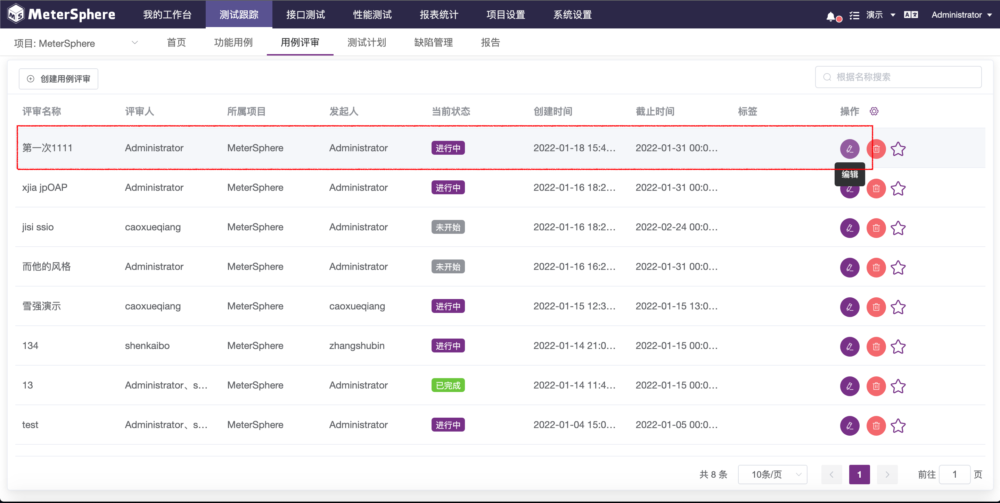

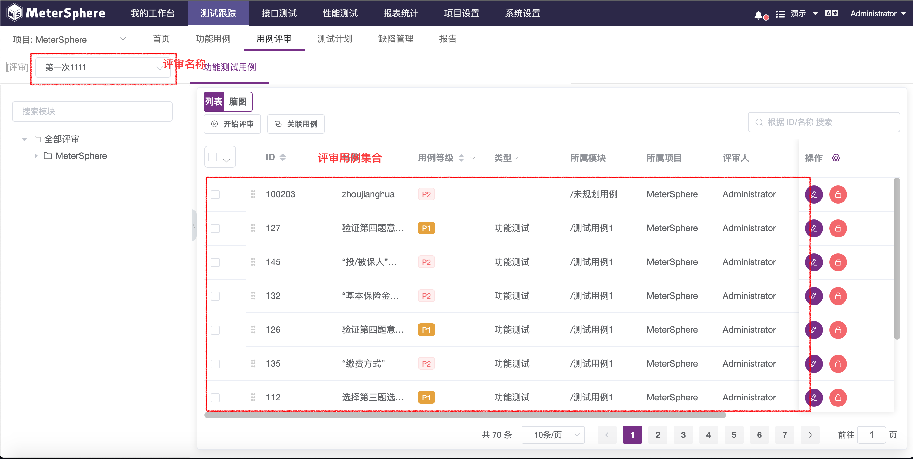

### 2.1 关联用例
!!! ms-abstract ""
    点击【关联用例】，可将需要评审的测试用例进行关联，这是开启评审测试用例的前提。

!!! ms-abstract ""
    同时系统支持跨项目关联测试用例。
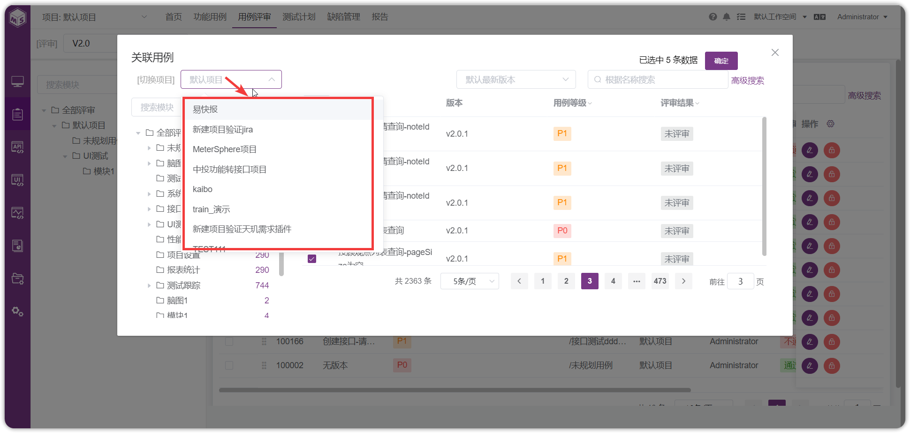

!!! ms-abstract ""
    选择需评审的测试用例后，点击【确定】即可完成测试用例的关联。

### 2.2 取消关联
!!! ms-abstract ""
    点击功能测试用例列表的【取消用例关联】按钮，可以取消该用例与用例评审的关联，取消后，该用例在用例列表中消失。当有多条的用例需要取消关联时，可以去勾选相关的用例，点击【批量取消关联】按钮，一次性对多条用例取消关联。
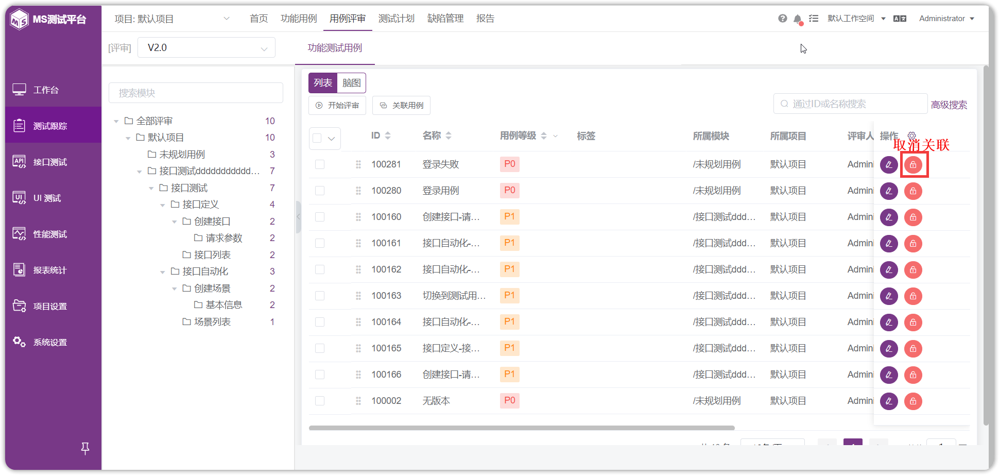

## 3 开始评审
!!! ms-abstract ""
    测试用例评审分为两种模式，一种是以列表模式进行评审；第二种方式是以脑图模式进行评审。

### 3.1 列表模式评审
!!! ms-abstract ""
    为评审任务添加完用例后，点击【开始评审】按钮进入用例详情页，默认从任务列表的第一条用例面实施评审，用户也可以点击任意一条用例的【编辑】按钮，从该条用例开始实施评审。

!!! ms-abstract ""
    进入用例评审详情页面，使用【翻页】按钮快速切换用例，使用标签快捷标注用例评审结果，标注后的评审结果将会在用例列表中显示。同时支持用户为此次评审发表评论。

!!! ms-abstract ""

    - 查看用例关联缺陷
    用户可以查看评审用例关联的缺陷。

!!! ms-abstract ""

    - 批量更改评审结果
    当多个用例的评审结果相同或发生相同变更，可以选中相应用例，进入【批量编辑】弹窗，对评审结果进行统一编辑。

### 3.2 指定用例评审
!!! ms-abstract ""
    如果不是从头开始做测试用例评审，可以用鼠标点击具体的某个测试用例，或者点击【编辑】，进入指定测试用例的评审。

### 3.3 脑图模式评审用例
!!! ms-abstract ""
    除了通过列表及表单方式评审用例外，用户还可以通过脑图方式实现此功能。在用例列表页面点击【脑图】切换到脑图展示模式，选中待评审用例，通过添加标签的方式来标记用例评审结果。

## 4 重新提审
!!! ms-abstract ""
    当评审活动中的用例发生内容变更后，用例状态会自动切换为【重新提审】状态。
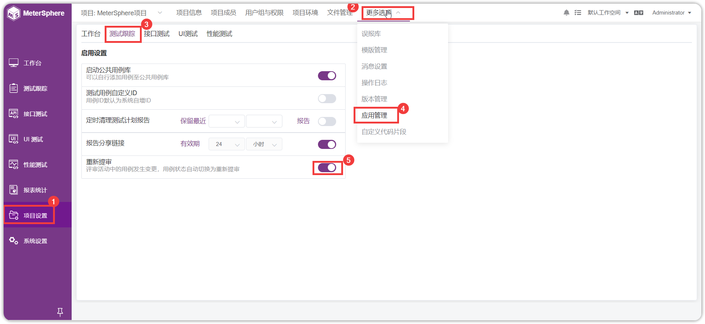

!!! ms-abstract ""
    评审人可快速检索出需要重新评审的用例。评审列表中还支持手动更新为【重新提审】状态。
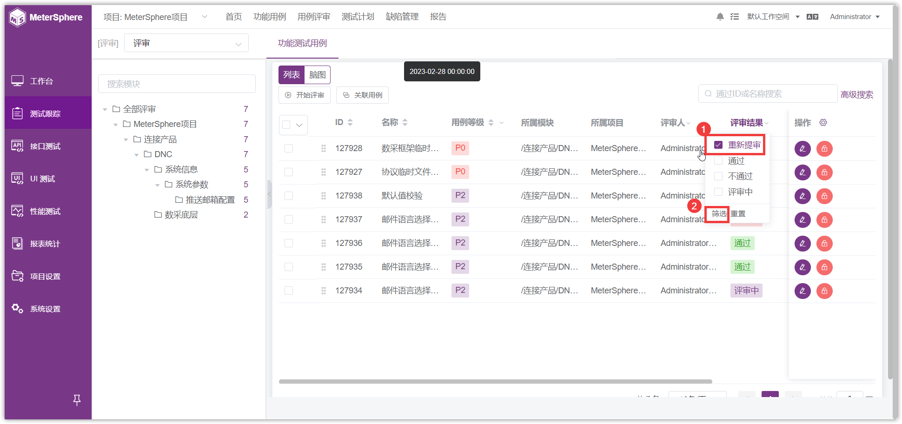

!!! ms-abstract "开启重新提审"
    【重新提审】流程需要在【应用管理】->【测试跟踪】选项卡中开启【重新提审】开关。

## 5 批量操作
!!! ms-abstract ""
    功能详细介绍及使用说明参考 [通用功能->表头功能](../../general/#_8)。勾选或全选所有用例，点击【…】按钮，可对其做批量的编辑和取消等相关操作。
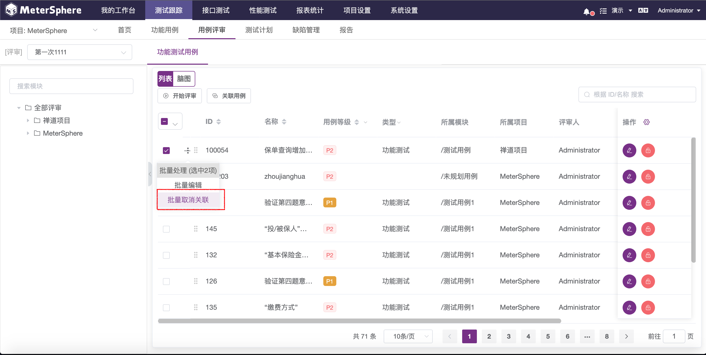

### 5.1 批量编辑 
!!! ms-abstract ""
    当有很多用例的评审结果相同，可以去勾选对应的用例，进入到批量编辑弹窗，点击【批量编辑】，对评审结果做统一的编辑。
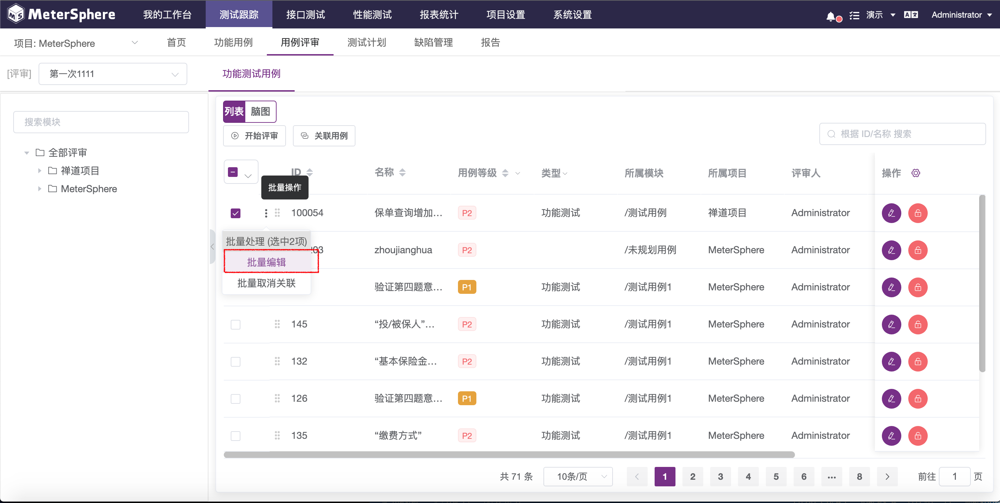

### 5.2 批量取消关联
!!! ms-abstract ""
    取消关联的目的就是该评审中不包含此测试用例，仅仅是修改了评审用例的范围，对测试用例没有任何修改和影响。 
    选择【批量取消关联】，可以一次性设置此次评审不包含多条指定的测试用例。
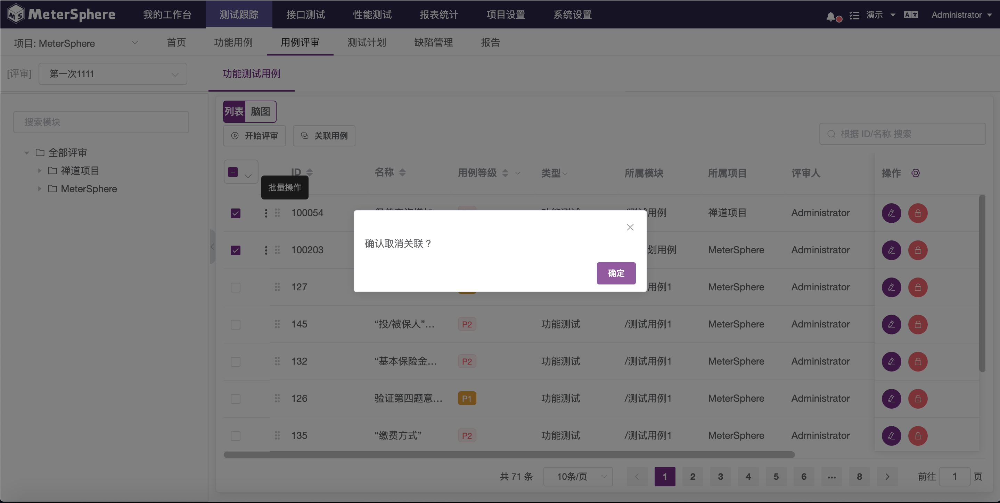

