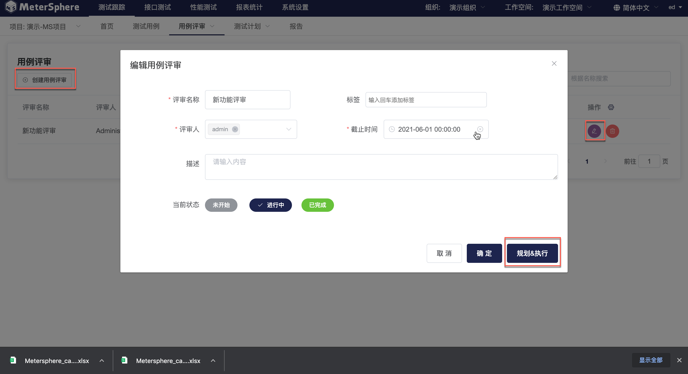

## 创建用例评审任务

进入用例评审首页，此页面展示所选项目下全部评审任务。点击`创建用例评审`创建新的评审任务。

在弹出页面中编辑评审任务基础信息。或在用例评审首页点击某一评审任务的`编辑`按钮进入编辑窗口。点击`规划&执行`进入评审任务执行主页。

在评审任务执行主页，点击右侧列表上方的 `关联用例` 按钮，在弹出的用例选择列表中选择要添加到此次用例评审任务中的测试用例。

## 评审测试用例

- 表单方式评审用例

关联测试用例后，即可在用例评审页面右侧的测试用例列表中查看到已关联的测试用例。点击某个测试用例操作列中的编辑按钮，进入用例详情页面。

在用例详情页面右侧输入并发送针对此条测试用例的评论。基于评审结果，点击 `通过` 或 `未通过` 的状态按钮为本条用例标记评审状态。

- 脑图方式评审用例

除了通过列表及表单方式评审用例外，还可以通过脑图方式实现此功能。在用例列表页面点击 `脑图` 切换到脑图展示模式，选中待评审用例，通过添加标签的方式来标记用例评审结果。
