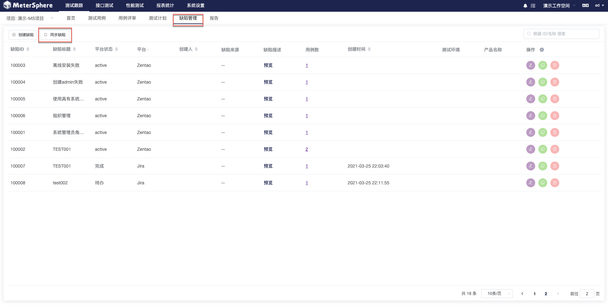
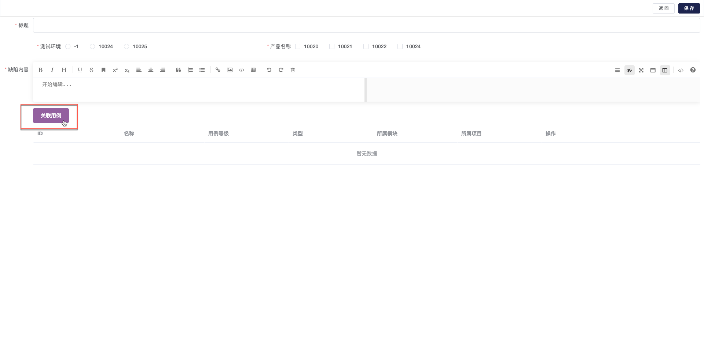

缺陷管理用于管理该项目下所有的缺陷信息，如果项目已关联其他第三方 BUG 平台，则 MeterSphere 平台上的BUG 状态会自动同步到关联平台。

## 创建缺陷

进入 `缺陷管理` 主页，列表显示该项目下的全部缺陷。用例数`一栏下的数字显示本条缺陷关联的用例，点击进入关联用例列表。

#### 为缺陷关联用例 		

点击`创建缺陷`进入缺陷详情页面，编辑缺陷基础信息即可保存至缺陷列表。用户也可以在此直接为缺陷关联用例。

