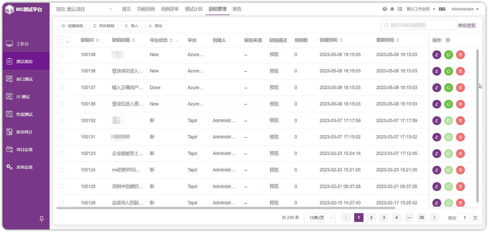
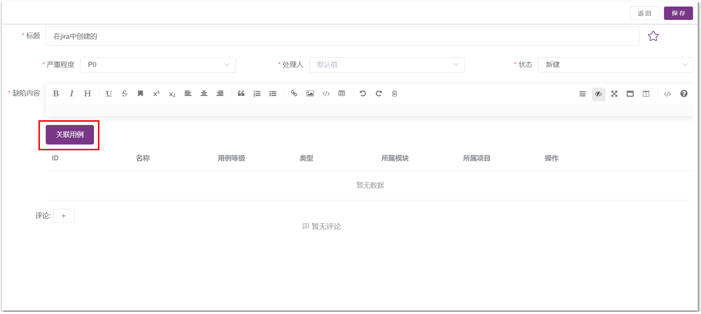
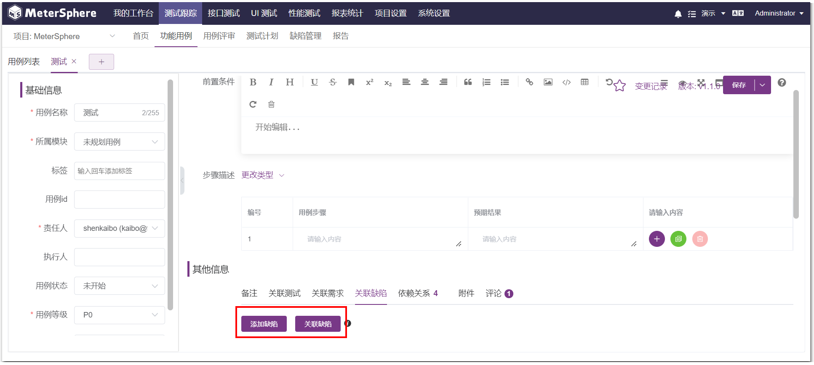
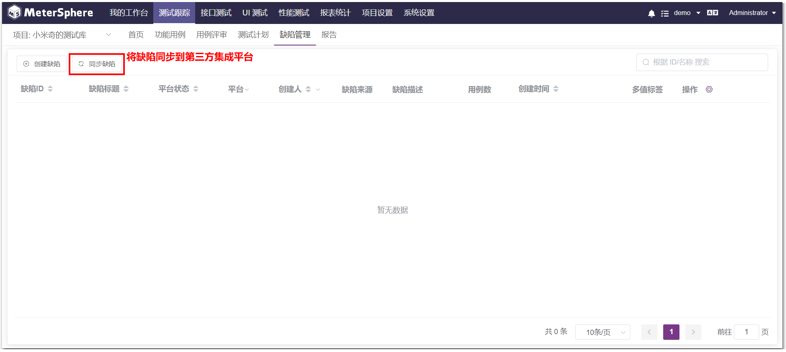

缺陷管理用于管理该项目下所有的缺陷信息，如果项目已关联其他第三方缺陷管理平台，则 MeterSphere 平台上的 Bug 状态会自动同步到关联平台。

## 缺陷管理
此缺陷管理是管理该项目下所有的缺陷信息，如果项目设置了和其他BUG平台（比如Jira、TAPD、禅道等）关联，则此 Bug 会自动同步到相应的平台。

### 缺陷列表功能
功能详细介绍及使用说明见 [通用功能->表头功能](../../general/#_8)。
	
### 创建缺陷
点击左上角的“创建缺陷”，可以在此创建缺陷，但在此创建的缺陷需要手动关联测试用例。

也可以在测试用例执行中创建缺陷或关联缺陷。

### 同步缺陷 (X-Pack)
点击左上角的“同步缺陷”，即可将缺陷同步到第三方集成平台
