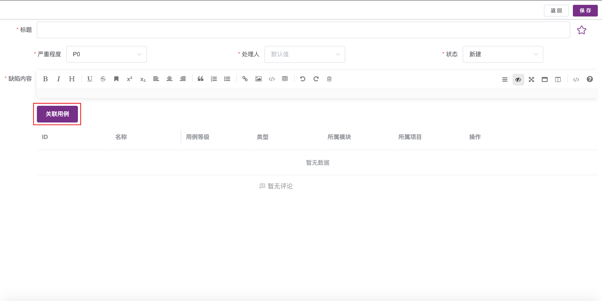

!!! ms-abstract ""
    缺陷管理用于管理该项目下所有的缺陷信息，如果项目已关联其他第三方缺陷管理平台，则 MeterSphere 平台上的 Bug 状态会自动同步到关联平台。 
    此缺陷管理是管理该项目下所有的缺陷信息，如果项目设置了和其他BUG平台（比如 Jira、TAPD、禅道等）关联，则此 Bug 会自动同步到相应的平台。
{ width="900px" }

## 1 创建缺陷
!!! ms-abstract ""
    点击左上角的【创建缺陷】，可以在此创建缺陷，但在此创建的缺陷需要手动关联测试用例。
{ width="900px" }

!!! ms-abstract ""
    也可以在测试用例执行中创建缺陷或关联缺陷。
{ width="900px" }

## 2 同步缺陷 (X-Pack)
!!! ms-abstract ""
    点击左上角的【同步缺陷】，即可将缺陷同步到第三方集成平台，第三方集成平台的缺陷也会同步到 MeterSphere 中。
{ width="900px" }

## 3 导入缺陷
!!! ms-abstract ""
    点击页面的【导入】按钮，下载导入缺陷模板，按照缺陷模板的规则进行填写，选择覆盖或者不覆盖进行上传即可。  
{ width="900px" }

## 4 导出缺陷
!!! ms-abstract ""
    选择缺陷，点击页面的【导出】按钮，勾选导出字段，点击【确定】按钮即可。  
{ width="900px" }
