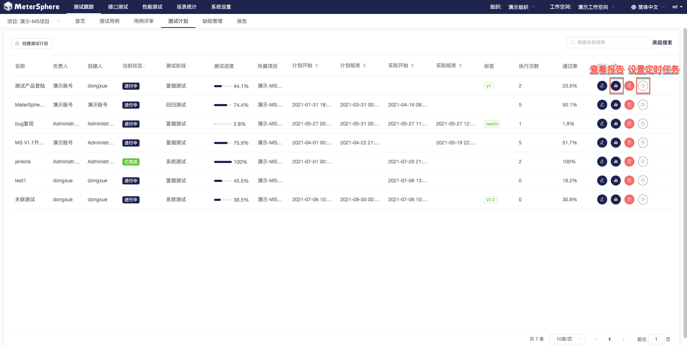
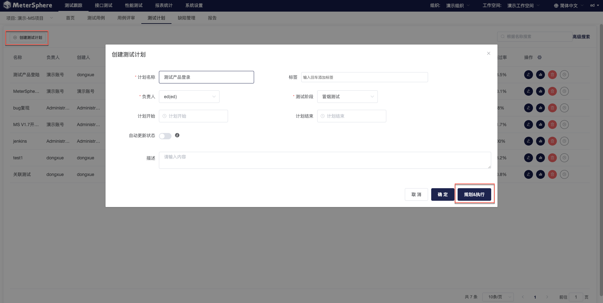
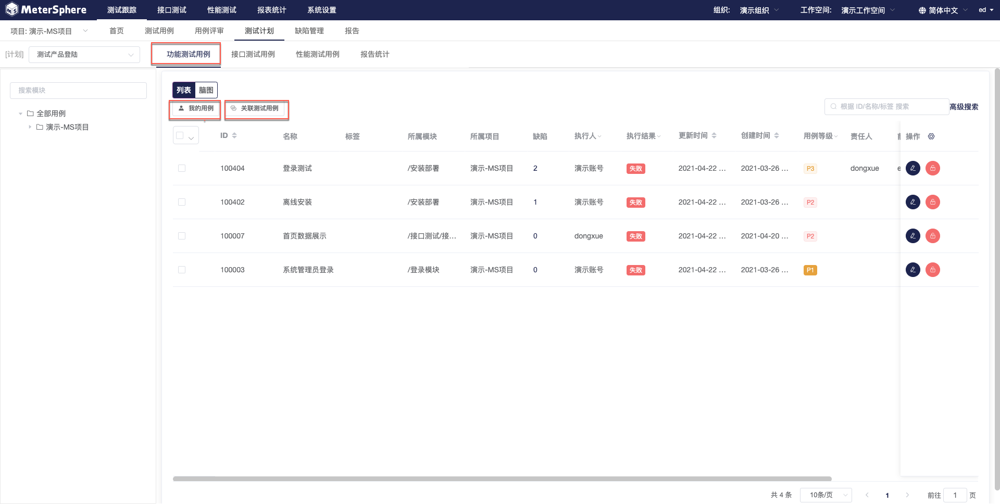
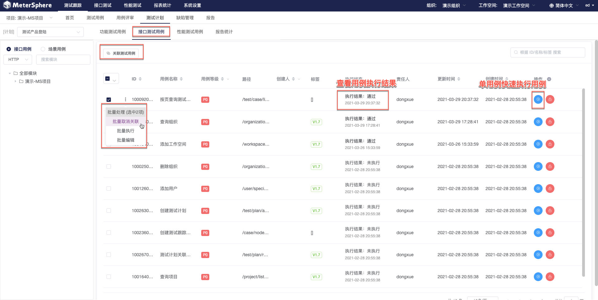
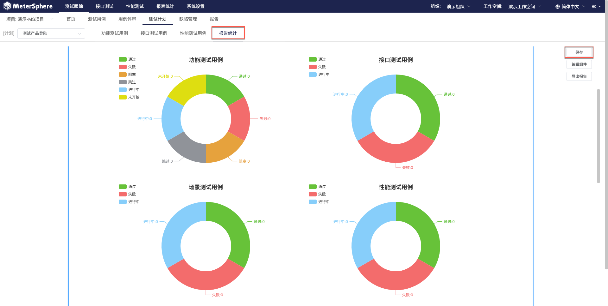
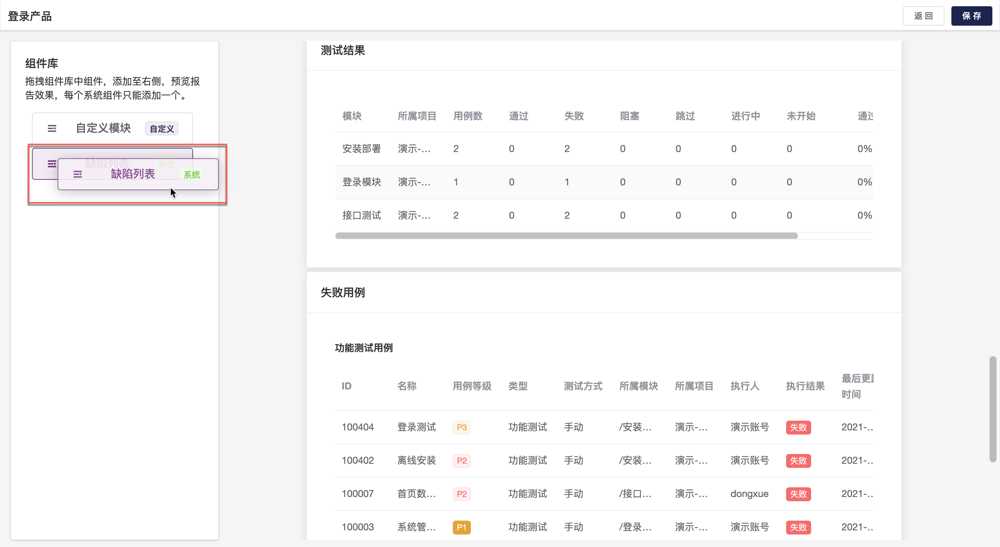

测试计划属于某个项目，并可关联该项目下的测试用例。测试计划用于将测试各环节不同类型的测试任务添加到一个测试计划中，包括功能测试、接口测试和性能测试等，支持实时展示各测试环节的进度及测试情况，并实时生成测试报告。

## 新建测试计划

计入测试计划主页，显示该项目下全部测试计划，支持编辑测试计划、删除测试计划、查看测试计划报告、为测试计划设置定时任务等操作。

点击测试计划列表上方的 `创建测试计划` 按钮，在弹出页面中编辑测试计划的基础信息，点击`确认`保存至测试计划列表，用户可以在测试计划主页点击选定计划的`编辑`按钮重新进入编辑窗口。在计划创建页面，点击`规划&执行`将直接进入测试计划执行主页。

####  为测试计划关联功能用例 	

进入测试计划执行主页，默认打开功能测试用例标签。点击`关联测试用例`支持为测试计划关联功能用例，同时支持用户快速切换`我的用例`或`全部用例`列表。

- 基于列表视图记录计划执行结果

功能测试用关联完成后，点击任意功能测试用例的`编辑`按钮，进入用例详情页面。在执行步骤中，填写每一步的实际结果及该步的执行结果，基于各步骤执行情况及评定标准，点击上方的状态按钮为此条用例标记执行状态。

- 基于脑图视图记录计划执行结果

与用例的创建和评审类似，用例执行结果同样可以通过脑图方式记录。在用例列表页面点击 `脑图` 切换到脑图展示模式，选中待执行用例，通过添加标签的方式来标记用例执行结果。

#### 为测试计划关联接口用例 		

切换至`接口测试用例`标签视图，支持用户为测试计划关联接口测试用例。用户可以在该页面发起单用例的快速执行、查看单用例执行结果，同时支持批量取消关联、批量执行等操作，目前平台支持以并行或串行方式批量执行接口测试用例。此外，用户还可以通过批量编辑快捷更改接口用例运行环境。

#### 为测试计划关联性能用例 		

切换至`性能测试用例`标签视图，支持用户为测试计划关联性能测试用例。用户可以在该页面发起单用例的快速执行、查看单用例执行结果，同时支持批量取消关联、批量执行等操作。目前，平台支持以并行或串行方式批量执行性能测试用例。

#### 查看测试计划执行报告统计 		

切换至`报告统计`标签视图查看本次计划的执行统计，支持分类型、分模块统计用例执行结果，展示失败用例及缺陷用例列表等。点击`保存`将本次计划执行报告存入测试跟踪报告中心，同时支持导出 PDF 格式报告。

点击`编辑组建`按钮进入报告组建编辑页面，支持从左侧组件库拖拽，自定义测试报告内容。

