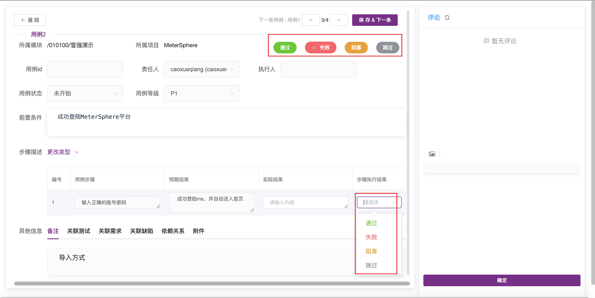

测试计划属于某个项目，并可关联该项目下的测试用例；该页面功能包括测试计划的添加、修改、删除操作；点击某行，跳转至对应计划详情页面。

## 新建测试计划

点击测试计划列表上方的 `创建测试计划` 按钮，输入此次测试计划的名称、负责人等信息后，点击 `确定` 按钮完成测试计划创建。

- 在测试计划中添加测试用例

点击测试计划列表中新创建的测试计划，进入测试计划详情页面。该页面可关联对应项目的下的测试用例，点击用例列表上方标签栏可以切换查看本次计划中不同类型的测试用例。

关联后的用例是测试执行的基本单位。该页面管理了测试用例执行的生命周期，支持测试用例的创建、修改、删除、批量执行、批量变更执行人、创建测试报告等操作。

点击右侧列表上方的 `关联测试用例` 按钮，在弹出的用例选择列表中选择要添加到此次测试计划中的测试用例。可以通过搜索框及高级搜索功能进一步筛选特定的测试用例进行添加。

## 纪录测试计划执行结果

- 表单方式记录用例执行结果

关联测试用例后，即可在测试计划页面右侧的测试用例列表中查看到已关联的测试用例。点击某个测试用例操作列中的编辑按钮，进入用例详情页面。
在执行步骤中，填写每一步的实际结果及该步的执行结果，基于各步骤执行情况及评定标准，点击上方的状态按钮为此条用例标记执行状态。

- 脑图方式记录用例执行结果

与用例的创建和评审类似，用例执行结果同样可以通过脑图方式记录。在用例列表页面点击 `脑图` 切换到脑图展示模式，选中待执行用例，通过添加标签的方式来标记用例执行结果。
