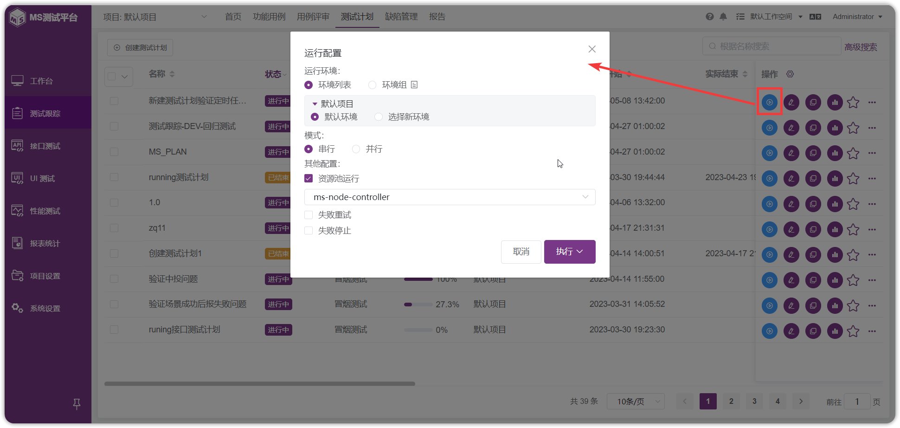

!!! ms-abstract ""
    测试计划属于某个项目，并可关联该项目下的测试用例。测试计划用于将测试各环节不同类型的测试任务添加到一个测试计划中，包括功能测试、接口测试和性能测试等，支持实时展示各测试环节的进度及测试情况，并实时生成测试报告。 
    测试计划可将测试各环节加入到一个测试计划中，包括功能测试、接口测试和性能测试等，能实时展示各测试环节的进度及测试情况，并实时生成测试报告。 
    点击【测试跟踪】,点击【项目】，点击测试计划，可查看当前项目中的测试计划。
{ width="900px" }

## 1 计划列表操作
!!! ms-abstract ""
    在测试计划列表信息页，鼠标点击某个计划，进入计划详情页面。
{ width="900px" } 

!!! ms-abstract ""
    点击【执行】按钮，选择和勾选运行测试计划的相关配置后，点击【执行】即可。默认环境为用例首次关联进测试计划所选择的用例，选择新环境后可选择执行和保存，保存后新选择的环境为默认环境，点击执行不会修改默认环境，默认环境多用于定时任务、API调用及流水线触发执行。 
{ width="900px" }

!!! ms-abstract ""
    可以管理和维护本次计划测试的范围：功能测试用例、接口测试用例、场景测试用例、性能测试用例等。
{ width="900px" } 

## 2 测试报告查看
!!! ms-abstract ""
    计划执行后，可以点击【查看测试报告】。
{ width="900px" } 

{ width="900px" }

!!! ms-abstract ""
    报告详细解读见 [测试跟踪->报告](../../test_report/)。