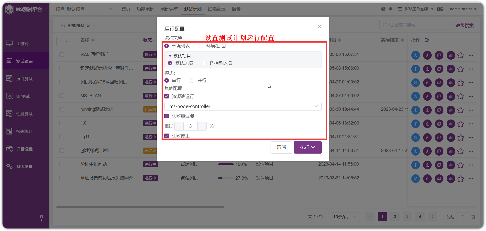
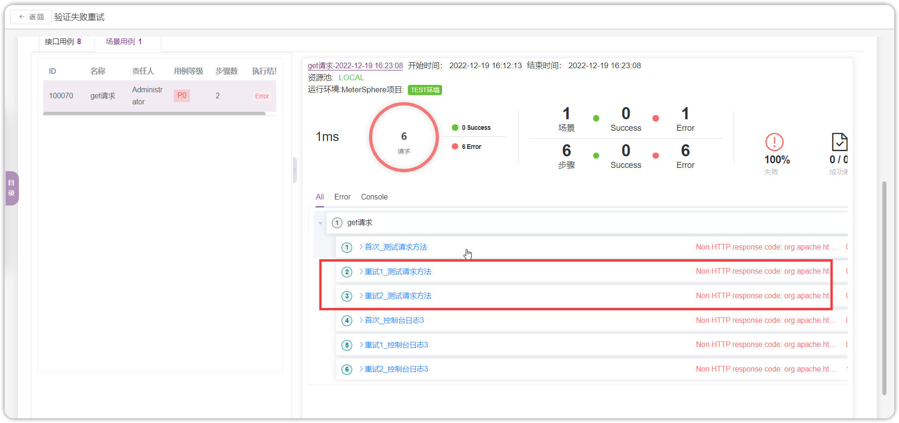
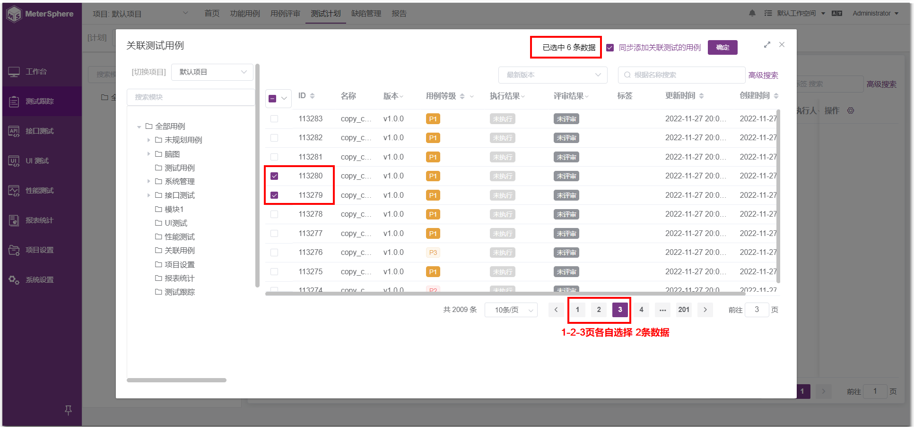
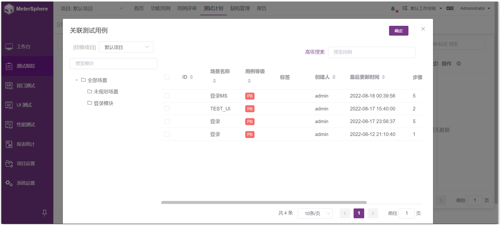
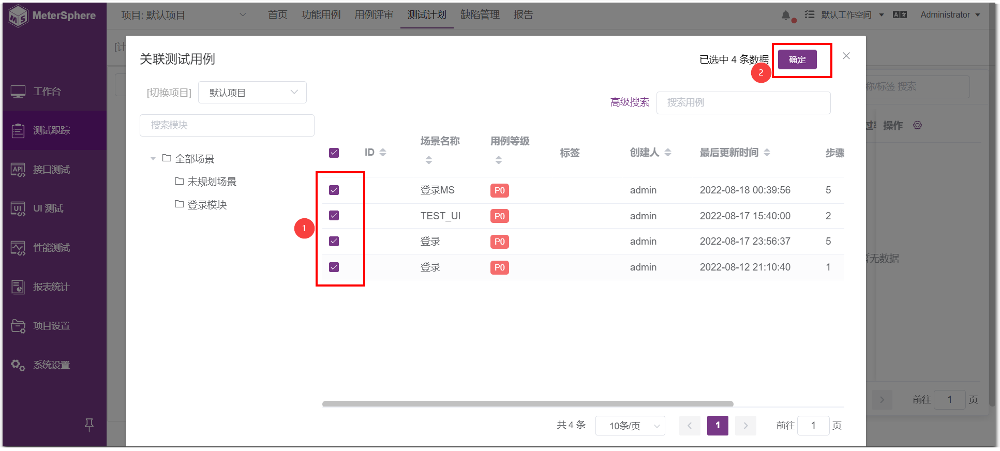
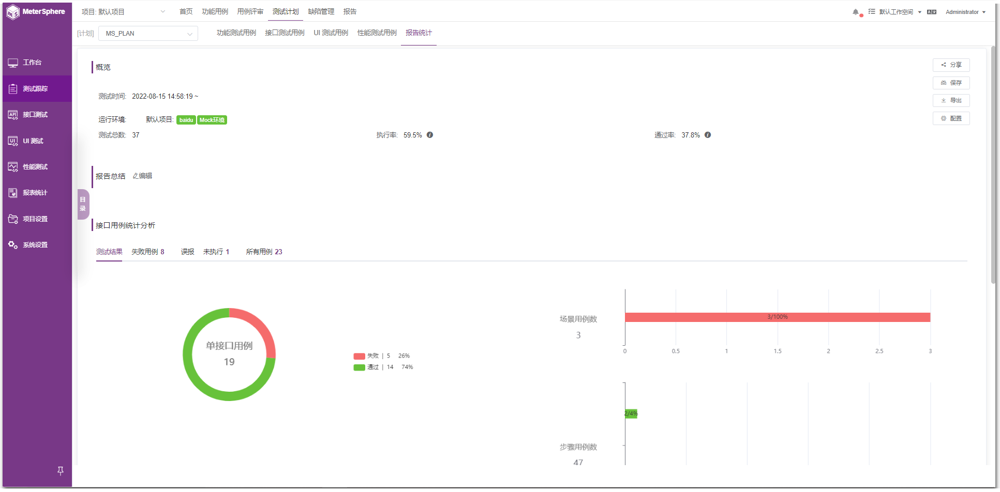
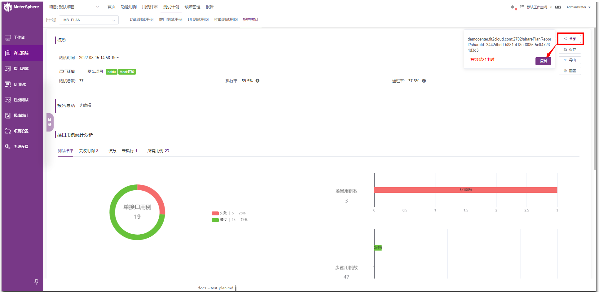
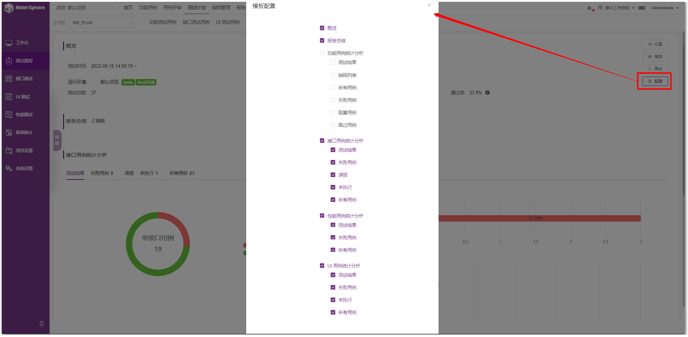
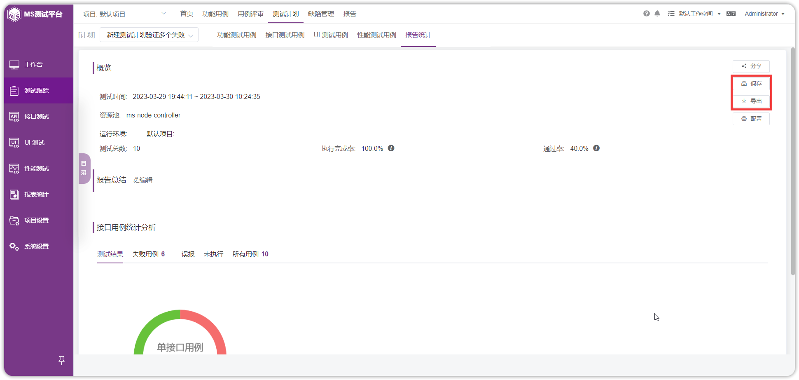

## 1 创建测试计划

!!! info "点击【创建测试计划】，即可进入创建测试计划页面，页面内容包括："
    1. 计划名称、负责人、测试阶段等等必填信息
    2. 标签、计划开始/结束时间、备注等等信息
    3. 自动更新状态开关 等选择信息
    
 

- 点击【确定】完成创建测试计划，并且页面跳转到测试计划列表信息页面，可在测试计划列表中查看到创建的测试计划。
- 点击【规划&执行】完成创建测试计划，并且页面跳转到测试计划内容维护界面，可直接添加本次计划的测试范围和测试内容。

 

## 2 执行测试计划
点击用例列表【执行】设置运行环境、执行模式、资源池、失败重试、失败停止等功能，可以进行【保存】、【保存并执行】、【执行】操作。
 

!!! info "执行操作"
    1. 保存：只保存当前设置的默认环境及运行配置，不触发执行。
    2. 保存并执行：保存当前设置的默认环境及运行配置并触发执行。
    3. 执行：不修改当前默认环境及运行配置，直接触发执行。
    改配置操作会影响【定时任务】、【流水线调用】、【API调用】，请慎重修改。

## 3 失败重试 
!!! info "失败重试"
    1. 测试计划中的用例执行失败后，支持根据设定的重试次数再次发起执行，测试报告会完整记录接口首次运行以及最后10次运行的响应结果，供用户进行对比分析。
 

## 4 维护测试计划 
在测试计划列表信息列表，点击某条计划，可以对测试计划详情进行维护；
 

添加本次计划测试的范围：功能测试用例、接口测试用例、场景测试用例、性能测试用例等；
 

- 点击【报告】按钮，可以查看测试计划的报告；
- 点击【执行】按钮，可以执行测试计划；
- 点击【...】按钮，在下拉操作菜单中，点击【删除】按钮，可以对测试计划进行删除；点击【定时任务】按钮，可以设置一个指定的执行时间；
- 点击【复制】按钮，可克隆原计划生成新的计划，同时可对此新计划进行正常的维护和操作。

 

点击【编辑】，修改测试计划的相关信息和当前状态；
 

!!! info "当前状态说明："
    1. 已完成：表示计划中所有的测试用例都通过了。
    2. 已结束：表示计划中执行结果有失败的，但是都执行完了。
    
!!! info "备注："
    此状态可由系统自动更新，也可以手动维护，手动改状态只是改测试计划的状态，里面的用例状态不会判断，也不会修改。

## 5 关联测试用例 
关联测试用例支持记住跨页选择的记录，再一并导入。

### 5.1 关联功能测试用例	
进入测试计划执行主页，默认打开功能测试用例标签。点击【关联测试用例】支持为测试计划关联功能用例，同时支持用户快速切换【我的用例】或【全部用例】列表。 

- 基于列表视图记录计划执行结果

功能测试用关联完成后，点击任意功能测试用例的【编辑】按钮，进入用例详情页面。在执行步骤中，填写每一步的实际结果及该步的执行结果，基于各步骤执行情况及评定标准，点击上方的状态按钮为此条用例标记执行状态。 

- 基于脑图视图记录计划执行结果

与用例的创建和评审类似，用例执行结果同样可以通过脑图方式记录。在用例列表页面点击【脑图】切换到脑图展示模式，选中待执行用例，通过添加标签的方式来标记用例执行结果。 

### 5.2 关联接口测试用例	
点击【接口测试用例】,点击【接口用例】和【场景用例】，可进入不同类型接口用例的关联列表。

点击【关联测试用例】，进入关联接口用例页面，同时此也支持跨项目的接口测试用例和场景用例的引用。
勾选需要关联的测试用例后，同时需要选择运行环境，点击【确定】即可完成接口用例的关联操作。

关联接口测试用例后，在测试用例列表中可点击【执行】，执行接口测试，执行完成后可点击【查看测试报告】查看测试结果。

### 5.3 关联 UI 测试用例 (X-Pack)		
切换至【UI测试用例】标签视图，进入 UI 测试用例关联页面，点击【关联测试用例】按钮。

勾选要关联的 UI 测试用例，点击【确定】按钮即可。

可看到 UI 测试用例页面，列表展示已经关联的用例

### 5.4 关联性能测试用例
切换至【性能测试用例】标签视图，支持用户为测试计划关联性能测试用例。用户可以在该页面发起单用例的快速执行、查看单用例执行结果，同时支持批量取消关联、批量执行等操作。目前，平台支持以并行或串行方式批量执行性能测试用例。 

### 5.5 报告统计 
切换至【报告统计】标签视图，可看到该测试计划的具体报告内容 

可自定义编写测试报告总结内容  

点击【分享】按钮，可复制该测试报告链接进行分享 

点击【配置】按钮，可自定义配置报告内容 

可保存当前测试报告，也可导出当前测试报告，导出的格式为 HTML 格式 

可切换不同测试计划查看报告统计，点击左侧目录，可查看报告统计目录 
