!!! ms-abstract ""
    对测试计划、接口测试、性能测试等，系统都支持提供实时的测试报告，支持分享、导出测试报告（html格式）等。
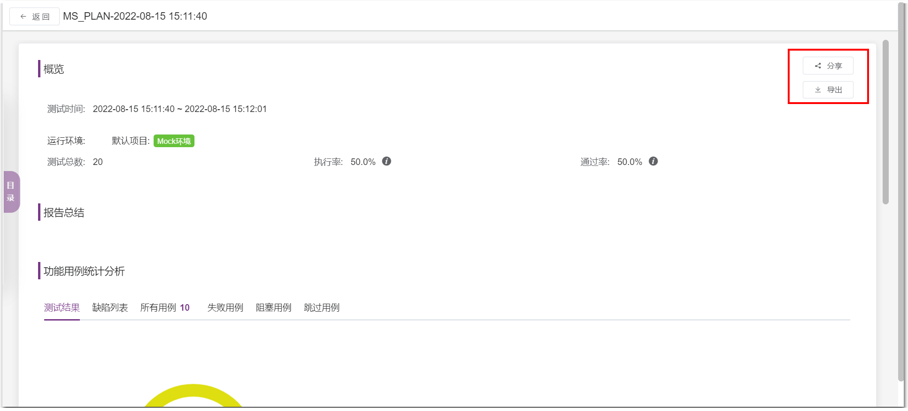

## 1 报告详情介绍
!!! ms-abstract ""
    对于测试计划的测试报告，包含各类测试的进度统计、脚本统计、缺陷统计以及详情等。

### 1.1 报告总结
!!! ms-abstract ""
    在【测试计划】页面，点击【查看测试报告】，可编辑测试报告总结。点击【报告】，进入测试报告页面，可看到此次报告的总结描述。
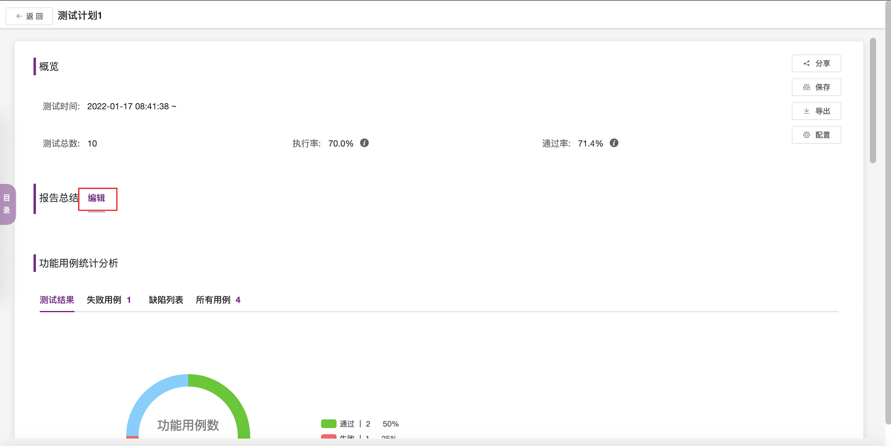

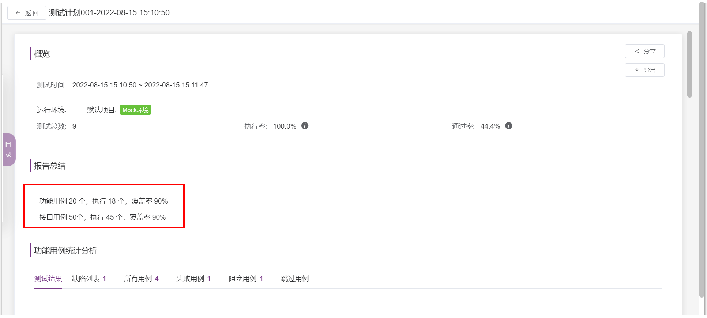

### 1.2 功能测试部分
!!! ms-abstract ""
    报告中功能测试统计分析中，提供了相关多个页签。比如测试结果、失败用例、缺陷列表、所有用例等。 
    测试结果统计，默认此以图形化展示。
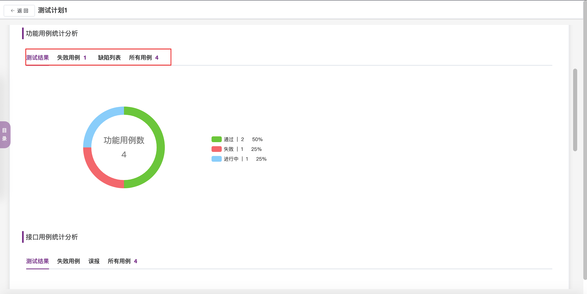

!!! ms-abstract ""
    同时支持用户自定义指定统计各个指标，统计图表为自动重新统计。
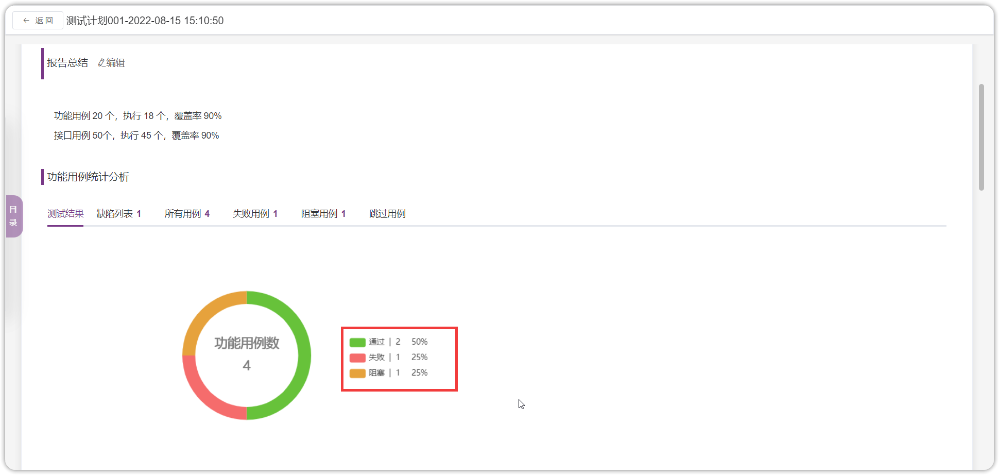

!!! ms-abstract ""
    报告中【缺陷列表、所有用例、失败用例、堵塞用例、跳过用例】都是以列表的形式显示其相关明细。
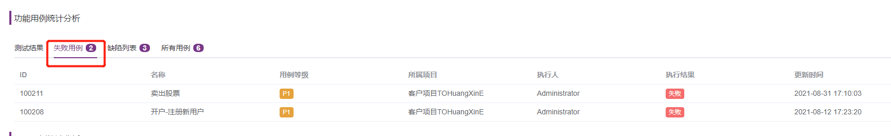

### 1.3 接口测试部分
!!! ms-abstract ""
    报告中接口测试统计分析，提供了相关多个页签。 
    测试结果统计，默认此以图形化展示。同时把鼠标悬浮在柱状图上，可出现此柱状相关统计信息。
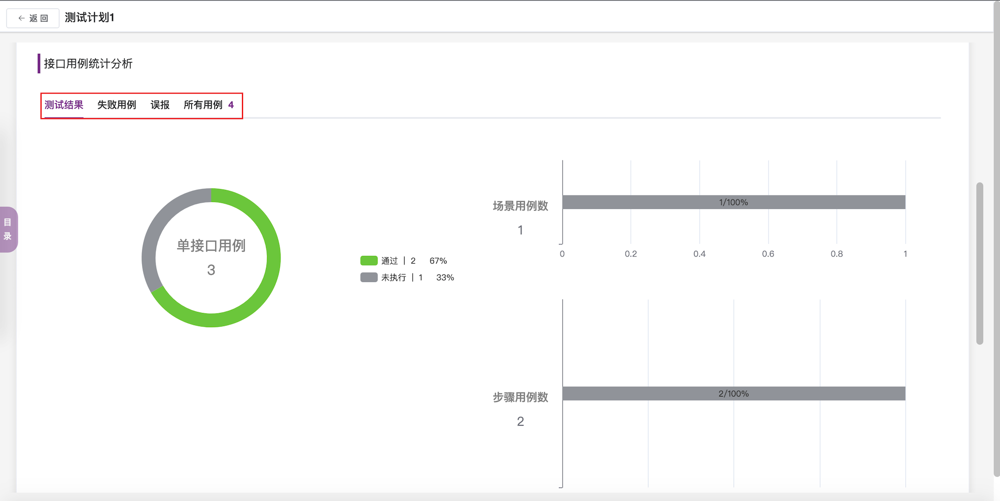

!!! ms-abstract ""
    报告中【失败用例、所有用例】都是以列表的形式显示其相关明细。 
    所有用例包含【接口用例】和【场景用例】两个页签。
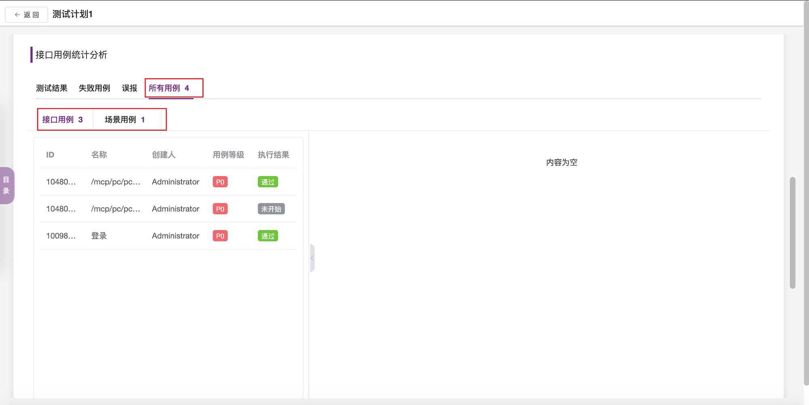

!!! ms-abstract ""
    选择【接口用例】，点击左侧接口用例列表中的某个接口，其右侧可呈现该接口运行时详细的测试数据及结果。
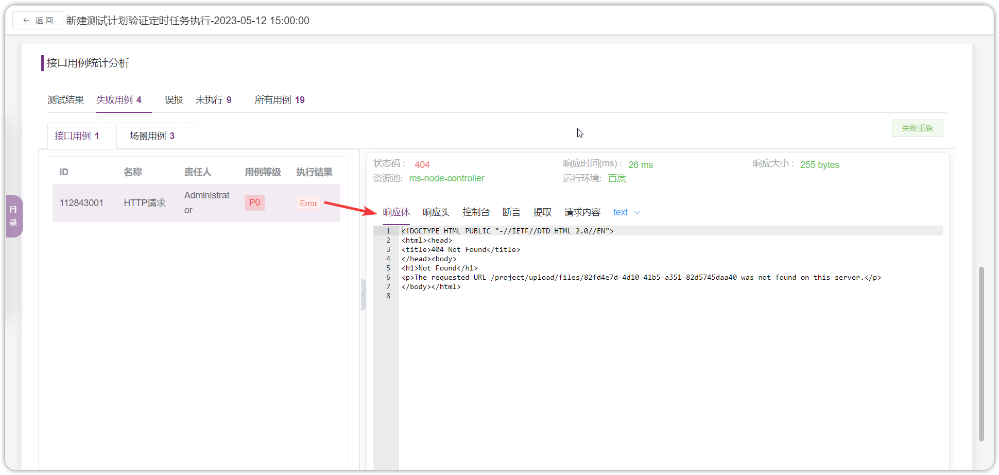

!!! ms-abstract ""
    选择【场景用例】，点击左侧场景用例列表中的某个场景，其右侧可呈现该场景用例运行时详细的测试数据及结果。
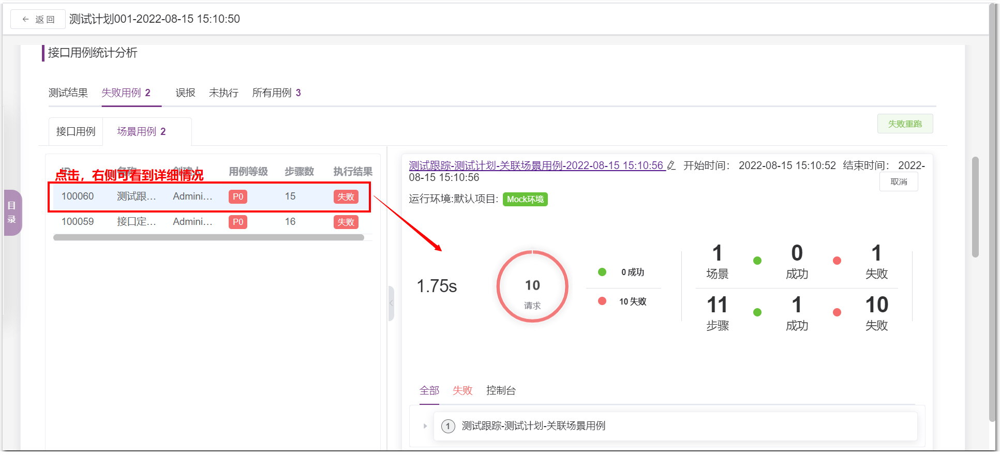

### 1.4 UI 测试 (X-Pack) 部分 
!!! ms-abstract ""
    测试结果统计，默认此以图形化展示。同时把鼠标悬浮在柱状图上，可出现此柱状相关统计信息。 
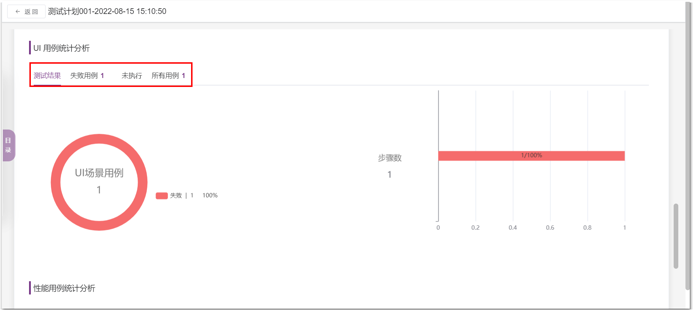

!!! ms-abstract ""
    点击左侧 UI 用例列表中的某个用例，其右侧可呈现该 UI 运行时详细的测试数据及结果。

### 1.5 性能测试部分
!!! ms-abstract ""
    报告中性能测试统计分析，提供了相关多个页签。 
    测试结果统计，默认此以图形化展示。同时把鼠标悬浮在统计图上，可出现此图相关统计信息。
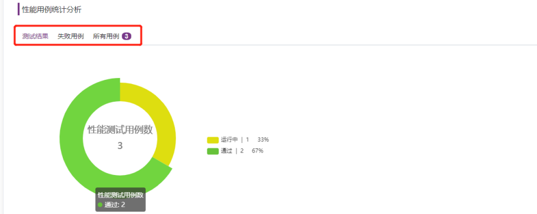

!!! ms-abstract ""
    报告中【失败用例、所有用例】都是以列表的形式显示其相关明细。 
    报告中选择【所有用例】，点击左侧用例列表中的某个用例，其右侧可呈现该运行时详细的性能测试结果。
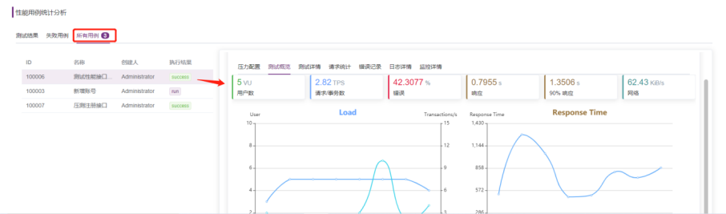

## 2 报告目录
!!! ms-abstract ""
    测试报告包含所有指定的测试范围的报告，内容繁多，系统提供了报告目录，可快速定位展示指定详情。 
    点击报告左侧【目录】，可看到此报告的目录，点击具体目录，可直接转入指定目录的测试报告详情。
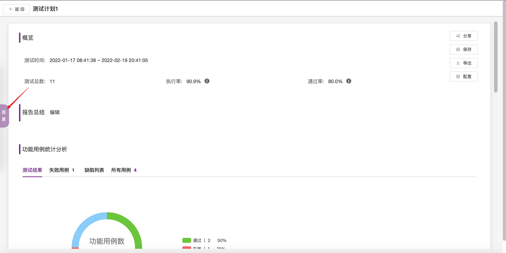

## 3 报告免登陆分享
!!! ms-abstract ""
    报告支持免登陆分享。点击测试报告右上角的【分享】，系统会生成该报告的地址，分享此地址给其他人员。

!!! ms-abstract ""
    在浏览器的地址栏中，输入该地址，就可直接打开此测试报告。
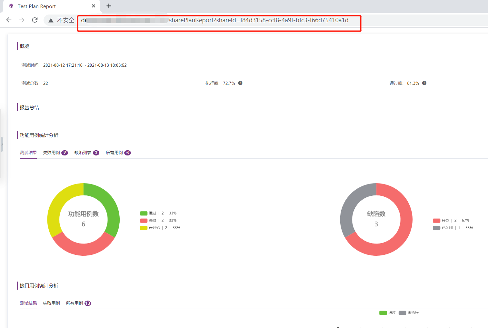

## 4 报告导出
!!! ms-abstract ""
    点击测试报告右上角的【导出】，此报告可导出 HTML 格式的报告，其内容和在线报告一致。
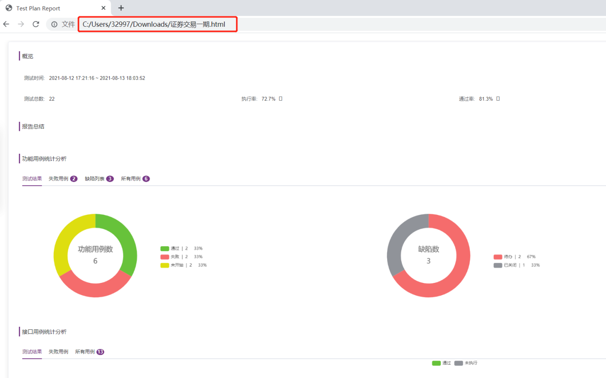

