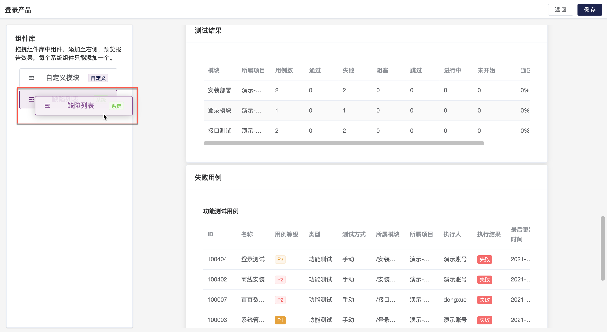

## 生成报告统计

测试计划中的所有测试用例均执行完成后，点击报告统计页面，查看该次测试计划的测试报告。

根据该测试计划的执行结果生成对应的测试报告详情页面，其中包括基础信息、测试结果列表、测试结果统计、失败用例模块、缺陷列表等模块。

点击`到处报告`将以 PDF 格式保存统计报告。点击`保存`按钮，将统计报告保存至`测试跟踪`-`报告`中，方便快捷查看。

## 编辑测试报告组件

在统计报告详情页面点击`编辑组建`按钮进入报告组建编辑页面。支持从左侧组件库拖拽，自定义测试报告内容。

