## 1 创建场景

### 1.1 基础信息
!!! ms-abstract ""
    点击【+】按钮，选择【创建场景】，进入场景创建页面。

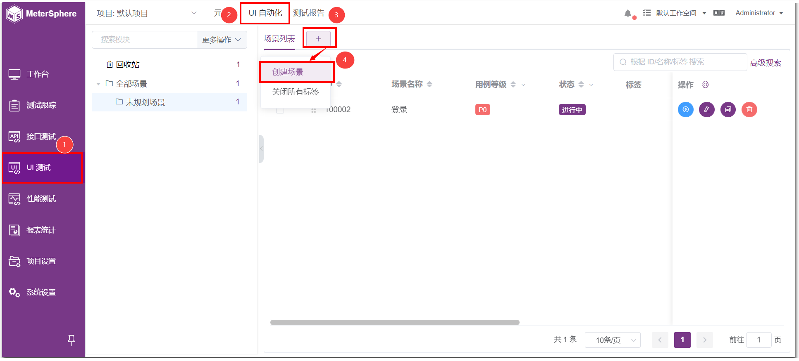{ width="900px" }

!!! ms-abstract ""
    在【基础信息】栏，添加模块、状态、名称等信息后即可保存场景。

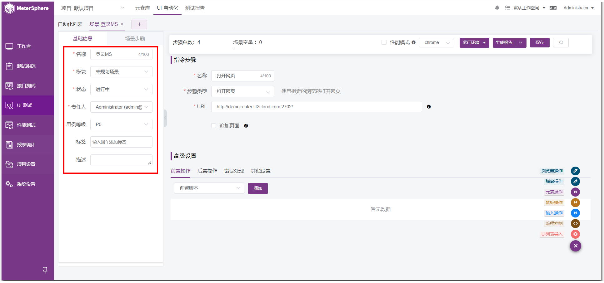{ width="900px" }

### 1.2 场景参数
!!! ms-abstract ""

    - **场景变量**：点击【场景变量】，进入变量添加页面。

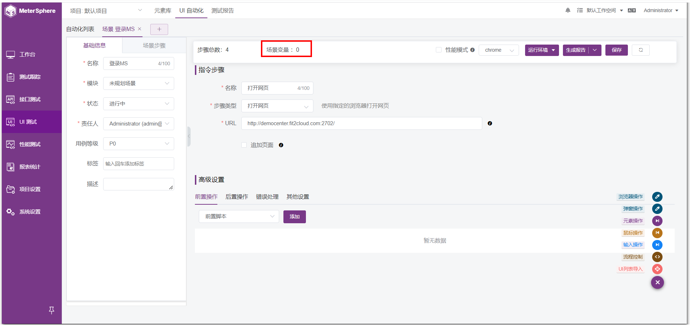{ width="900px" }
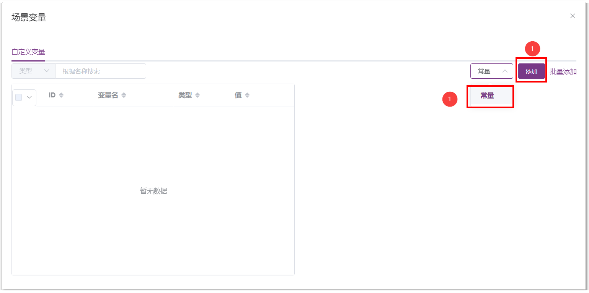{ width="900px" }

!!! ms-abstract ""
    目前支持添加【字符串、数组、json、数值】，可以单行添加和批量添加，批量添加以 “变量名:变量值” 格式添加。

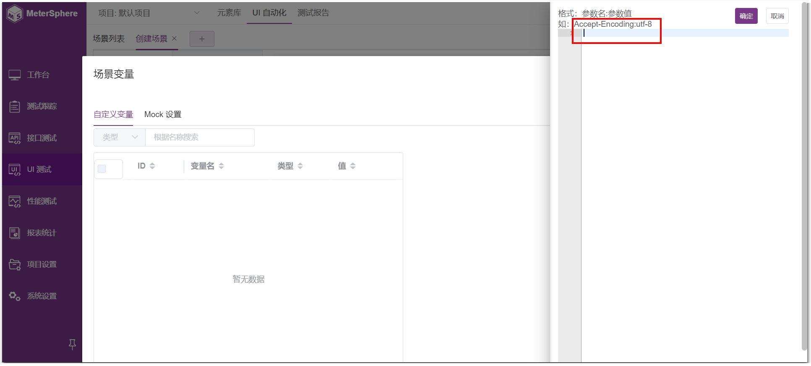{ width="900px" }

!!! ms-abstract ""

    - **性能模式**：【性能模式】默认开启，开启后不会对每个步骤都截图，更节省资源。

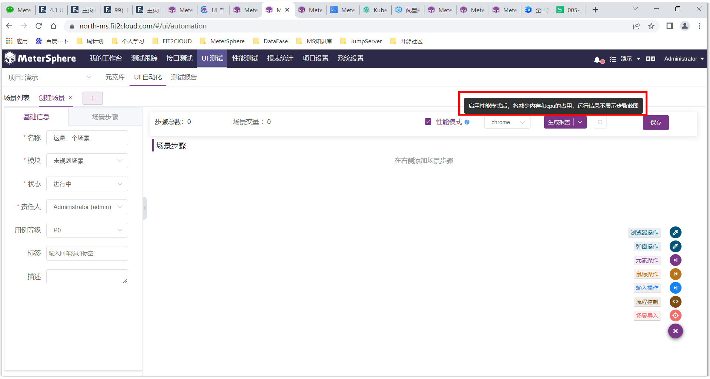{ width="900px" }

!!! ms-abstract ""

    - **浏览器驱动**：浏览器驱动即以什么浏览器执行该场景，当前支持 chrome 浏览器和 firefox 浏览器。

{ width="900px" }

### 1.3 添加步骤
!!! ms-abstract ""

    - **添加步骤** ：点击场景右下角【+】按钮。

{ width="900px" }

!!! ms-abstract ""

    - **浏览器操作**：点击【浏览器操作】，输入【URL】地址，可添加浏览器相关操作步骤。

{ width="900px" }

!!! ms-abstract ""
    目前支持浏览器打开网页、关闭网页、切换窗口、设置窗口大小、选择内嵌网页的操作。

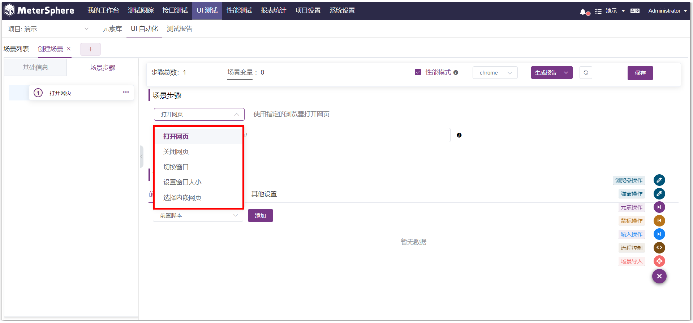{ width="900px" }

!!! ms-abstract ""

    - **弹窗操作**：支持对弹窗输入框输入内容，点击【确定】和【取消】的操作。

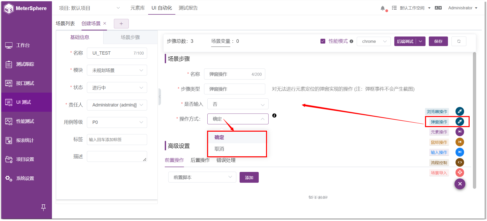{ width="900px" }

!!! ms-abstract ""

    - **元素操作**： 支持【提交表单】、【下拉框操作】、【设置选项】、【等待元素】四种方式。 
    -   【提交表单】：针对属性type="submit”的元素，用于提交表单数据。 
    -   【下拉框操作】：对下拉选项进行操作，可实现单选，多选，以及取消选择的操作。 
    -   【设置选项】：用于设置 checkbox/radio 的状态。 
    -   【等待元素】：对页面对象执行指定的等待操作，默认等待超时3000ms。

{ width="900px" }

!!! ms-abstract ""

    - **鼠标操作**：支持【鼠标点击】、【鼠标移动】和【鼠标拖拽】的操作，通过定位找到元素后，还支持设置鼠标在元素上的点击位置。 
     -  【鼠标点击】：模拟鼠标点击的操作，支持单击/双击/按下/弹起。 
     -  【鼠标移动】：将鼠标悬停在网页元素的上方。 
     -  【鼠标拖拽】：模拟鼠标将元素从某个位置拖到另一个位置。

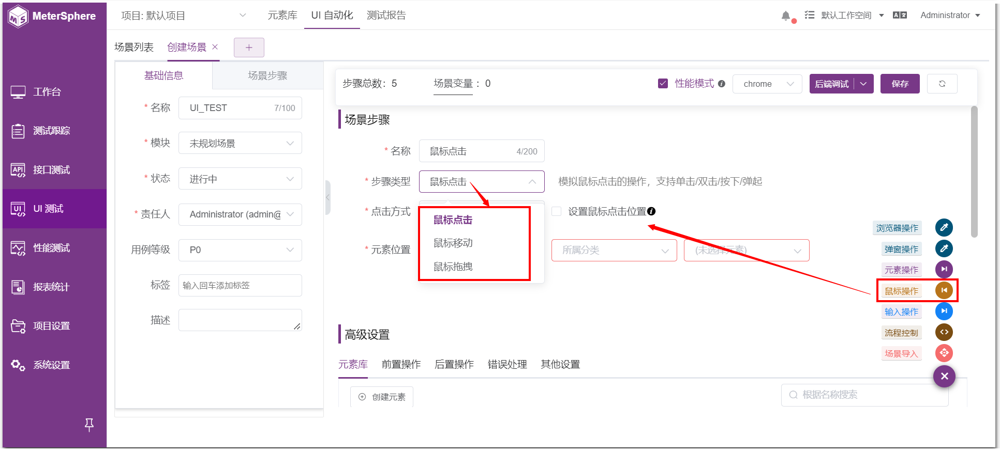{ width="900px" }

!!! ms-abstract ""
    【鼠标操作】选择【鼠标点击】，选择点击方式，填写元素位置以及鼠标点击位置即可
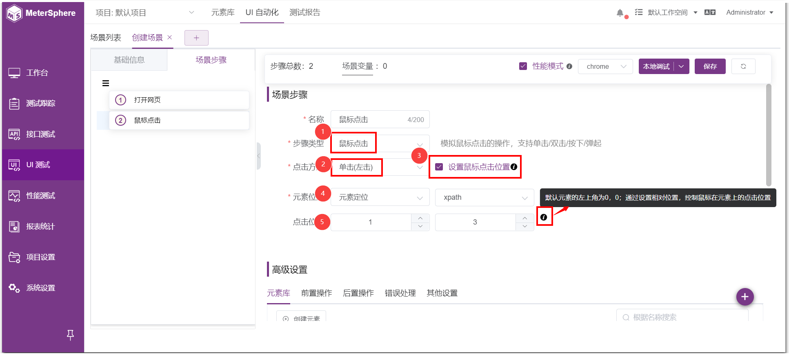{ width="900px" }

!!! ms-abstract ""
    当定位元素被遮挡时，可进行强制点击

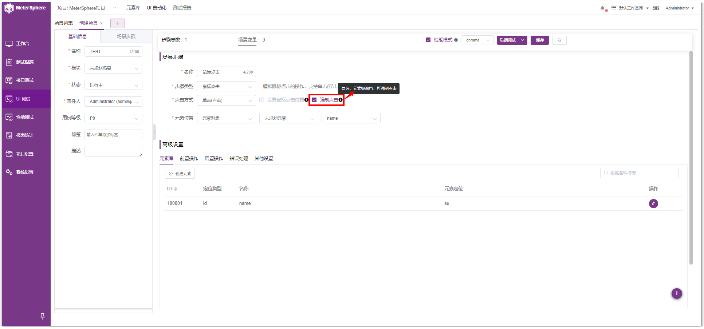{ width="900px" }

!!! ms-abstract ""
    【鼠标操作】选择【鼠标移动】，选择移动方式，填写鼠标位置即可

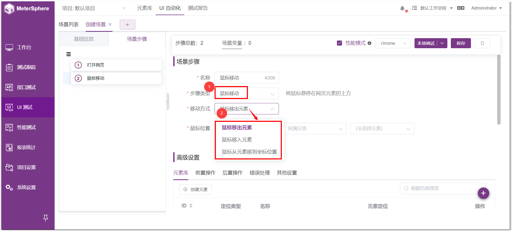{ width="900px" }

!!! ms-abstract ""
    【鼠标操作】选择【鼠标拖拽】，选择拖拽方式，填写操作元素以及坐标点即可。

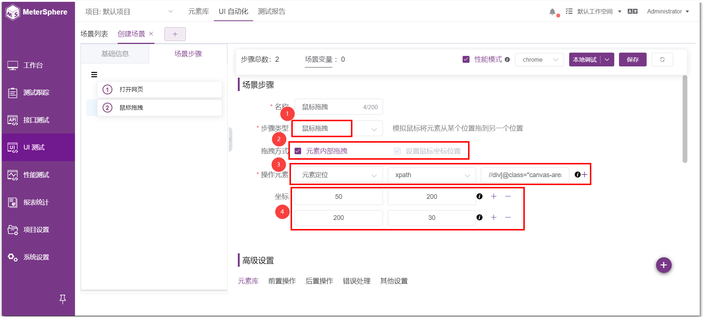{ width="900px" }

!!! ms-abstract ""

    - **输入操作**：支持输入框和可编辑段落输入，同时支持追加输入和覆盖输入模式。

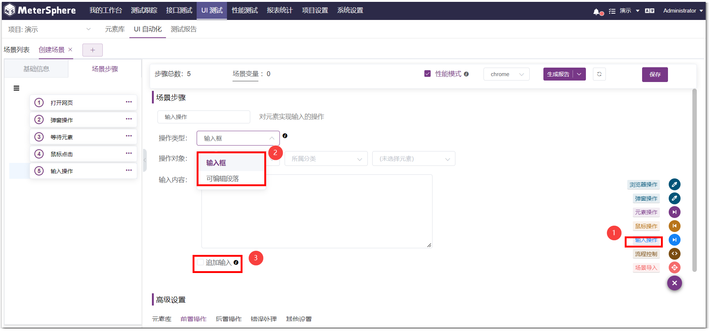{ width="900px" }

!!! ms-abstract ""

      - **流程控制**：支持【次数循环】、【ForEach循环】、【While】、【If】、【ElseIf】、【Else】等方式。

      -  【次数循环】：设置步骤执行次数。 
      -  【ForEach 循环】：遍历给定的集合。 
      -  【While 循环】：满足表达式的条件则循环执行里面的步骤。 
      -  【If】：满足 If 条件则执行里面的步骤。 
      -   【ElseIf】：不满足 If 条件且满足 ElseIf 条件则执行。 
      -  【Else】：不满足 If 条件则执行。

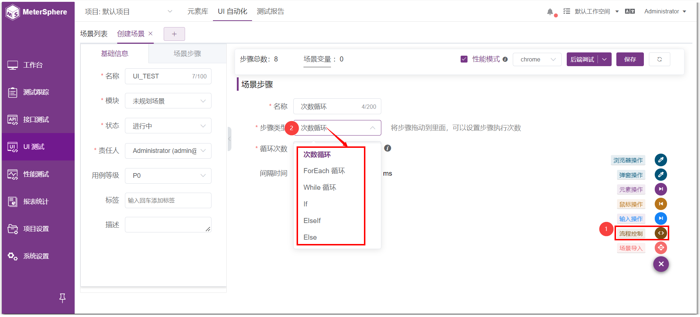{ width="900px" }

!!! ms-abstract ""
    将需要进行流程控制的步骤拖入流程控制器下即可实现步骤循环或者条件控制。

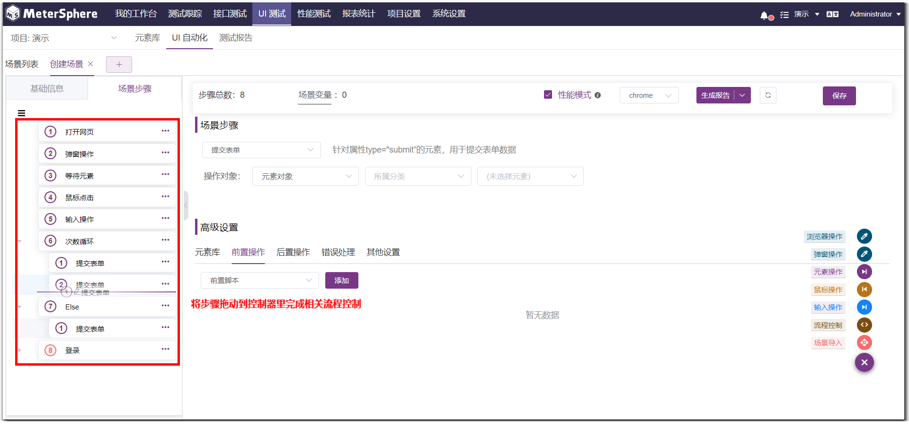{ width="900px" }

!!! ms-abstract ""

    - **场景导入**：点击【场景导入】，可以选择项目下的多个场景/指令导入到该场景做为一个步骤。

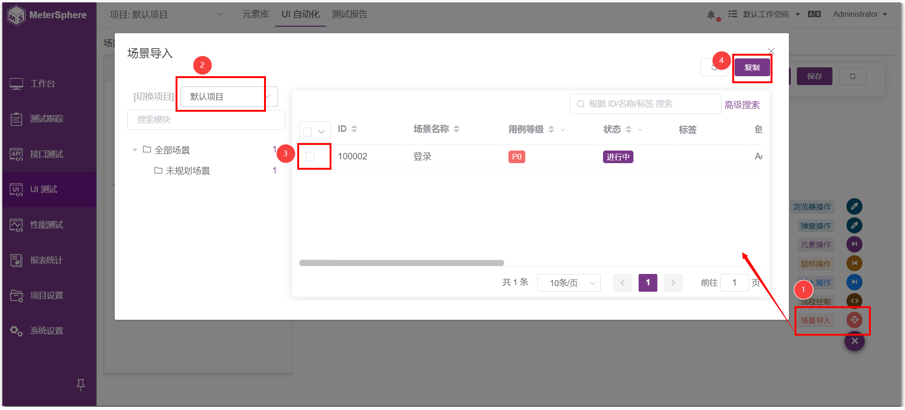{ width="900px" }

### 1.4 高级设置
!!! ms-abstract ""

    - **元素库**：如果当前步骤使用了元素库的元素，在【高级设置】的元素库下会展示当前步骤所选的元素对象。

{ width="900px" }
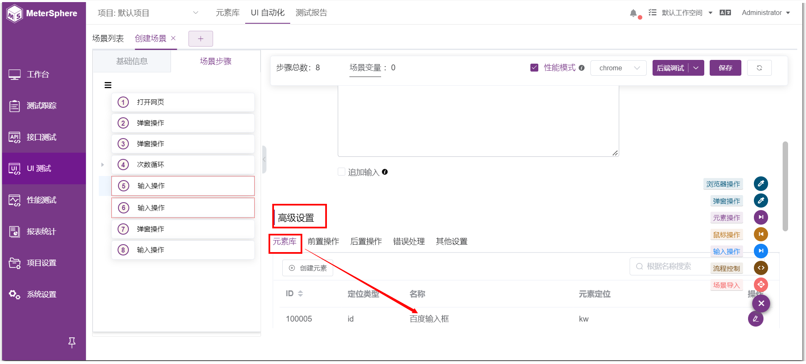{ width="900px" }

!!! ms-abstract ""

    - **前置操作**：有四种类型，包括【前置脚本】、【等待时间】、【数据提取】和【截图】。

{ width="900px" } 

!!! ms-abstract ""
    （1）前置脚本：目前支持【js脚本】，设置 js 脚本后，会先于当前步骤在浏览器中执行该脚本。

{ width="900px" }

!!! ms-abstract ""

    脚本类型可选择同步或异步，如果脚本执行后有返回，可以以变量形式存储返回值。

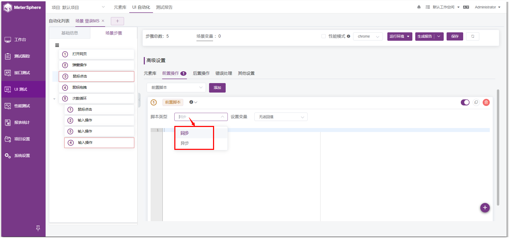{ width="900px" }

!!! ms-abstract ""

    （2）等待时间：【前置操作】可以设置等待时间，如下图所示，将会等待 3 秒再执行当前步骤。

{ width="900px" } 

!!! ms-abstract ""

    （3）数据提取：【前置操作】可以使用数据提取，可以提取窗口信息和元素信息，并以变量形式进行存储。

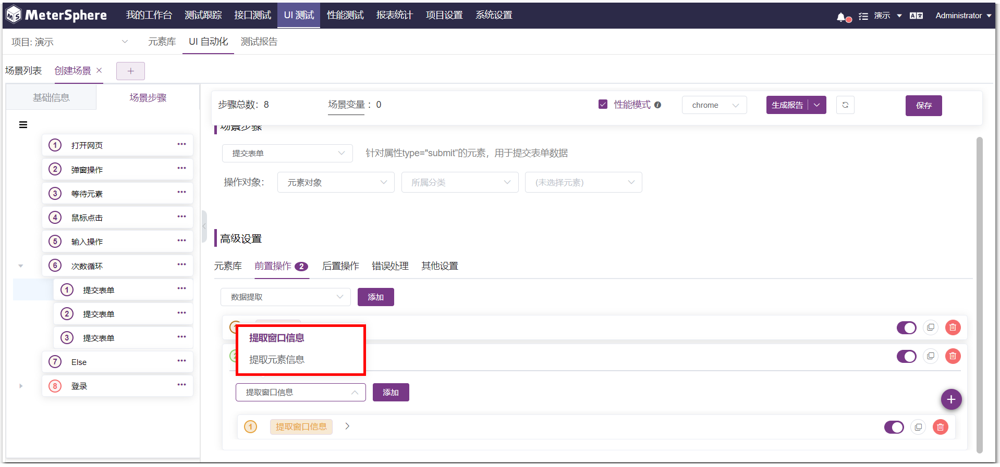{ width="900px" }

!!! ms-abstract ""
    窗口信息包括窗口 Handle 信息和网页标题。
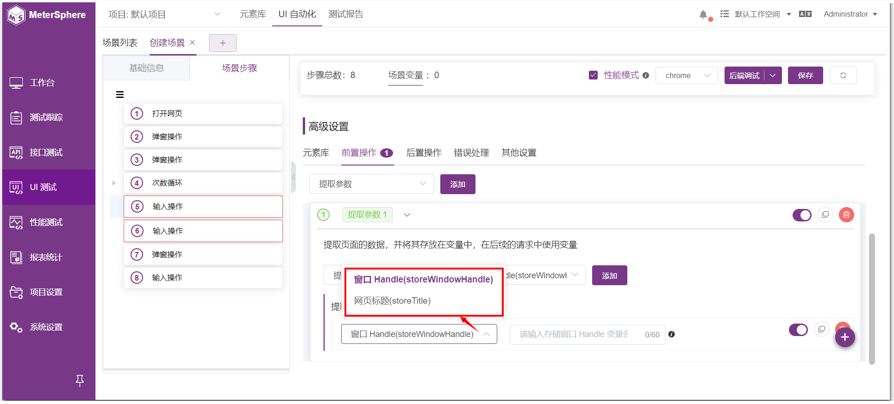{ width="900px" }

!!! ms-abstract ""
    元素信息可以提取普通对象、文本对象、元素值、元素属性和匹配 xpath 的元素数量。

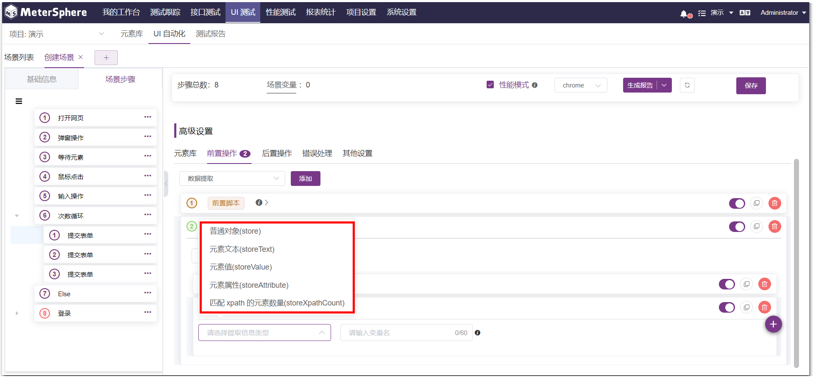{ width="900px" }

!!! ms-abstract ""
    系统会根据所选的定位方式、定位表达式和元素属性提取数据以及存储变量。

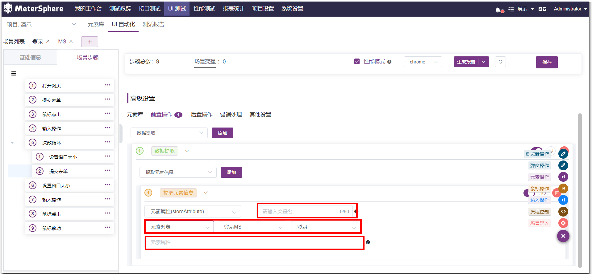{ width="900px" }

!!! ms-abstract ""
     （4）后置操作：后置操作会在当前步骤执行结束后再执行，后置操作与前置操作的方式基本一致，只是多了断言类型。

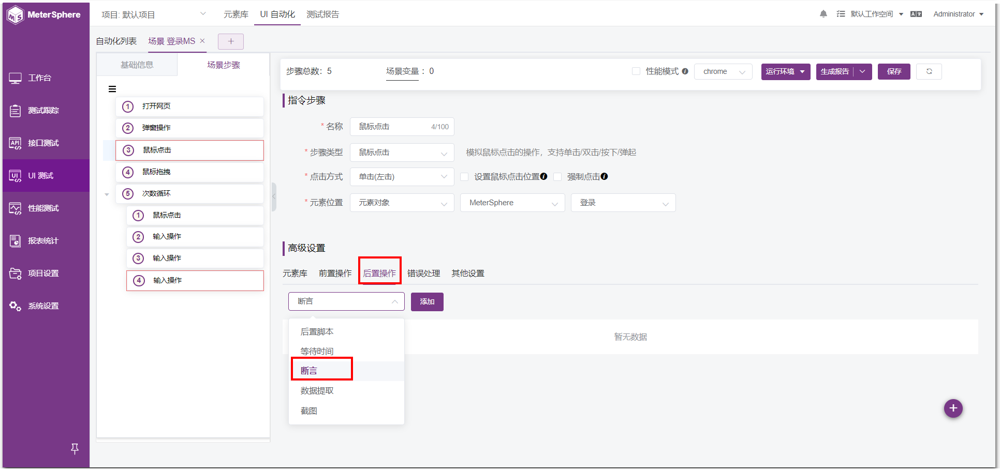{ width="900px" } 

!!! ms-abstract ""
    目前断言对象支持断言值、弹窗文本、元素断言、下拉框和网页标题。

{ width="900px" } 

!!! ms-abstract ""

    - **错误处理**：目前有两种错误处理方式： 
    -  【终止流程】：当前步骤失败后，停止测试，后续的步骤不会再执行。 
    -  【忽略异常并继续执行】：忽略该错误，继续往下执行测试。

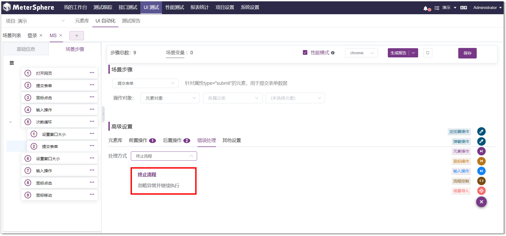{ width="900px" } 

### 1.5 步骤列表
!!! ms-abstract ""

    - **查看详情**：点击某个步骤，右侧会展示该步骤的详细内容。
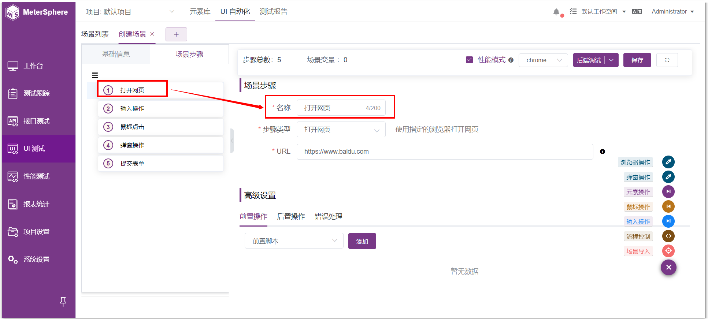{ width="900px" } 

!!! ms-abstract ""

    - **基础操作**：鼠标悬浮在某个步骤之上，会展示【编辑】键，点击后可重命名该步骤。

{ width="900px" } 

!!! ms-abstract ""
    鼠标悬浮在某个步骤之上，点击步骤右侧【…】，可对步骤进行复制、禁用、删除步骤和重命名。

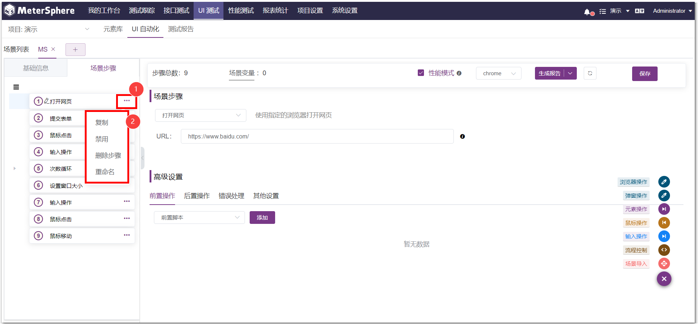{ width="900px" } 

!!! ms-abstract ""

    - **批量操作**：点击左侧小图表，可以列表进行批量操作。

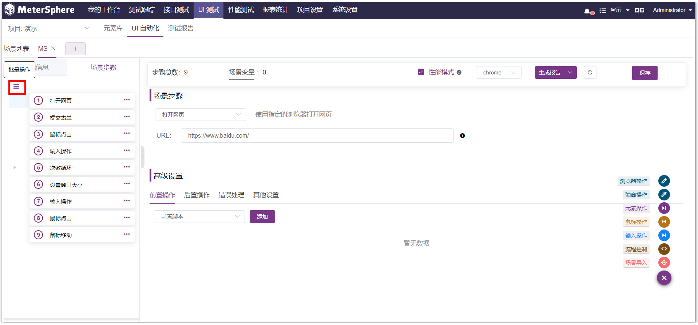{ width="900px" } 

!!! ms-abstract ""
    包括批量启用、批量禁用、批量展开、批量折叠和批量删除步骤。

{ width="900px" } 

## 2 导入导出
### 2.1 导出场景
!!! ms-abstract ""
    勾选场景，点击左侧【更多操作】，选择【导出】，场景会导出为 side 格式。

{ width="900px" } 

### 2.2 导入场景
!!! ms-abstract ""
    点击左侧【更多操作】，选择【导入】。

{ width="900px" } 

!!! ms-abstract ""
    在导入页面选择【导入模块】和【导入模式】，并上传 side 格式的文件，点击【保存】即可把 UI 自动化场景导入到相应的模块。

{ width="900px" } 

## 3 基础操作
### 3.1 场景列表
!!! ms-abstract ""
    在场景列表，可以选择左侧的用例目录，右边会根据所选目录展示对应的场景。

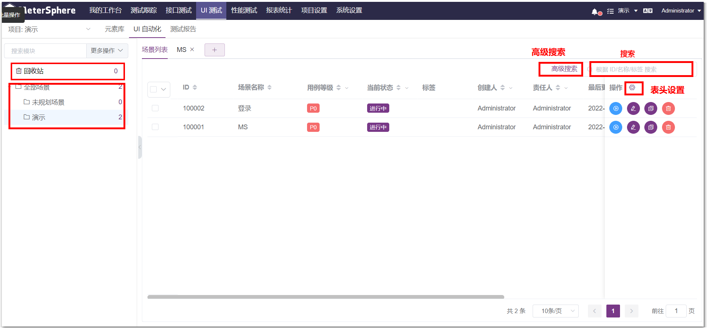{ width="900px" } 

### 3.2 执行场景
!!! ms-abstract ""
    点击右侧【执行】按钮，会在当前页面执行该场景。

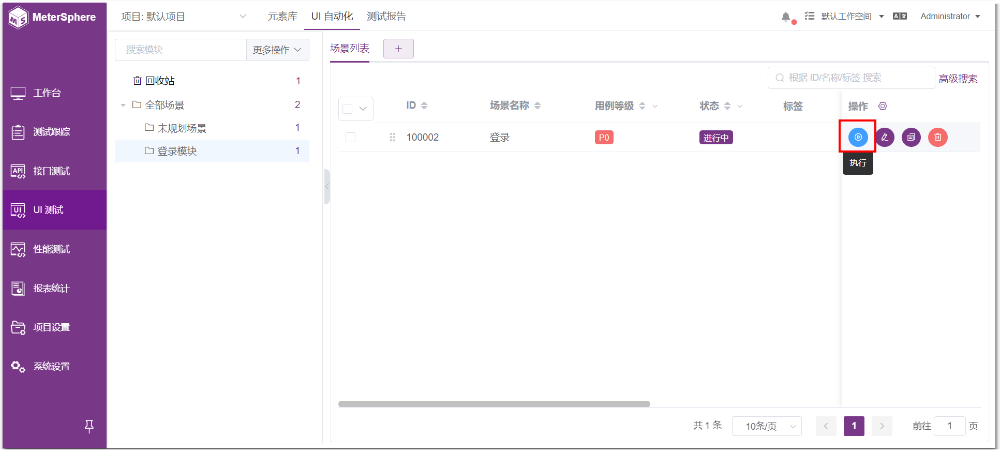{ width="900px" } 

!!! ms-abstract ""
    场景执行完成会，会在当前也会展示测试报告详情，也可以到【UI测试-测试报告】路径下查看报告。

{ width="900px" } 

### 3.3 编辑场景
{ width="900px" } 

### 3.4 复制场景
{ width="900px" } 

### 3.5 删除场景
!!! ms-abstract ""
    点击【删除】按钮，会弹出提示框，确认删除后，场景会被删除到回收站。

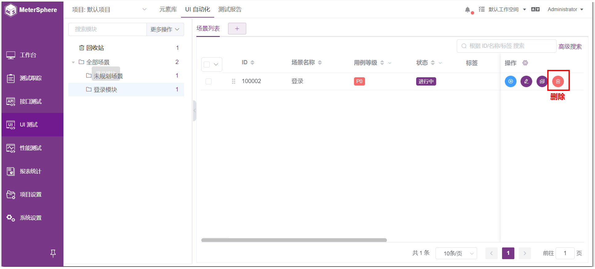{ width="900px" } 

!!! ms-abstract ""
    回收站内的场景可以恢复或彻底删除。
{ width="900px" } 

## 4 批量操作
### 4.1 批量编辑
!!! ms-abstract ""
    勾选多个场景，点击列表左侧的三个点，点击【批量编辑】。

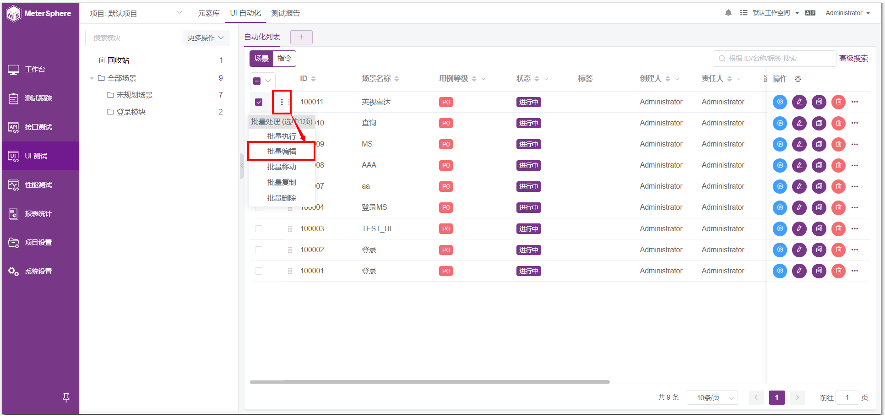{ width="900px" } 

!!! ms-abstract ""
    弹出批量编辑页面，选择需要修改的属性和属性值，点击【确定】即可。
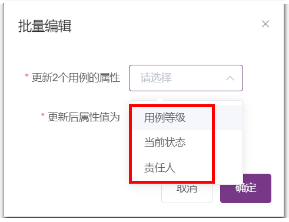{ width="900px" } 

### 4.2 批量移动
!!! ms-abstract ""
    勾选多个场景，点击【批量移动】，弹出批量移动编辑页面。

{ width="900px" } 

!!! ms-abstract ""
    选择用例目录点击【确定】，勾选的场景会移动到该目录下。

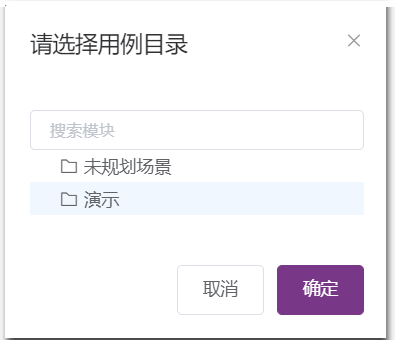{ width="900px" } 

### 4.3 批量复制
!!! ms-abstract ""
    勾选多个场景，点击【批量复制】，会弹出批量复制编辑页面。
{ width="900px" } 

!!! ms-abstract ""
    选择用例目录并点击【确定】，勾选的用例会复制到该目录下。
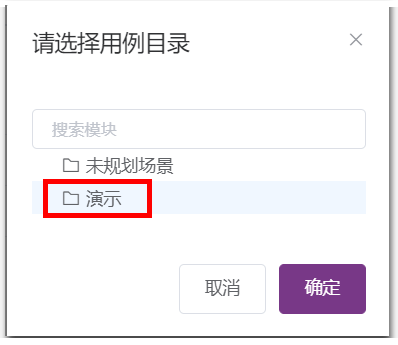{ width="900px" } 

### 4.4 批量删除
!!! ms-abstract ""
    勾选多个场景，点击【批量删除】，弹出确认页面。
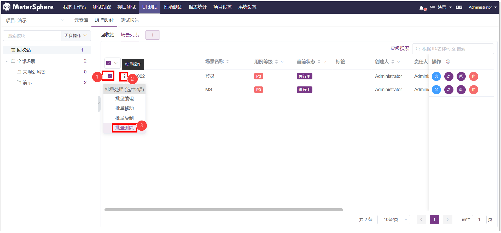{ width="900px" } 

!!! ms-abstract ""
    点击【确定】，勾选的删除会被删除到回收站。
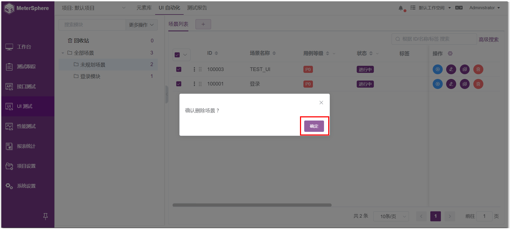{ width="900px" } 

## 5 创建指令
### 5.1 基本信息
!!! ms-abstract ""
    点击【+】按钮，选择【创建指令】，进入指令创建页面。
{ width="900px" }

!!! ms-abstract ""
    在【基础信息】栏，添加模块、状态、名称等信息后即可保存场景。
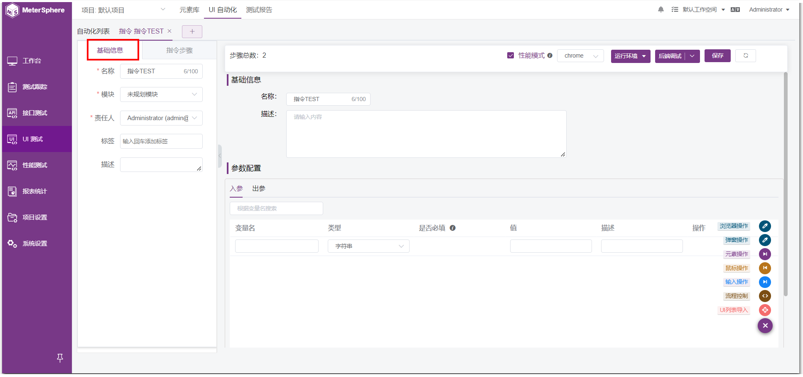{ width="900px" }

### 5.2 指令步骤
!!! ms-abstract ""
    在右下角选择步骤进行添加，可在【指令步骤】页面看到各个步骤，默认有前置步骤、自定义步骤、后置步骤。
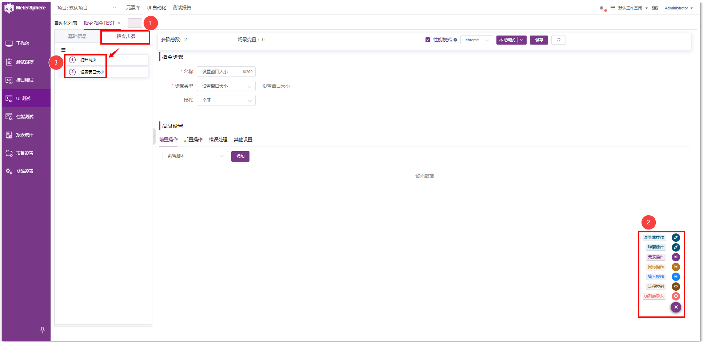{ width="900px" }

!!! ms-abstract ""
    添加 UI 自动化控件到相应步骤下，其中自定义步骤处支持参数化配置。
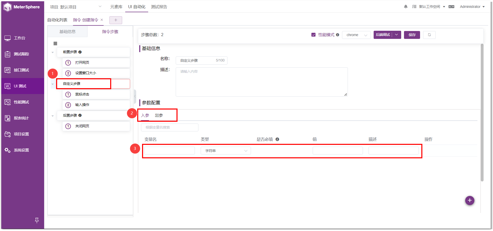{ width="900px" }

!!! ms-abstract ""
    可在【场景步骤】或【指令步骤】的批量选择中，点击创建自定义指令选项。
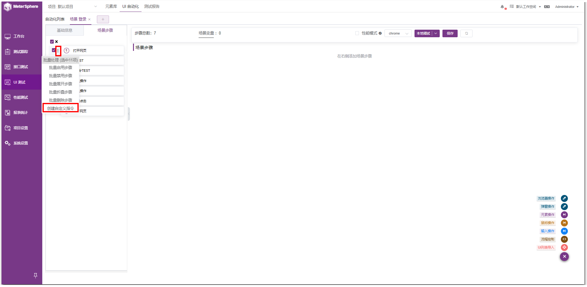{ width="900px" }

### 5.3 指令列表
!!! ms-abstract ""
    在【自动化列表】页面，切换到【指令】页面，可看到所有的指令列表。

{ width="900px" }

!!! ms-abstract ""
    可对列表中的指令进行【编辑】、【复制】、【删除】、【查看引用】等操作。
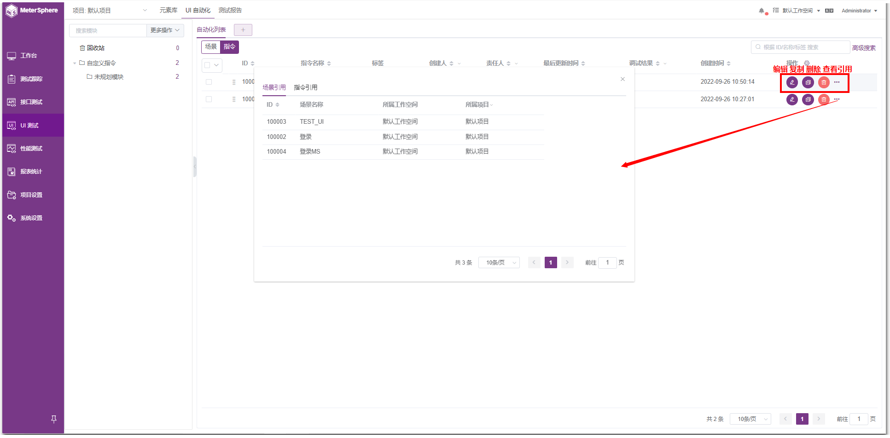{ width="900px" }

