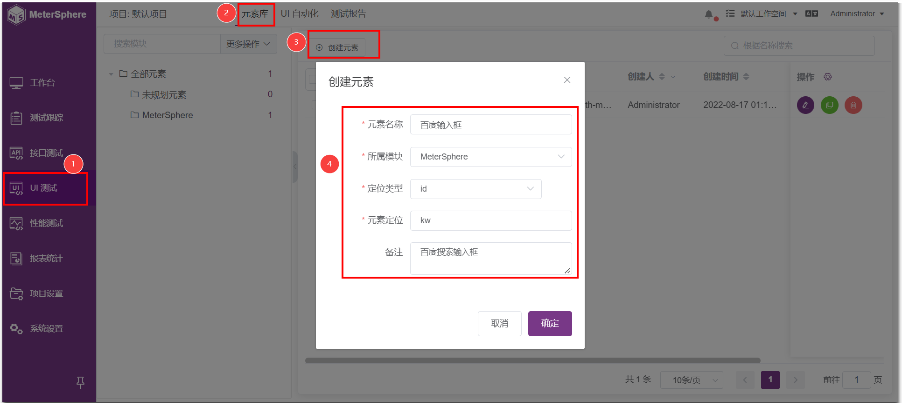
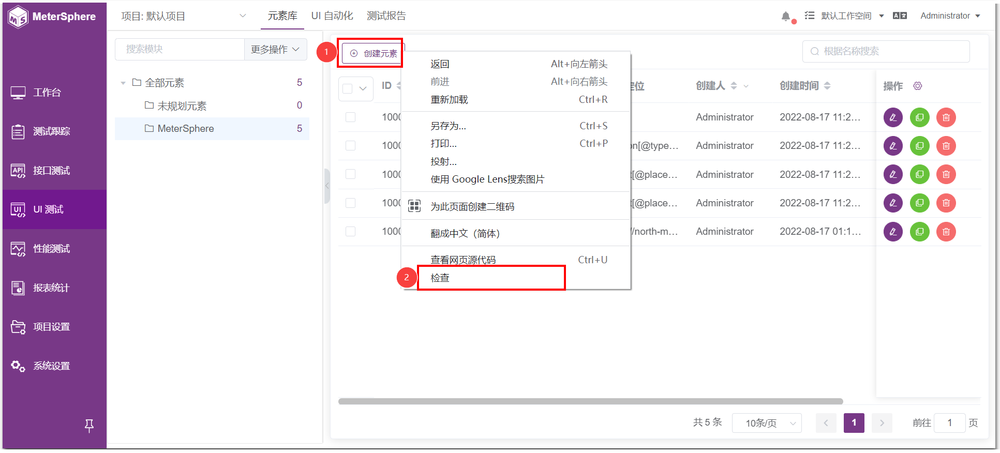
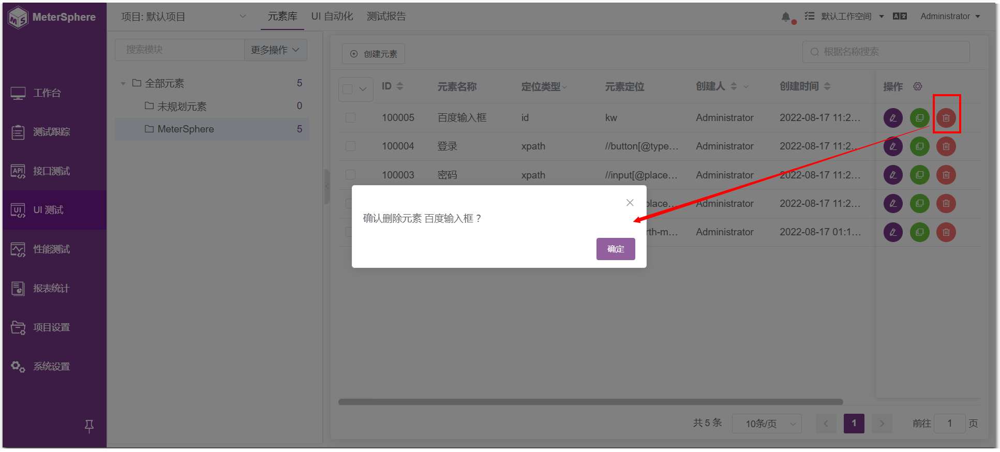

## 1 创建元素
!!! ms-abstract ""
    切换到【UI测试】模块下的【元素库】页面，点击【创建元素】，输入元素字段名，选择所属模块和定位类型，然后输入元素定位的表达式和备注。

{ width="900px" }

## 2 元素定位
!!! ms-abstract ""
    元素定位支持多种方式，包括 id、name、class、tag、link、plink、css、xpath、lable、value、index，这里以 xpath 为例。输入必填信息后，点击确认即可保存元素。

{ width="900px" }

!!! ms-abstract ""
    在页面上点击你要定位的元素，然后右键选择【检查】。

{ width="900px" }

!!! ms-abstract ""
    右键选择 Copy-Copy XPath 即可获得该元素的 xpath 路径。

{ width="900px" }

## 3 编辑元素
!!! ms-abstract ""
    在元素库列表，点击【编辑】键，可以修改元素属性，修改之后点击确认即可保存。

{ width="900px" }

## 4 复制元素
{ width="900px" }

## 5 删除元素
{ width="900px" }