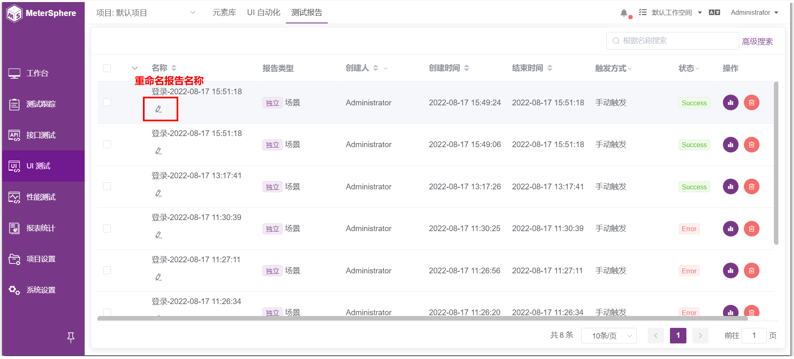
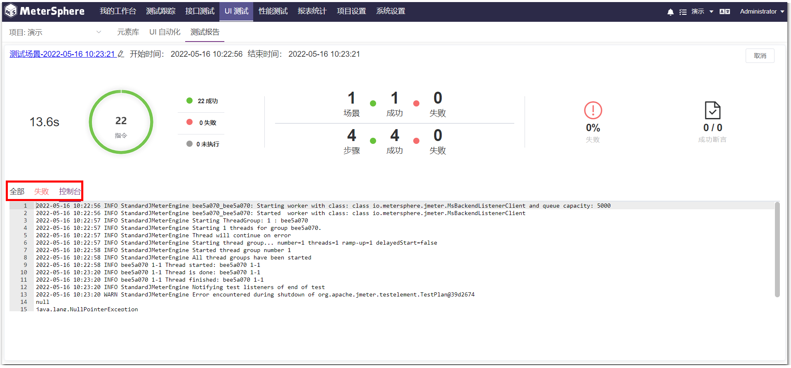
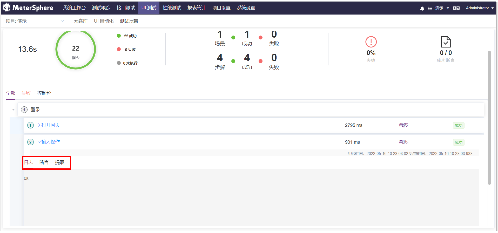
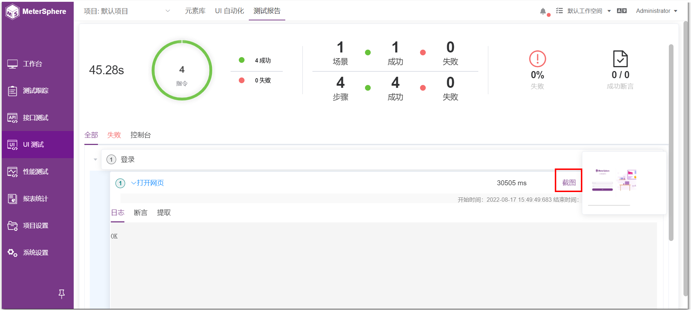
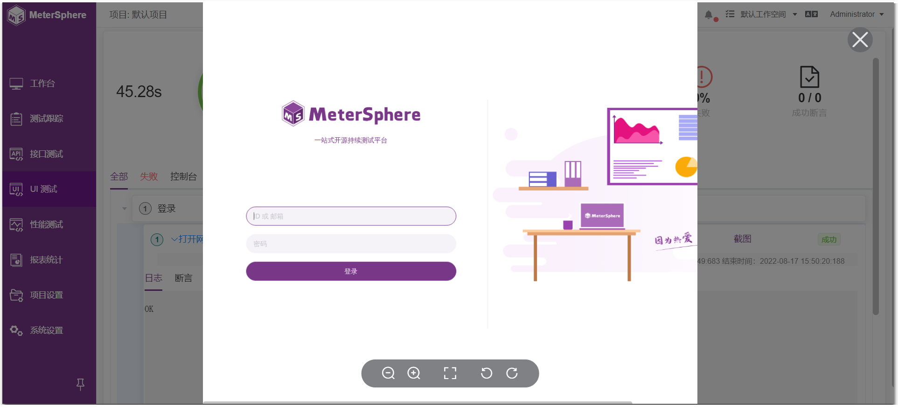

## 1 报告列表
测试报告列表表头展示了报告的名称、创建人、创建时间、结束时间、触发方式、状态和操作。测试报告支持按名称搜索和高级搜索。
 

高级搜索支持以名称、状态、创建人等维度进行组合查询。

 

## 2 重命名报告
在测试报告列表的名称栏，可以重命名报告名称。
 

## 3 报告详情
点击“报告详情”，可进入报告详情页面。
 

详情页面面板展示了本次执行场景的耗时、成功和失败以及未执行的步骤数，还有断言成功和失败的数量。
 

在总览面板下面，可以查看场景全部步骤和失败步骤，以及控制台详情。
 

展开步骤详情可以查看当前步骤的执行结果日志、断言结果和提取结果。
 

鼠标悬浮在右侧的“截图”上，会展示该步骤执行时的UI截图预览。
 

点击该预览图，会以网页大图形式展示UI截图。
 

## 4 删除报告
在测试报告列表页面，点击“删除”键，会弹出确认删除的提示。
 

## 5 批量操作
### 5.1 批量删除报告

 