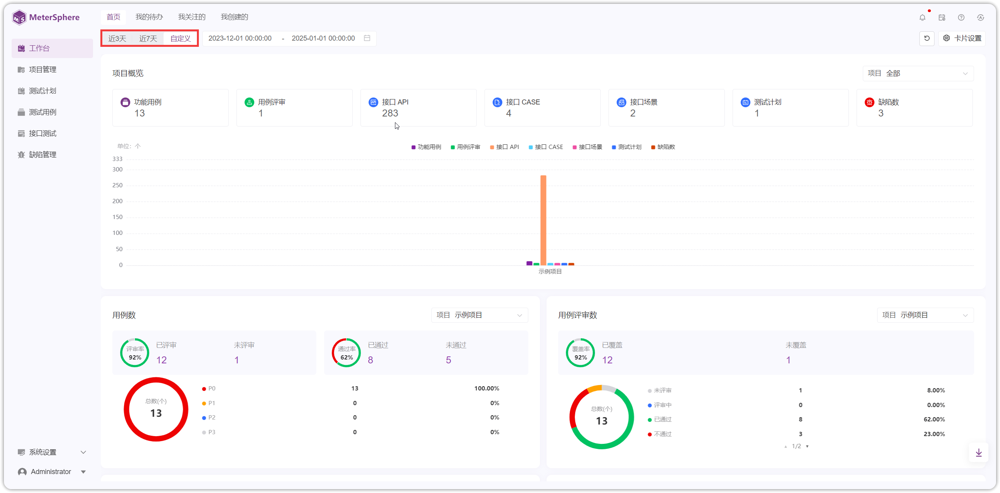
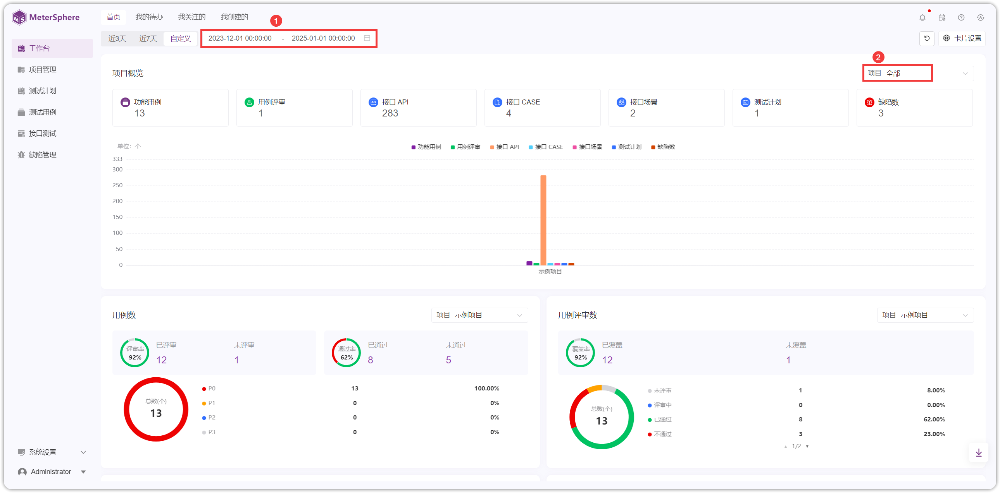
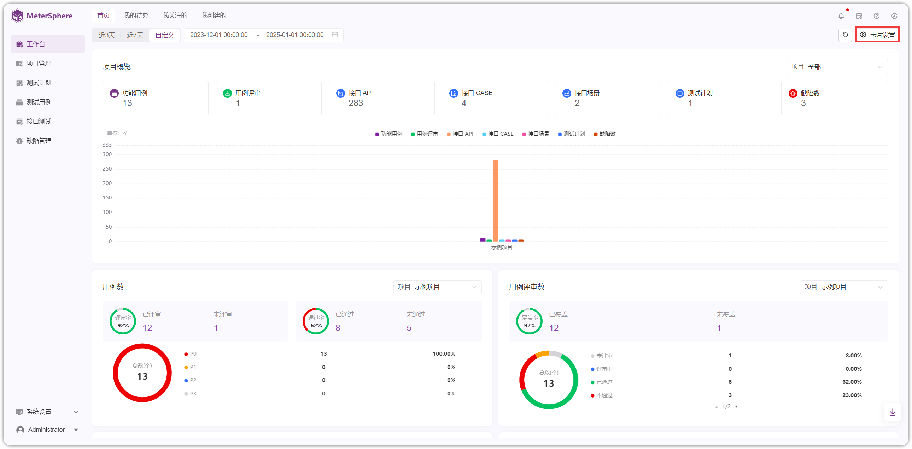
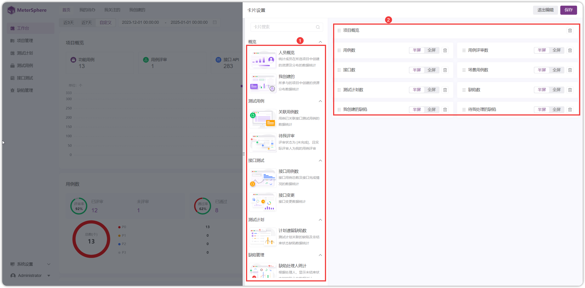
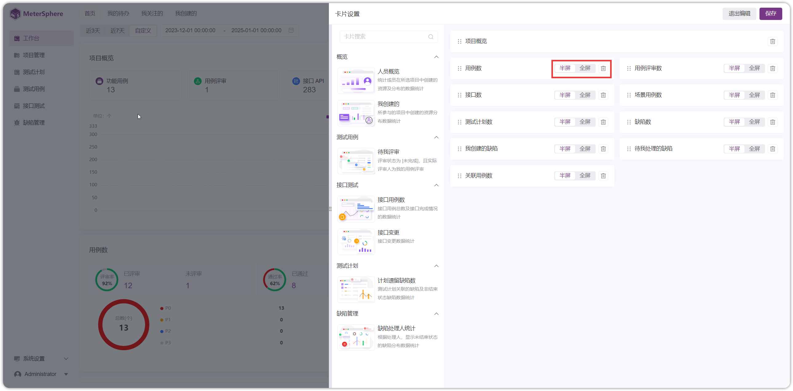

## 1 项目概览
!!! ms-abstract ""
    点击【工作台】进入工作台首页，有近3天、近7天、自定义时间的项目概览情况。
{ width="900px" }

!!! ms-abstract ""
    自定义时间，选择项目，页面自动显示筛选后的数据。
{ width="900px" }

## 2 卡片设置
!!! ms-abstract ""
    点击右上角【卡片设置】进入设置页面，点击左侧标签页会显示在右侧。
{ width="900px" }

{ width="900px" }

!!! ms-abstract ""
    页面展示的数据设置为不展示或半屏或全屏展示。
{ width="900px" }
