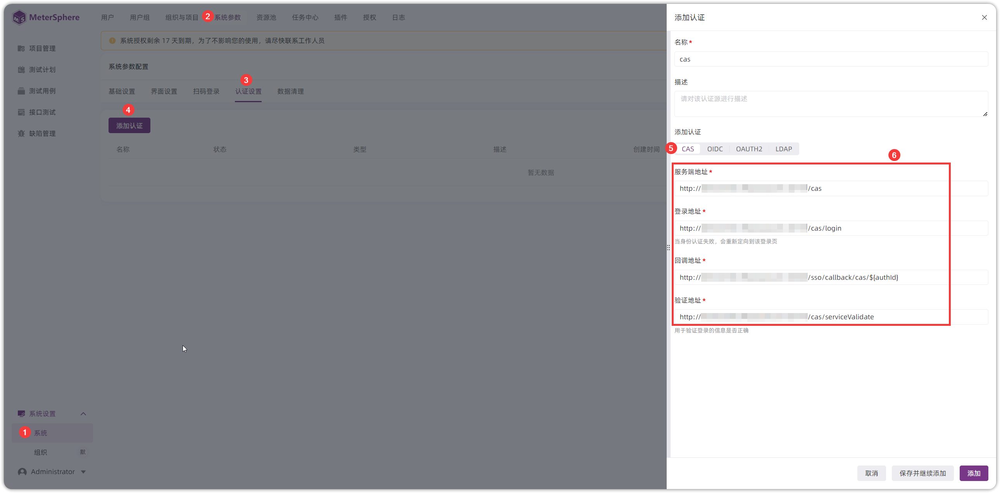
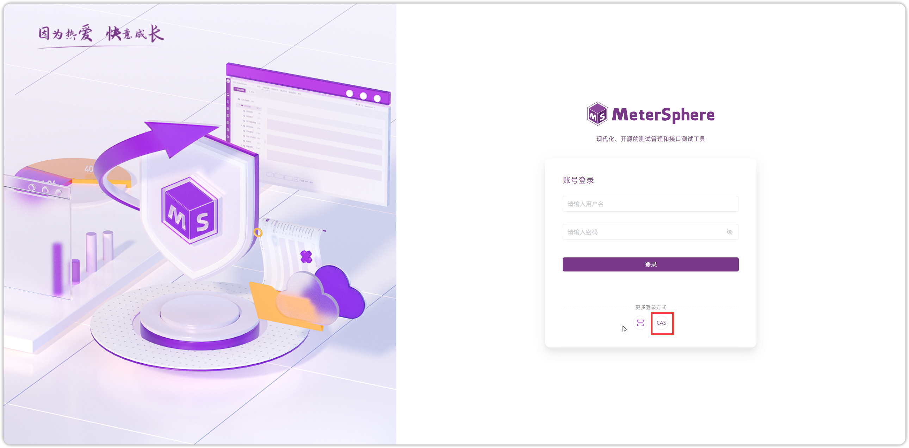
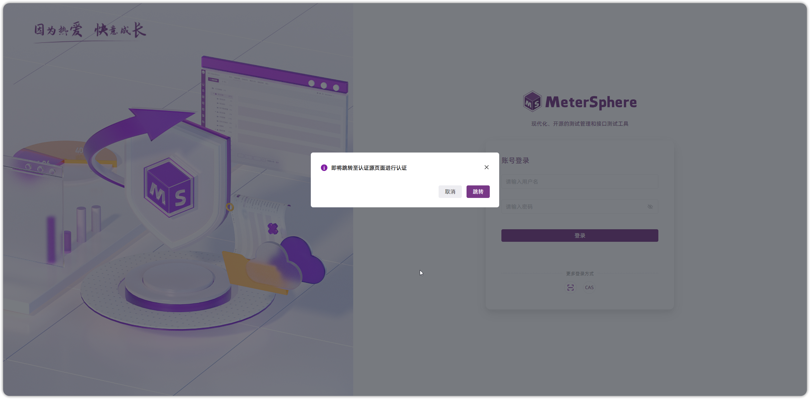
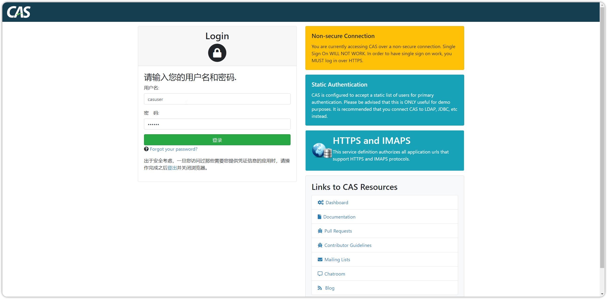
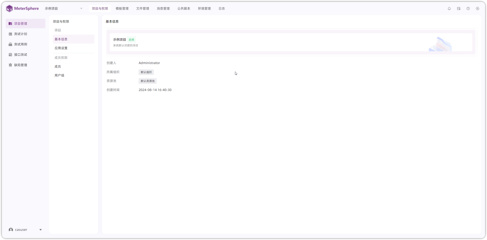

## 1 CAS 配置
!!! ms-abstract ""
    点击【系统设置-系统-系统参数-认证配置-添加认证】进入认证页面，填写名称、认证方式、服务端地址、登录地址、回调地址、验证地址等信息，点击【添加】即可。
{ width="900px" }

!!! ms-abstract "字段说明"

    - 【服务端地址】cas 系统地址，格式为 `http://cas系统url`
    - 【登录地址】cas 系统的登录地址，格式为 `http://cas系统url/login`
    - 【回调地址】格式为 `http://MeterSphere 访问地址/sso/callback/cas/${authId}`
    - 【验证地址】cas 系统的验证地址，格式为 `http://cas系统url/serviceValidate`

## 2 CAS 登录
!!! ms-abstract ""
    在 MeterSphere 登录页面，点击【cas】跳转 cas 系统登录页面进行登录。
{ width="900px" }

{ width="900px" }

{ width="900px" }

{ width="900px" }

