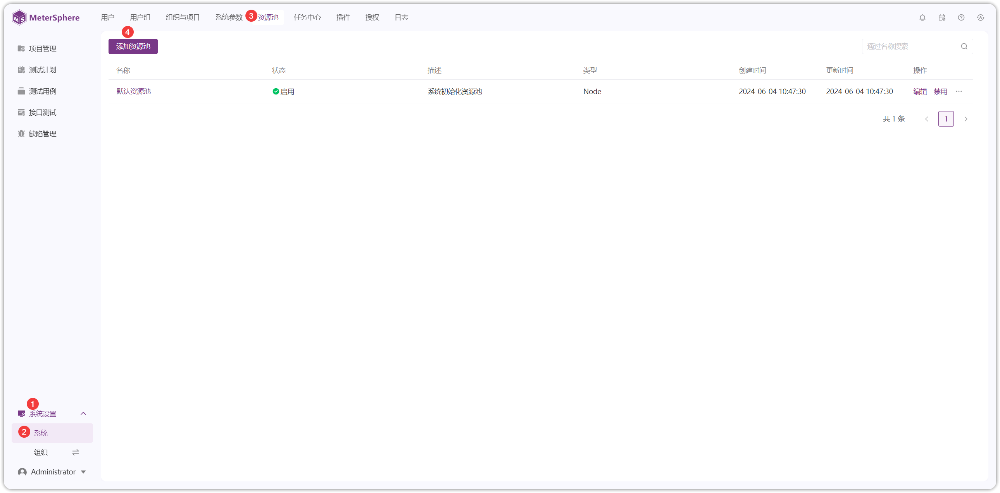
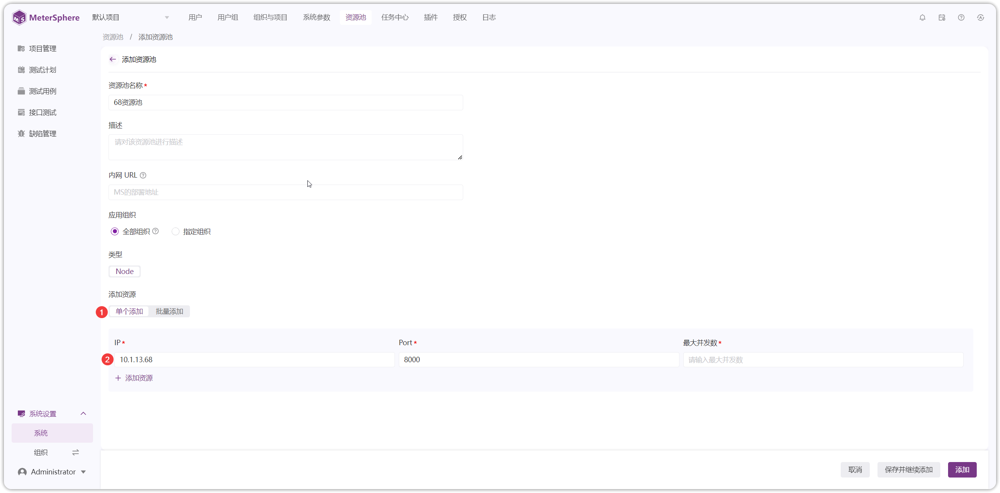
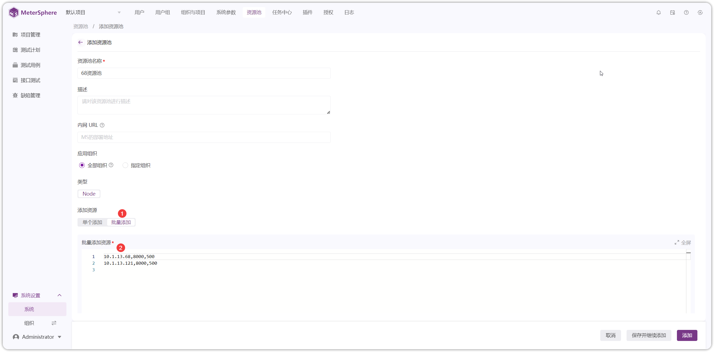
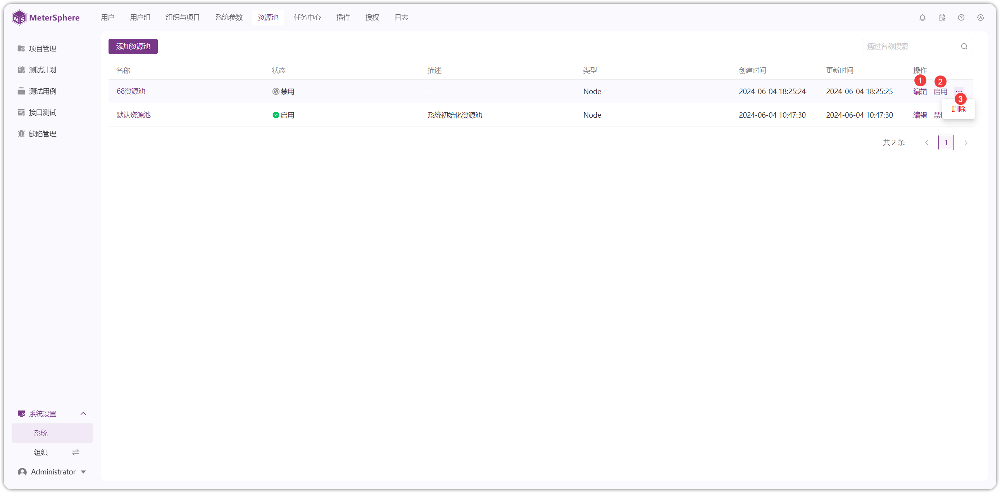

!!! ms-abstract "注意"
    需要先在服务器上安装 Task_Runner 服务，然后再添加资源池。详情参考：[Task_Runner 部署](../../installation/task_runner.md) 

!!! ms-abstract ""
    点击【系统-资源池-添加资源池】进入资源池添加页面。
{ width="900px" }

{ width="900px" }

!!! ms-abstract "说明"
    - 【资源池名称】自定义名称。
    - 【内网 URL】资源池部署在内网时，可走内网地址。
    - 【应用组织】资源池应用全部组织或指定组织。
    - 【添加资源】单个添加或批量添加资源池。

!!! ms-abstract ""
    点击【单个添加】输入资源池的 IP、Port、最大并发数。
{ width="900px" }

!!! ms-abstract "字段说明"
    - 【IP】资源池服务器的 IP。
    - 【Port】资源池的端口号，默认是 8000。
    - 【最大并发数】4C8G 的服务器配置支持 1000-2000 并发。

!!! ms-abstract ""
    点击【批量添加】在批量添加页面，依次输入资源池的 IP、Port、最大并发数。
{ width="900px" }

!!! ms-abstract "注意"
    **切换资源池**：项目可以切换其他资源池进行使用。详情参考：[切换资源池](../project_management/project_permissions.md#23)

!!! ms-abstract ""
    资源池可进行【编辑】、【启用/禁用】、【删除】操作。
{ width="900px" }

