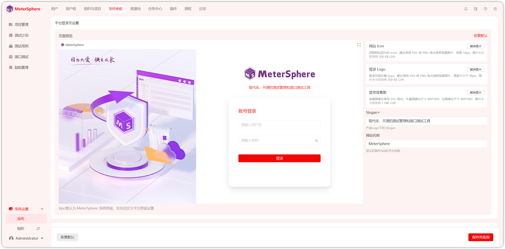
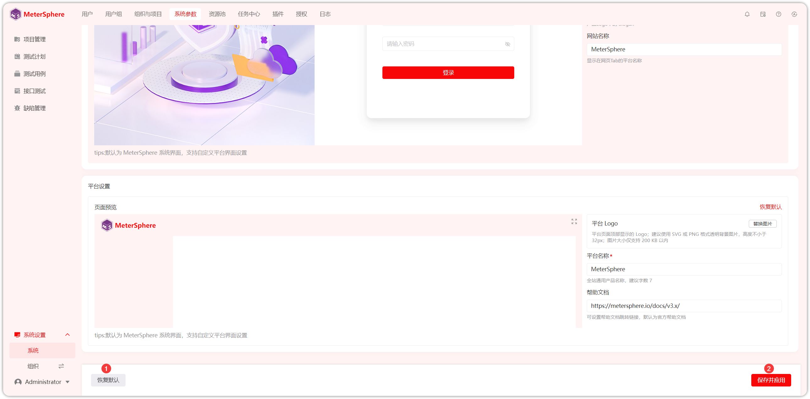

!!! ms-abstract ""
    点击【系统设置-系统-系统参数-界面设置】进入自定义主题页面。
{ width="900px" }

!!! ms-abstract "说明"
    - 【平台主题色】是指除了页面背景色之外的颜色。
    - 【平台风格】是指页面背景色风格。
    - 【平台登录页面设置】是指登录页面的 Logo、图片、名称的设置。
    - 【平台设置】登录后进入系统的 Logo、名称、帮助文档地址的设置。

!!! ms-abstract ""
    自定义【平台主题色】，界面主题颜色实时变化。
{ width="900px" }

!!! ms-abstract ""
    【平台风格】默认页面背景色是白色，如下图设置的跟随主题色，可以自定义平台风格。
{ width="900px" }

!!! ms-abstract ""
    【平台登录页面设置】设置登录页面的网站 Icon、登录 Logo、登录背景图、Slogan、网站名称，可实时预览登录页面。
{ width="900px" }

!!! ms-abstract ""
    【平台设置】设置登录后系统页面的平台 Logo、平台名称、帮助文档地址。
{ width="900px" }

!!! ms-abstract ""
    点击【恢复默认】可恢复设置前的风格样式，点击【保存并应用】即可生效配置。
{ width="900px" }

