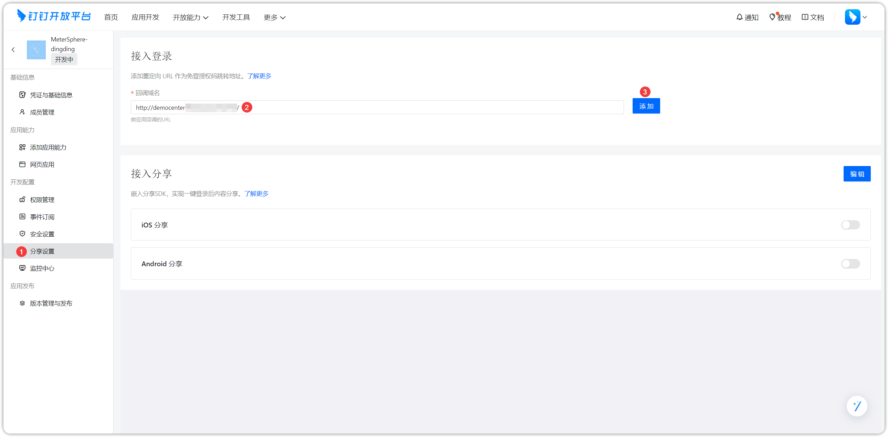

## 1 创建应用
!!! ms-abstract ""

    - 打开 [钉钉开发平台](https://developers.dingtalk.com/)，用管理员权限用户登录。
    - 点击【应用开发-钉钉应用-创建应用】
{ width="900px" }

!!! ms-abstract ""
    在创建应用的信息设置页面进行相关设置，点击保存。
{ width="900px" }

!!! ms-abstract ""
    在创建应用成功后，点击【凭证与基础信息】后，可以查看到应用凭证。
{ width="900px" }

## 2 权限配置
!!! ms-abstract ""
    点击【分享设置-回调域名】，在配置页面填写回调域名(回调域名为 MeterSphere 的访问地址)，点击添加即可。
{ width="900px" }

!!! ms-abstract ""
    点击【安全设置】，填写服务器出口IP，点击保存即可。
{ width="900px" }

!!! ms-abstract "参数说明"

    - 【服务器出口IP】MeterSphere 实际对外的公网地址。钉钉的白名单限制，你设置此 ip 后，只能通过此 ip 与钉钉 api 通信。
    - 【应用首页地址】 http 或 https 开头的 MeterSphere 访问地址。

!!! ms-abstract ""
    如下图，进行【权限管理-成员信息读权限-勾选-批量申请】操作。
{ width="900px" }

!!! ms-abstract ""
    搜索【User】后，开通【个人手机号信息】、【通讯录个人信息读权限】、【调用钉钉项目管理相关接口的权限】权限。
{ width="900px" }

## 3 钉钉认证配置
!!! ms-abstract ""
    点击【系统-系统参数-钉钉】进入钉钉配置页面，填写应用key、应用ID、应用秘钥内容，测试连接成功后即可。
{ width="900px" }

!!! ms-abstract "注意"

    - 应用key: 对应钉钉上的【Client ID】
    - 应用ID: 对应钉钉上的【AgentId】
    - 应用秘钥: 对应钉钉上的【Client Secret】

!!! ms-abstract ""
    在 MeterSphere 登录页面，点击【更多登录方式】进行钉钉扫码登录。
{ width="900px" }

{ width="900px" }

{ width="900px" }
