## 1 创建应用
!!! ms-abstract ""

    - 打开 [飞书开放平台](https://open.feishu.cn/app/)，用管理员权限用户登录。
    - 点击【创建企业自建应用】
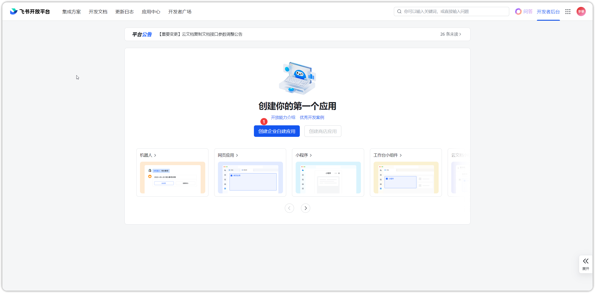{ width="900px" }

!!! ms-abstract ""
    输入应用名称和应用描述，点击【创建】即可
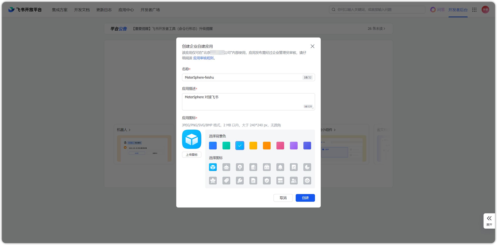{ width="900px" }

## 2 设置飞书引用
### 2.1 配置网页应用
!!! ms-abstract ""
    点击【添加应用能力】，添加网页应用。
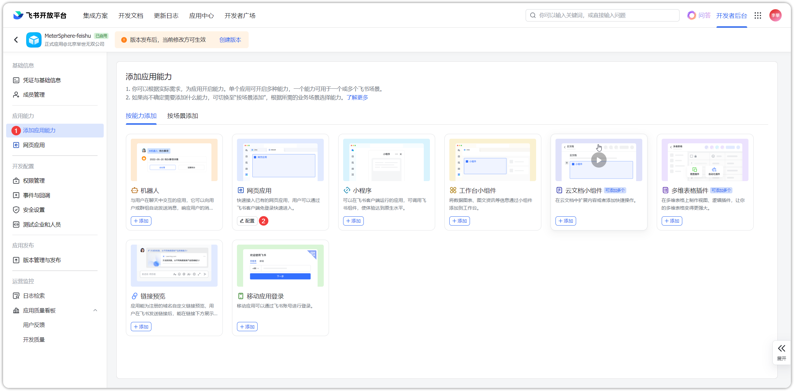{ width="900px" }

!!! ms-abstract ""
    在【网页应用】页面，填写"桌面端主页"和"移动端主页"内容，均为 MeterSphere 访问地址。
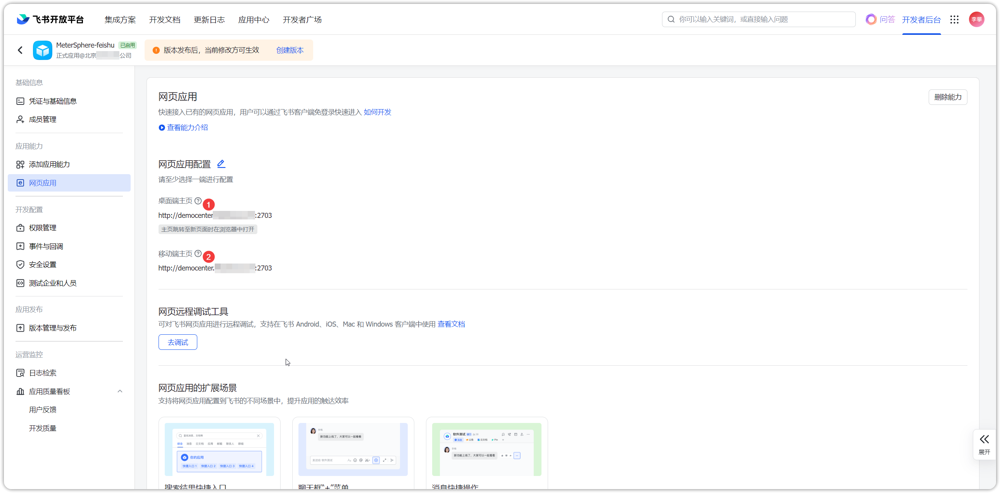{ width="900px" }

### 2.2 配置安全设置
!!! ms-abstract ""
    点击【安全设置】，添加重定向 URL 和 H5 可信域名，均填写填写 MeterSphere 访问地址。
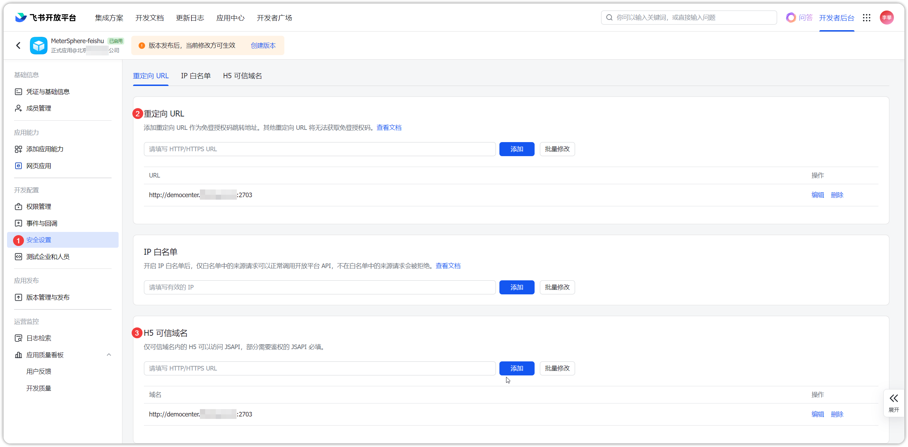{ width="900px" }

### 2.3 配置权限管理
!!! ms-abstract ""
    如下图，批量开通【获取用户 user ID】、【获取与发送单聊、群组消息】、【获取用户性别】、【获取单位信息】、【获取通讯录部门组织架构信息】、【获取用户组信息】、【获取用户组织架构信息】、【获取角色权限】、【获取职务列表】、【获取部门基础信息】、【通过手机号或邮箱获取用户 ID】、【获取用户基本信息】、【获取工作城市列表】、【获取用户邮箱信息】、【获取用户手机号】、【获取通讯录基本信息】、【获取成员所在部门路径】、【获取用户受雇信息】等权限。
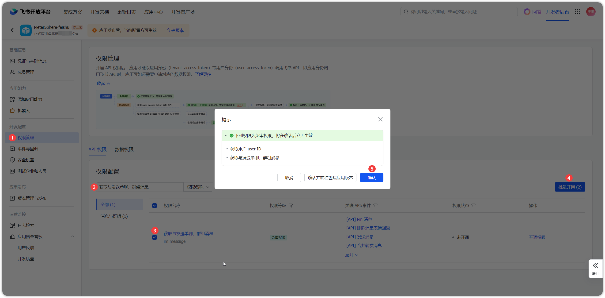{ width="900px" }

### 2.4 配置版本管理
!!! ms-abstract ""
    点击【版本管理与发布-创建版本】，填写应用版本号和更新说明等信息，点击【保存】。
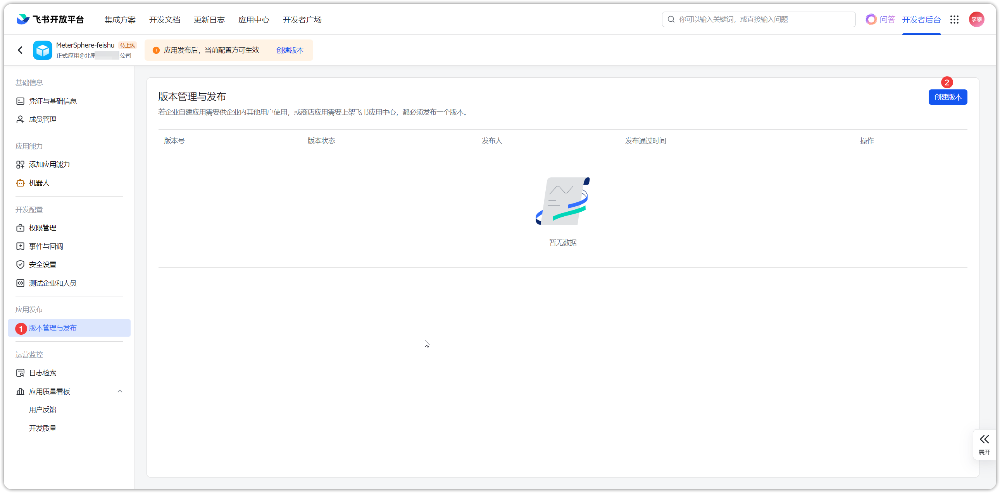{ width="900px" }

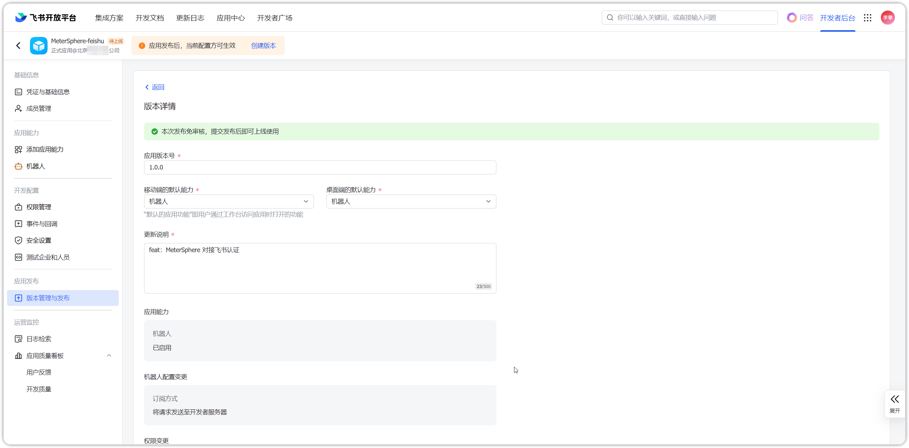{ width="900px" }

!!! ms-abstract ""
    点击【确认发布】即可将该应用提交到线上并自动生效。
{ width="900px" }

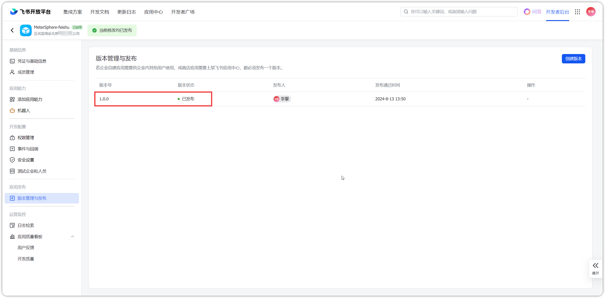{ width="900px" }

## 3 获取凭据
!!! ms-abstract ""
    点击【凭证与基础信息】，获取 APP ID 和 APP Secret 等凭证信息。
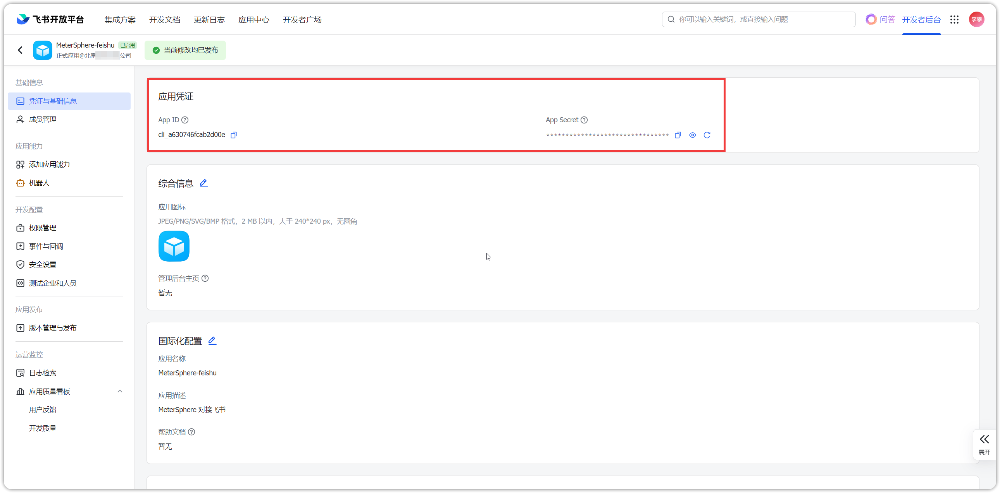{ width="900px" }

## 4 MeterSphere 配置飞书
!!! ms-abstract ""
    点击【系统设置-系统-系统参数-扫码登录-飞书】，配置飞书的应用 ID 和应用秘钥，测试连接通过后，点击【确认】即可。
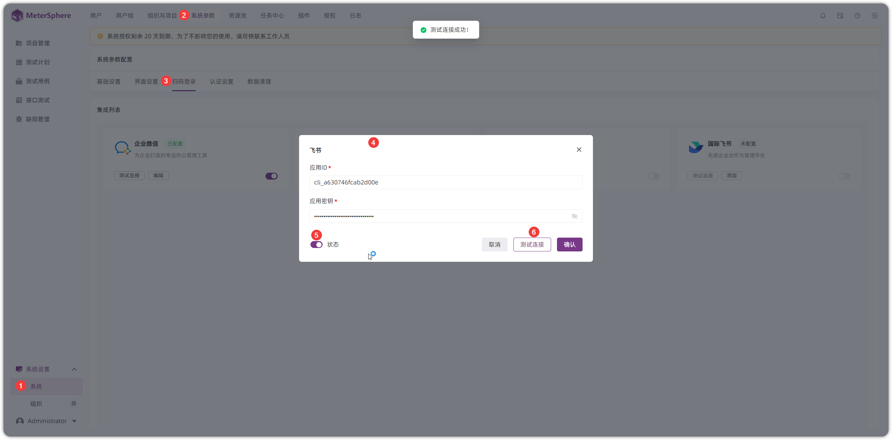{ width="900px" }

## 5 飞书登录
!!! ms-abstract ""
    在 MeterSphere 登录页面，点击【更多登录方式】进行飞书扫码登录。
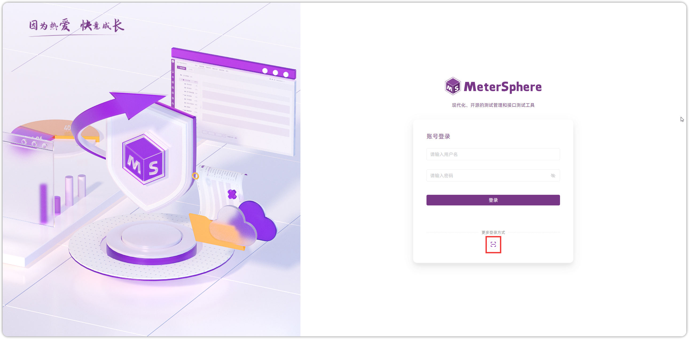{ width="900px" }

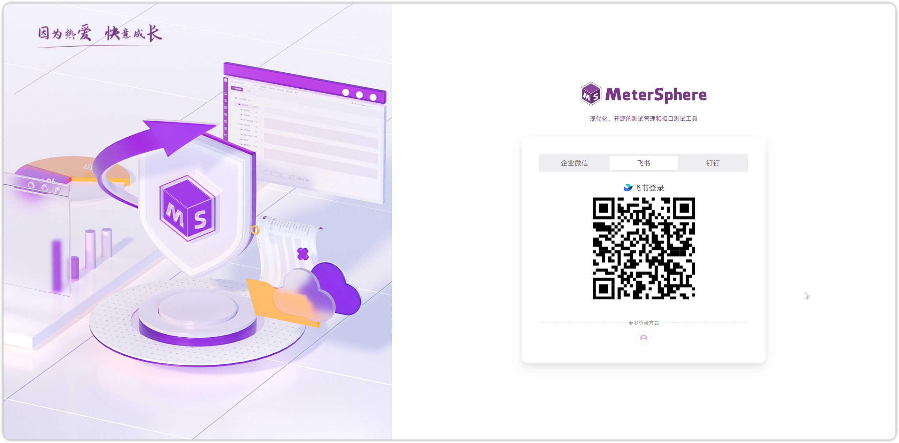{ width="900px" }

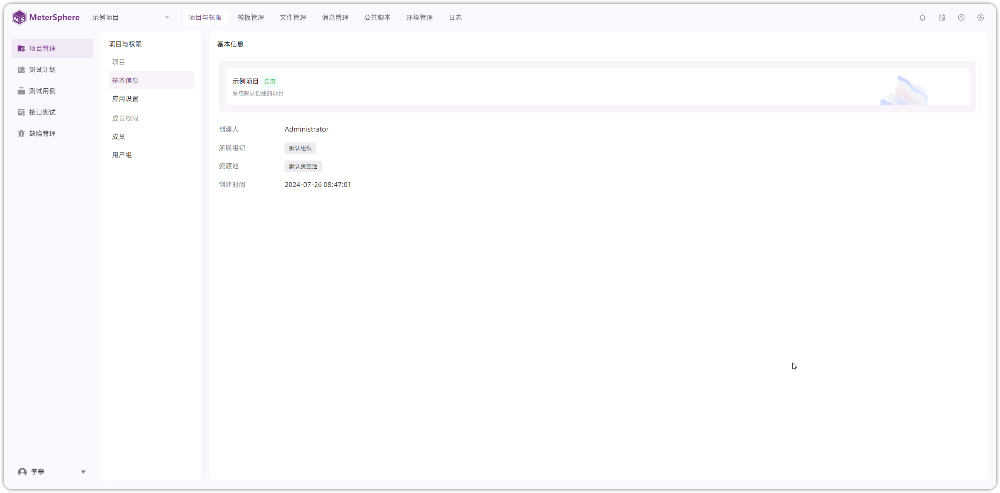{ width="900px" }

