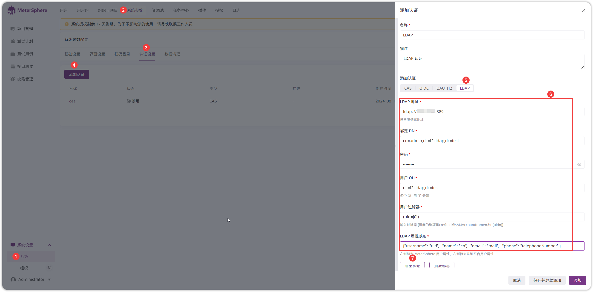

## 1 配置 LDAP
!!! ms-abstract ""
    LDAP 系统登录进入后，可看到 DN、OU、CN 等信息。
{ width="900px" }

!!! ms-abstract "示例说明"
    
    - CN=Zhang San,OU=TestGroup,DC=BeiJing,DC=Base，即 CN=Zhang San 代表一个用户名，OU=TestGroup 代表一个组织单位（测试组），说明 Zhang San 这个用户是处在 BeiJing.Base 的TestGroup（测试组）下

!!! ms-abstract ""
    点击【系统-系统参数-认证设置-添加认证】进入认证配置页面，配置 LDAP 地址、绑定 DN、填写密码、用户 OU、用户过滤器、LDAP 属性映射等信息内容后，点击【测试连接】即可。
{ width="900px" }

!!! ms-abstract "字段说明"

    - 【LDAP 地址】ldap://ldapserver:389 或者 ldap://ldapserver:636
    - 【绑定 DN】一定要是完整的 DN，可以使用工具查询，格式为 cn=admin,dc=f2cldap,dc=test
    - 【用户 OU】用户 OU 可以只写顶层 OU，不写子 OU，格式为 dc=f2cldap,dc=test
    - 【用户过滤器】根据规则到 用户OU 里面去检索用户，可能的选项为 (uid={0}) 或 (sAMAccountName={0}) 或 (cn={0})
    - 【LDAP属性映射】LADP 属性映射 MeterSphere 属性，格式为 { "username": "uid", "name": "cn", "email": "mail", "phone": "telephoneNumber" }

!!! ms-abstract ""
    点击【测试登录】，输入登录用户名和密码后，测试登录成功后，点击【添加】即可。
{ width="900px" }

!!! ms-abstract ""
    点击【启用-确认启用】，即可启用 LDAP 认证登录。
{ width="900px" }

## 2 LDAP 登录
!!! ms-abstract ""
    在 MeterSphere 登录页面，点击【LDAP】跳转 LDAP 登录页面进行登录。
{ width="900px" }

{ width="900px" }

{ width="900px" }

