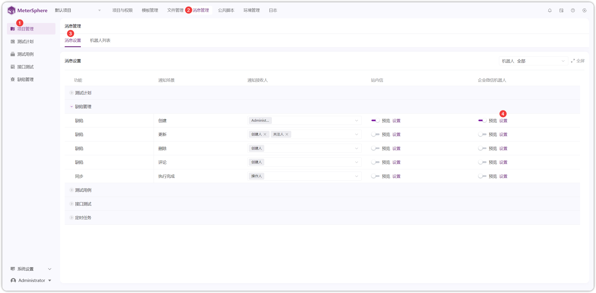
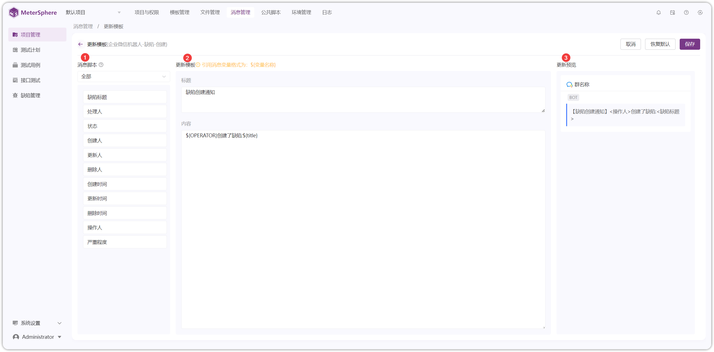
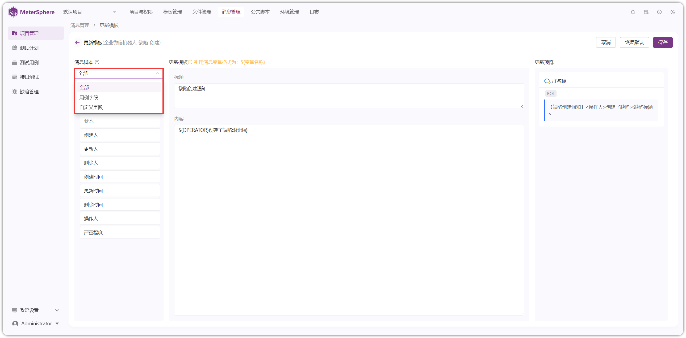
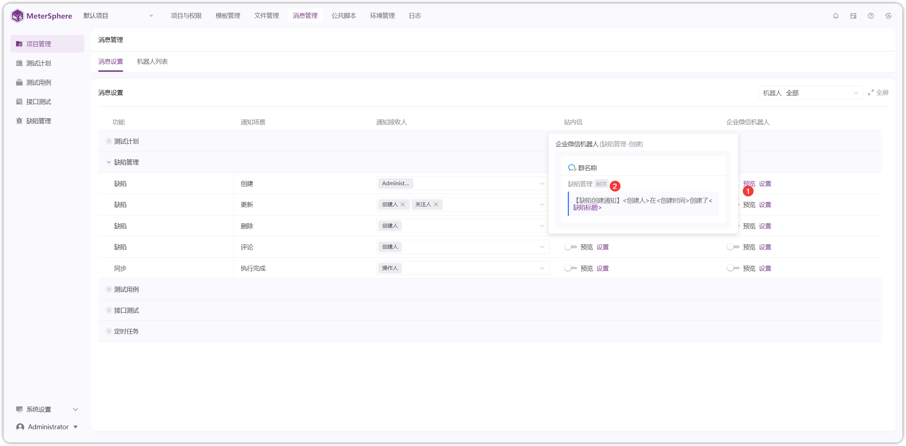

!!! ms-abstract ""
    需要先在【项目管理-信息管理-机器人列表】开启消息通知方式。详情参考：[消息通知](../../user_manual/project_management/message_management.md) 
    点击【项目设置-消息管理-消息设置-设置】进入自定义消息设置页面。如下图，以【企业微信】的自定义模板为例。
{ width="900px" }

{ width="900px" }

!!! ms-abstract "自定义消息模板的字段说明"
    - 【消息脚本】展示消息通知的具体内容，以及引用的消息变量。
    - 【更新模板】模板中引用消息变量格式和内容。
    - 【更新预览】预览自定义消息模板。

!!! ms-abstract ""
    【消息脚本】将字段分类为用例字段、自定义字段等类型。
{ width="900px" }

!!! ms-abstract ""
    点击左侧字段，自定义消息模板中的标题和内容均可使用字段变量，右侧预览处实时更新消息通知内容。
{ width="900px" }

!!! ms-abstract ""
    保存自定义消息模板后，在【预览】处显示消息通知内容。
{ width="900px" }

