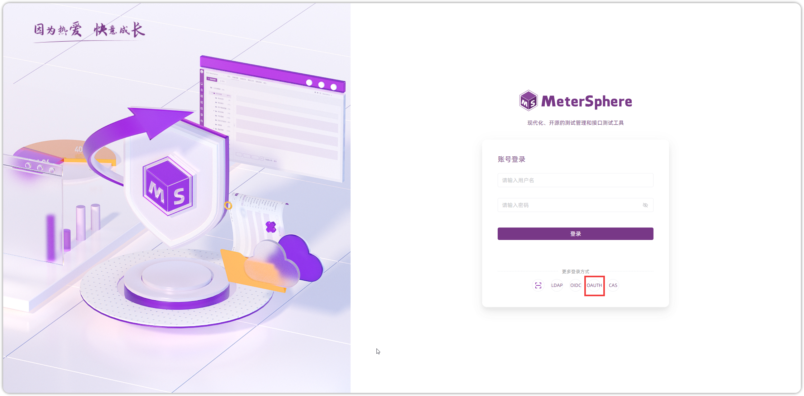

## 1 OAuth2.0 配置
!!! ms-abstract ""
    使用 GitHub 平台作为 OAuth2.0 配置环境，进入 [创建应用](https://github.com/settings/applications/new) 页面，填写信息进行创建应用。
{ width="900px" }

!!! ms-abstract ""
    获取 Client ID 和 Client secrets 凭证信息。
{ width="900px" }

!!! ms-abstract ""
    点击【系统设置-系统-系统参数-认证设置-添加认证-OAuth2.0】填写认证信息，点击【添加】即可。
{ width="900px" }

!!! ms-abstract "字段说明"

    - 【授权端地址】格式为 `https://github.com/login/oauth/authorize`
    - 【Token 端点地址】格式为 `https://github.com/login/oauth/access_token`
    - 【用户信息端点地址】格式为 `https://api.github.com/user`
    - 【回调地址】格式为 `http://MeterSphere 访问地址/sso/callback/oauth2`
    - 【注销会话端地址】格式为 `https://github.com/loginout`
    - 【属性映射】格式为 {"userid":"login","username":"name","email":"email"}

## 2 OAuth2.0 登录
!!! ms-abstract ""
    在 MeterSphere 登录页面，点击【OAuth2.0】跳转 OAuth2.0 登录页面进行登录。
{ width="900px" }

{ width="900px" }

{ width="900px" }

{ width="900px" }

