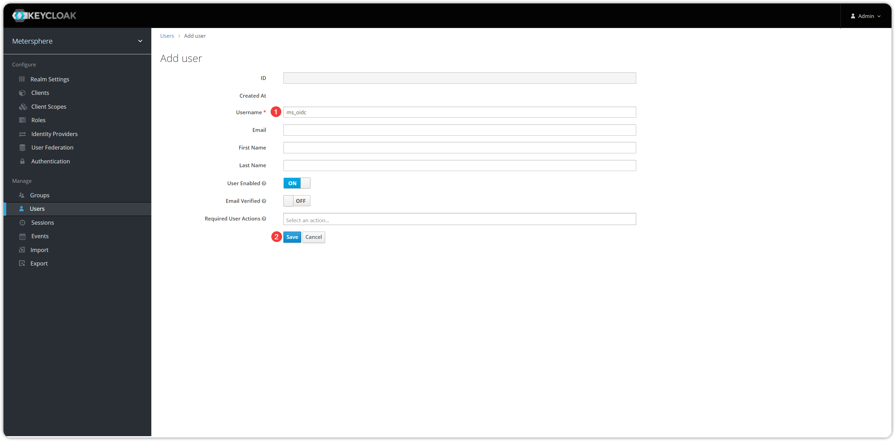

## 1 OIDC 系统配置
!!! ms-abstract ""
    点击【Realm Setting】，输入名称后，点击【保存】。
{ width="900px" }

!!! ms-abstract ""
    点击【Client-Create】进入页面，填写 Client ID、Root URL 信息后，进行保存。
{ width="900px" }

{ width="900px" }

!!! ms-abstract ""
    【Access Type】选择 confidential。
{ width="900px" }

!!! ms-abstract ""
    点击【User】创建用户后，切到【Credentials】页面，关闭临时，并设置用户密码。
{ width="900px" }

{ width="900px" }

{ width="900px" }

!!! ms-abstract ""
    点击【Realm Settings】后，切到【General】页面，点击【OpenID Endpoint Configuration】进入 openid-configuration 页面。
{ width="900px" }

!!! ms-abstract ""
    留存此页面，用于 MeterSphere OIDC 配置参考。
{ width="900px" }

!!! ms-abstract ""
    点击【client-metersphere-Credentials】获取 Secret 值。
{ width="900px" }

## 2 MeterSphere 配置 OIDC
!!! ms-abstract ""
    点击【系统设置-系统-系统参数-认证设置-添加认证-OIDC】填写认证信息，点击【添加】即可。
{ width="900px" }

!!! ms-abstract "字段获取"

    - 【授权端地址】对应 openid-configuration 页面 authorization_endpoint 参数
    - 【Token 端点地址】对应 openid-configuration 页面 token_endpoint 参数
    - 【用户信息端点地址】对应 openid-configuration 页面 userinfo_endpoint 参数
    - 【回调地址】格式为 `http://Metersphere 访问地址/sso/callback/oidc/${authId}`
    - 【注销会话端地址】对应 openid-configuration 页面 end_session_endpoint 参数

## 3 OIDC 登录
!!! ms-abstract ""
    在 MeterSphere 登录页面，点击【OIDC】跳转 OIDC 登录页面进行登录。
{ width="900px" }

{ width="900px" }

{ width="900px" }

{ width="900px" }

