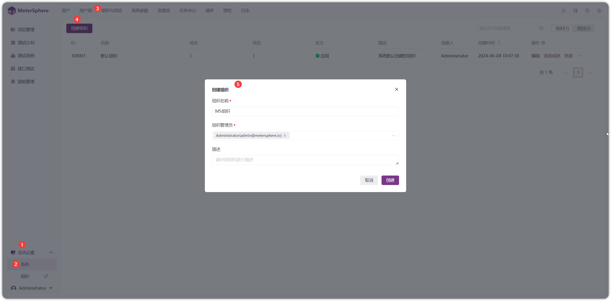
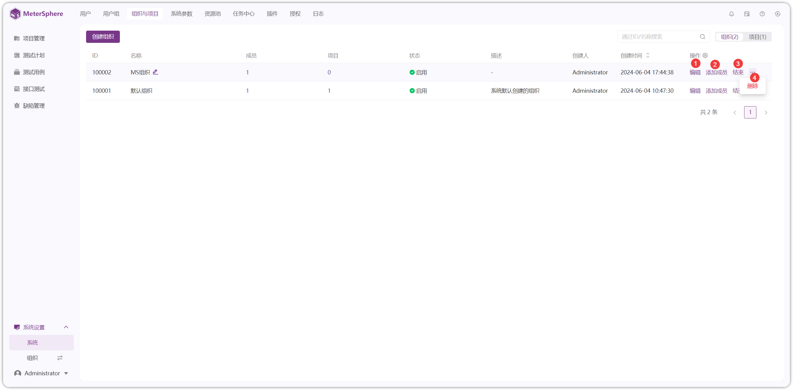
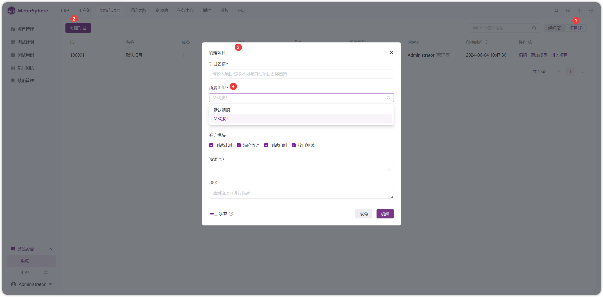

!!! ms-abstract ""
    点击【系统设置-系统-组织与项目-创建组织】，输入组织名称、组织管理员、描述信息创建组织。
{ width="900px" }

!!! ms-abstract ""
    组织可进行【编辑】、【添加成员】、【结束】、【删除】操作
{ width="900px" }

!!! ms-abstract "说明"
    - 【编辑】编辑组织名称、组织管理员、描述等信息。
    - 【添加成员】添加组织成员。
    - 【结束】结束后的组织不展示在组织切换列表。
    - 【删除】删除组织同时将该组织下的项目数据一起删除，请谨慎操作！

!!! ms-abstract ""
    点击组织列表处的【成员】或【项目】的数字，可查看具体内容。如下图，点击【成员】数字，查看成员信息，【移除】成员。
{ width="900px" }

!!! ms-abstract ""
    创建完组织后，切到【项目】页面，点击【创建项目】，所属组织处可选择已创建的组织。
{ width="900px" }

