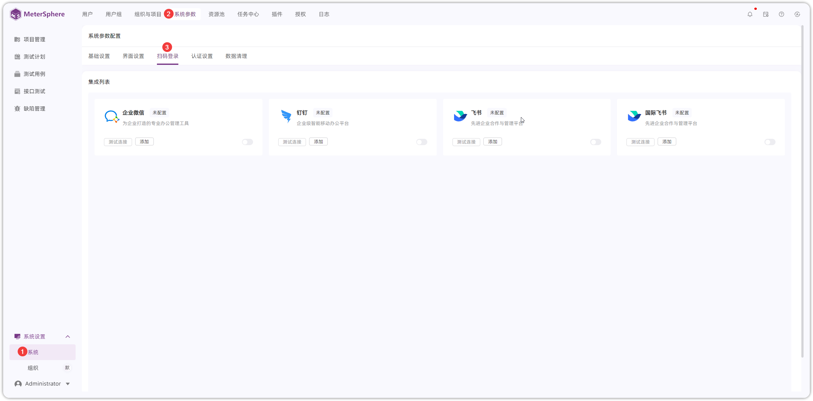
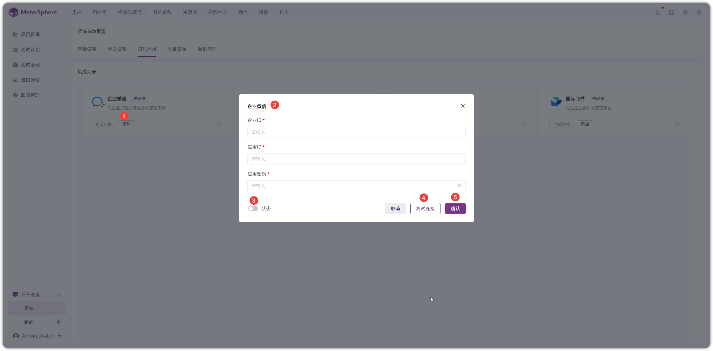
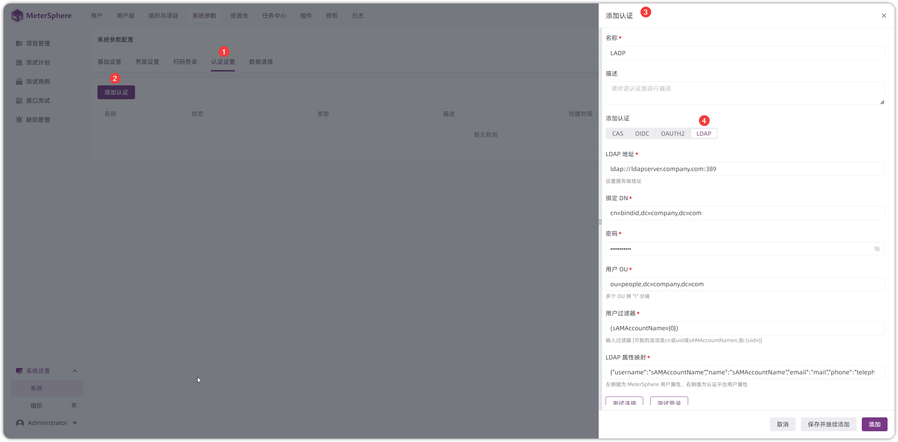
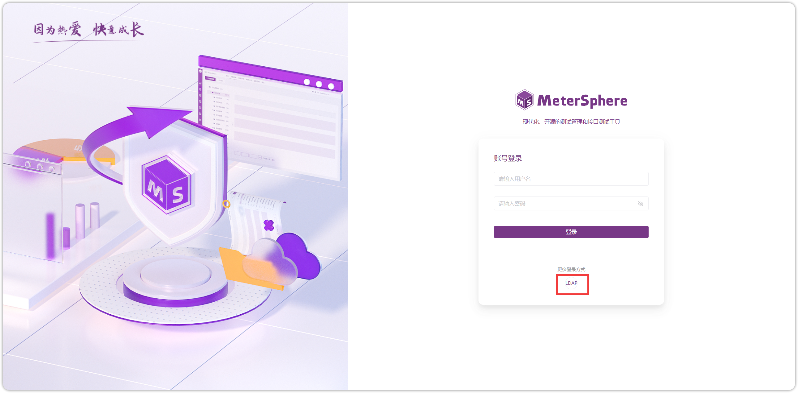
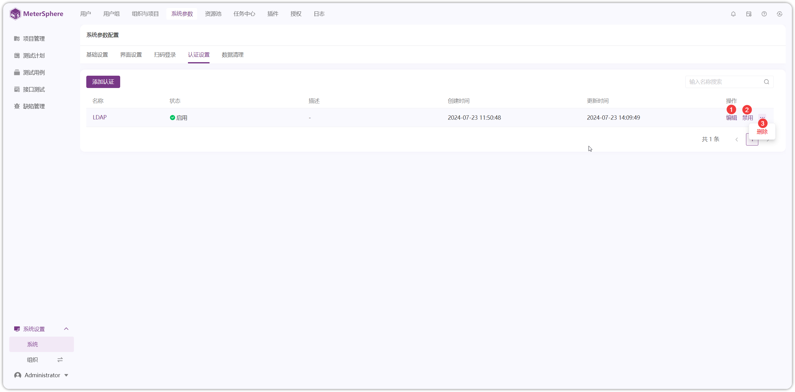

## 1 扫码登录
!!! ms-abstract ""
    点击【系统-系统参数-扫码登录】进入扫码登录配置页面。
{ width="900px" }

!!! ms-abstract ""
    以企业微信为例，点击【添加】进入配置页面。
{ width="900px" }

!!! ms-abstract "字段"

    - 【企业 ID】登录企业微信管理后台页面，在【我的企业-企业信息-企业 ID】获取企业 ID
    - 【应用 ID/应用密钥】点击【应用管理-具体某应用-点击 API】可获取到 AgentId 和 Secret

## 2 认证登录
!!! ms-abstract ""
    点击【系统-系统参数-认证设置-添加认证】进入认证配置页面。
{ width="900px" }

!!! ms-abstract "字段"

    - 【LDAP 地址】ldap://ldapserver:389 或者 ldap://ldapserver:636
    - 【绑定 DN】cn=bindid,dc=company,dc=com
    - 【用户 OU】ou=people,dc=company,dc=com
    - 【用户过滤器】(sAMAccountName={0})
    - 【LDAP属性映射】{"username":"sAMAccountName","name":"sAMAccountName","email":"mail","phone":"telephoneNumber"}

!!! ms-abstract "字段说明"

    - 【OU】同级多OU用｜分割
    - 【用户过滤器】根据规则到 用户OU 里面去检索用户，可能的选项为 (uid={0}) 或 (sAMAccountName={0}) 或 (cn={0})
    - 【LDAP属性映射】{"username":"sAMAccountName","name":"sAMAccountName","email":"mail","phone":"telephoneNumber"}，username,name,email 三项不可修改删除, phone 属性可选

!!! ms-abstract ""
    配置完成并启用后，在登录页面可以看到 LDAP 选项登录。
{ width="900px" }

!!! ms-abstract ""
    LDAP 可以进行编辑、禁用、删除操作。
{ width="900px" }
