## 1 创建应用
!!! ms-abstract ""

    - 打开 [企业微信管理后台](https://work.weixin.qq.com/)，用管理员权限用户登录。
    - 点击【工作台-应用管理-创建应用】
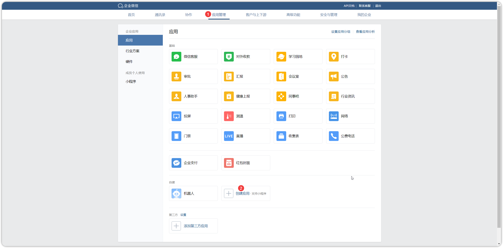{ width="900px" }

!!! ms-abstract ""
    在创建应用的信息设置页面进行相关设置，可见范围可以选择接收消息通知的部门或个人。
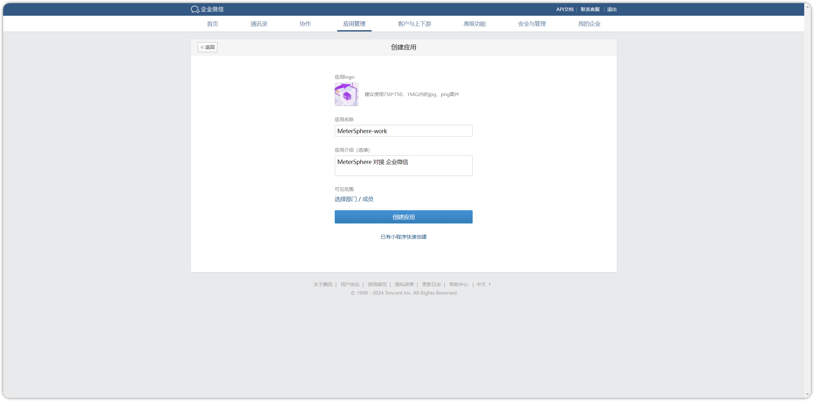{ width="900px" }

## 2 获取凭据
!!! ms-abstract ""
    创建完应用后，可以进入应用查看相关的访问凭证信息，记录 AgentId、Secret 对应的值。
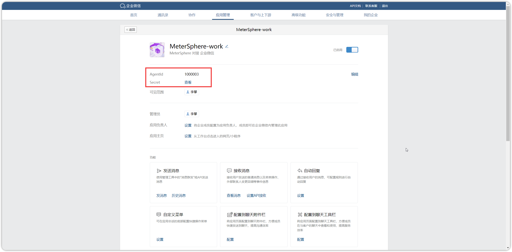{ width="900px" }

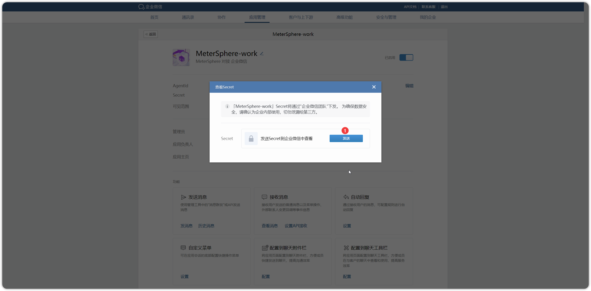{ width="900px" }

!!! ms-abstract ""
    应用管理页面滑向页面底部，选中【企业微信授权登陆-设置】页面进行配置
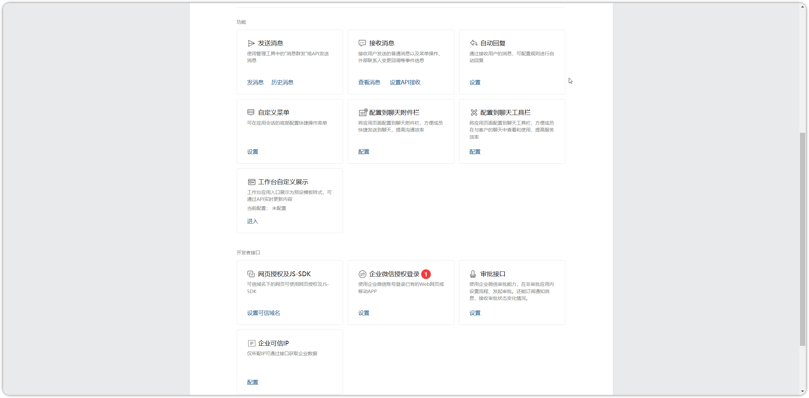{ width="900px" }

!!! ms-abstract ""
    【授权回调域】填写 MeterSphere 访问地址
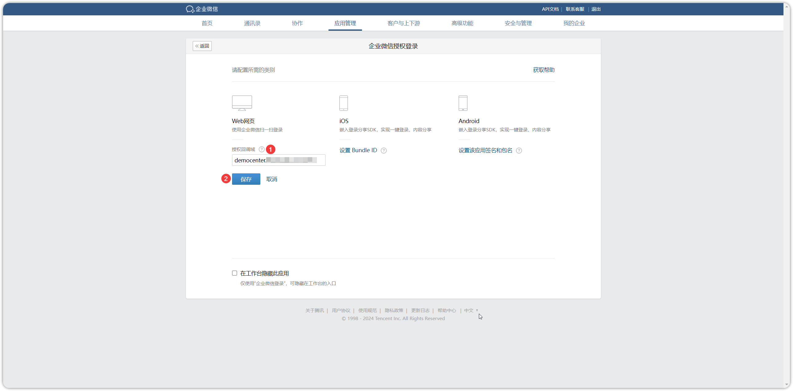{ width="900px" }

!!! ms-abstract ""
    点击【企业可信 IP-配置】按钮进入配置页面，填写 MeterSphere 服务器 IP 即可。
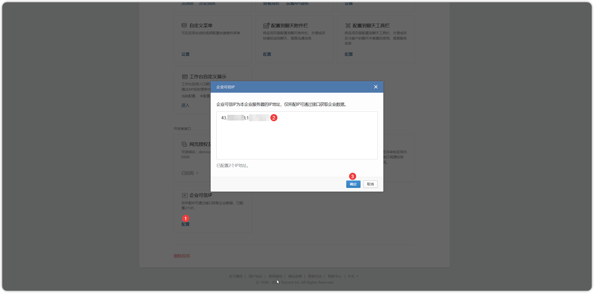{ width="900px" }

!!! ms-abstract "注意"
    【企业可信 IP】首次配置时，需要先配置可信域名。下载 txt 文件，并将其放到填写域名根目录下，可在 nginx 代理配置端口以便该 txt 能正常访问。
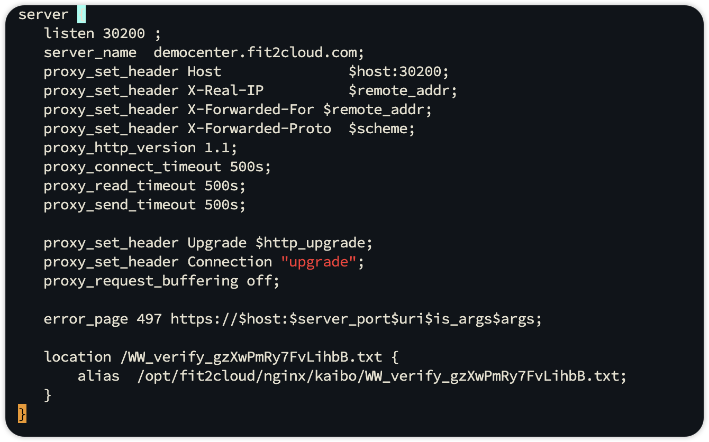{ width="900px" }

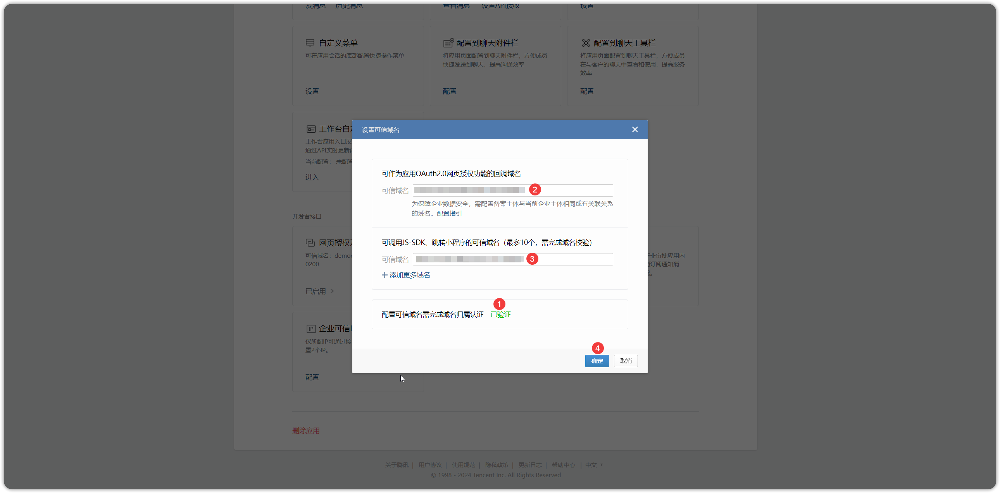{ width="900px" }

!!! ms-abstract ""
    点击【我的企业-企业信息】获取企业ID。
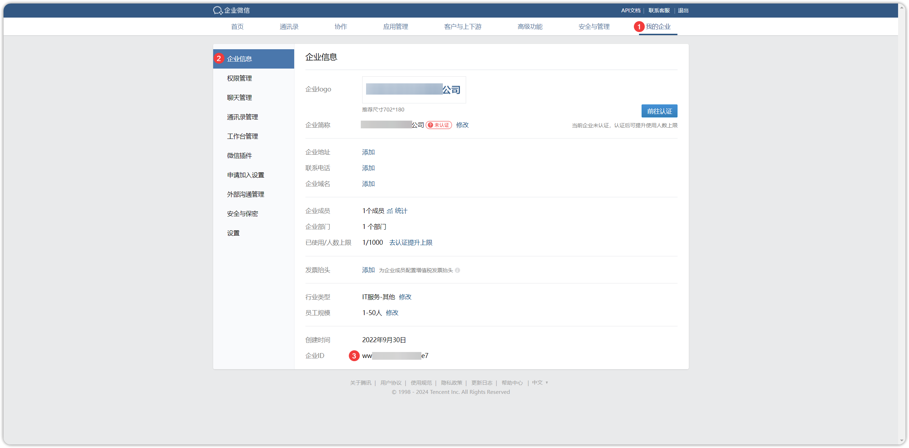{ width="900px" }

## 3 企业微信认证配置
!!! ms-abstract ""
    点击【系统-系统参数-扫码登录-企业微信】，添加企业ID、应用ID、应用秘钥等信息后，测试连接成功后点击保存即可。
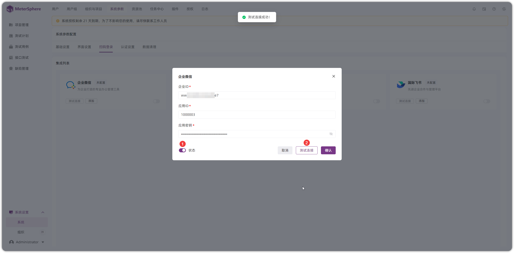{ width="900px" }

## 4 企业微信登录
!!! ms-abstract ""
    点击【系统-系统参数-扫码登录-企业微信】，添加企业ID、应用ID、应用秘钥等信息后，测试连接成功后点击保存即可。
{ width="900px" }

!!! ms-abstract ""
    在 MeterSphere 登录页面，点击【更多登录方式】进行企业微信扫码登录。
{ width="900px" }

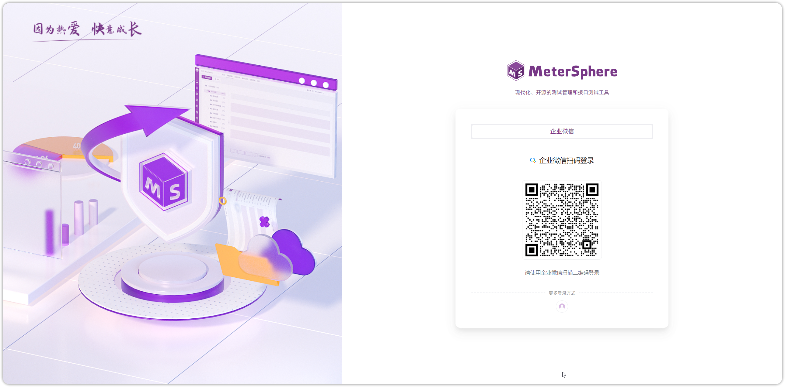{ width="900px" }

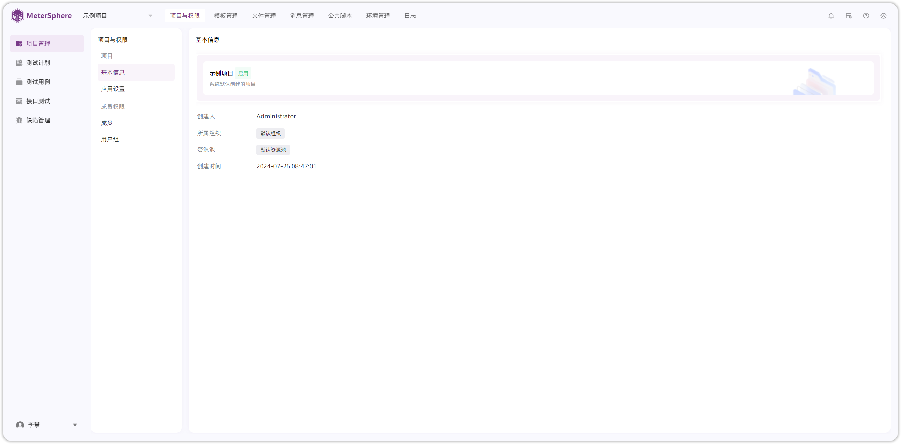{ width="900px" }
